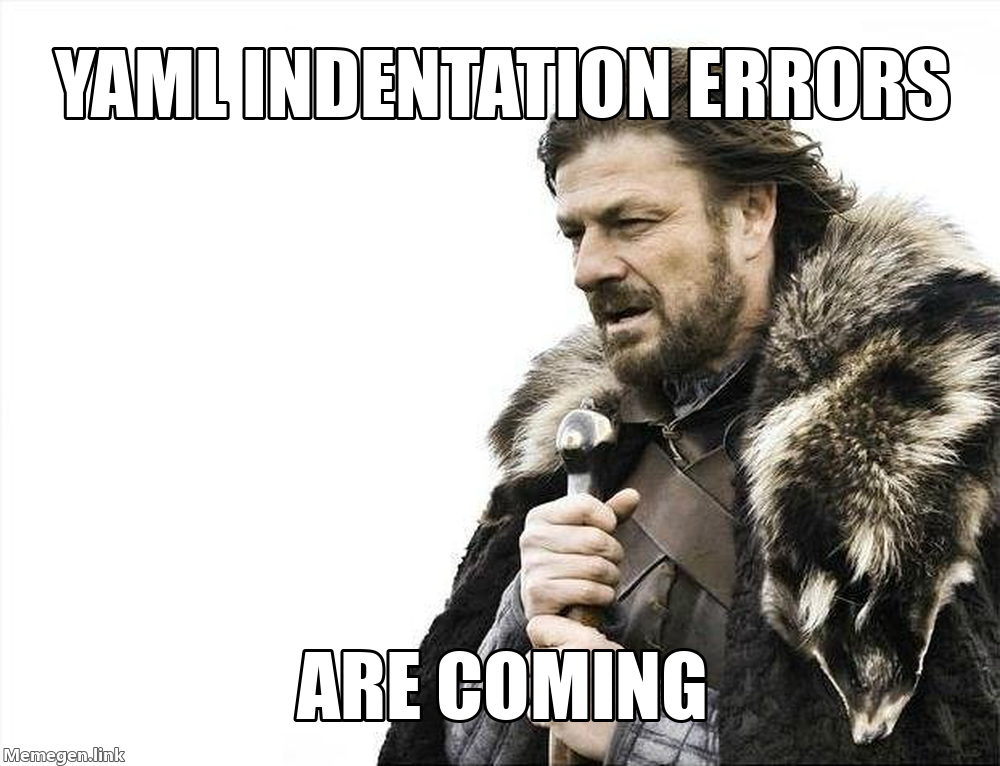

# 33  Automation

> **TIP:**
>
> **Prerequisites (read first if unfamiliar):** [sec-terminal](#sec-terminal), [sec-scripts-vs-notebooks](#sec-scripts-vs-notebooks).
>
> **See also:** [sec-git-github](#sec-git-github), [sec-remote-computing](#sec-remote-computing).

## Purpose



It’s the night before your group project is due, and the README explains how to rebuild the report: activate the environment, run `clean.py`, run `analyze.py`, regenerate the figures, and (in bold) rerun the cleaning first if the raw data changed. You do it at 11 p.m., you skip the bold step, and the chart you turn in is built from last week’s data. Meanwhile your teammate follows the same steps on their laptop and gets `ModuleNotFoundError`, because a package you installed months ago never made it into `requirements.txt`.

Nobody in that story was careless. The process lived in a checklist and in people’s heads, and checklists get skipped when you’re tired. [Automation](https://en.wikipedia.org/wiki/Automation) is the fix: you write the checklist down in a form the computer runs, so “I can do this once” becomes “anyone on the team can do this, the same way, every time.” The payoff is less about saving minutes than about trust: when one command rebuilds everything and the same checks run on every change, you stop wondering whether the numbers in the report are current.

This chapter climbs a ladder: shell scripts that fail safely, `make` for named tasks and rebuilds, schedulers that run jobs while you sleep, and continuous integration and pre-commit hooks that check every change, ending with how to let an AI assistant draft this plumbing without trusting it blindly. It assumes you can use a terminal ([sec-terminal](#sec-terminal)) and write a Python script ([sec-scripts-vs-notebooks](#sec-scripts-vs-notebooks)); Git itself is in [sec-git-github](#sec-git-github), and running jobs on other machines is in [sec-remote-computing](#sec-remote-computing).

## Why read this chapter

- Your project’s README has a seven-step “how to run this” list, and every teammate runs it a little differently.
- You changed the cleaning script, forgot to rerun the report, and turned in a figure built from last week’s data.
- Your script printed an error halfway through, kept going anyway, and finished as if everything were fine.
- Your first Makefile answered with `*** missing separator. Stop.`, and you have no idea what separator it wants.
- A script that works when you run it fails at 6 a.m. under cron with `command not found`, or never runs at all because your laptop was asleep.
- Your team keeps merging pull requests that break `main`, and you’ve heard CI would help, but a GitHub Actions YAML file looks like a wall of indentation.
- You asked an AI assistant for a workflow file and want to know how to tell whether it’s right before it runs with access to your repository.

## Running theme: make the correct path the easy path

If running the checks is one command, people run them. If it’s a checklist, people skip steps, especially at 11 p.m.

## 33.1 The automation ladder

Automation can sound all-or-nothing, as if you either type everything by hand or build a professional pipeline. It’s more useful to picture a ladder, where you climb a rung only when the one below it has become a real chore. At the bottom, you type commands by hand, which is fine until a task has more than two or three steps and you start forgetting one. **The first rung is a script** (a [shell script](https://en.wikipedia.org/wiki/Shell_script), a Python file, or a PowerShell file) that runs the steps for you: the biggest jump for the least effort, because the sequence is now written down where a teammate can read and repeat it. **The second rung is a task runner** such as `make`, which gives each job a short name (`make test`, `make report`) and skips work whose inputs haven’t changed. **The third is a scheduler,** which runs a task at set times with nobody at the keyboard. **The top rung is continuous integration (CI),** where checks run on every push and pull request and the whole team sees the results.

How high should you climb? A common rule of thumb is to automate the third time you do something: the first time you’re still working out the steps, the second time you might do them differently, and by the third the sequence is stable enough that writing it down pays you back. Automate sooner when the task must be done exactly the same way every time, when a mistake costs something real (a grade, a published figure), or when teammates need to run it without asking you. Hold off when you don’t yet know what the right steps are, or when doing it by hand is how you’re still learning it; automating an analysis you don’t understand only hides the confusion.

For most student projects, three commands cover nearly everything: one to set up the environment, one to run a quick [smoke test](https://en.wikipedia.org/wiki/Smoke_testing_(software)) (the code imports, the data is where it should be, nothing is wildly broken), and one to build the outputs. Once those exist, anyone who clones the project can reproduce it, including you in three months. Solo coursework lives happily on the first rung; a team project usually wants CI for the checks that matter most. Climbing before you need to is busywork, but refusing to climb after a chore has bitten you twice is procrastination in disguise.

## 33.2 Scripts that behave well

Here’s a confusing one. Your script prints a traceback halfway through, the rest of it keeps running, and at the end nothing says anything went wrong. When a scheduler or CI runs that script, it reports success, because nobody told it otherwise. What separates a script you can automate from one you have to babysit comes down to four habits.

**Fail loudly, with an exit code.** Every program ends by handing back a number, its [exit status](https://en.wikipedia.org/wiki/Exit_status): `0` means success and anything else means failure. Schedulers, `make`, and CI read that number and nothing else, so a script that swallows an error and exits 0 is lying to all of them. In Python, let the exception propagate or call `sys.exit(1)` rather than printing a warning and carrying on; in bash, use the header in the next section.

**Make reruns safe.** A script is [idempotent](https://en.wikipedia.org/wiki/Idempotence) if running it twice leaves things the same as running it once, which matters because the natural response to a failure is to fix the cause and run the whole thing again. Plain `mkdir out` fails the second time (`mkdir: cannot create directory 'out': File exists`); `mkdir -p out` doesn’t. Overwrite outputs instead of appending to them.

**Say what goes in and what comes out.** Pass file paths as arguments, write outputs to predictable places (`data/processed/`, `reports/`, `logs/`), and never write over raw data; as [sec-tabular-data](#sec-tabular-data) puts it, raw data is read-only and everything else can be rebuilt.

**Leave a trail.** Nobody watches a script that runs unattended, so print a line when each stage starts and ends, and save it. Programs send normal output and errors to two separate [streams](https://en.wikipedia.org/wiki/Standard_streams), stdout and stderr, and `>> logs/pipeline.log 2>&1` appends both to one file you can read the next morning.

Which language? When a script mostly runs other commands in order, write [bash](https://www.gnu.org/software/bash/manual/): it’s what you already type at the prompt, and it’s on every Mac and Linux machine. When it mostly works with data, write Python (see [sec-scripts-vs-notebooks](#sec-scripts-vs-notebooks)). [sec-terminal](#sec-terminal) introduced shebangs and `chmod +x`; the rest of this section picks up from there.

### Start every script with the same two lines

``` bash
#!/usr/bin/env bash
set -euo pipefail
```

The first line, the [shebang](https://en.wikipedia.org/wiki/Shebang_(Unix)), says which program should run the file. Going through `env` finds bash wherever it lives on the current machine, which matters because macOS, Linux, and BSD don’t agree on the path.

The second line is the most useful line in this chapter. By default, bash is forgiving to a fault: when a command fails, it prints the error and moves on to the next line, and the script’s exit code is whatever the *last* command returned. Run this three-line script:

``` bash
#!/usr/bin/env bash
ls /does/not/exist
echo "still running"
```

``` text
ls: cannot access '/does/not/exist': No such file or directory
still running
```

It exits 0, a success, even though the thing it was supposed to do failed. [`set`](https://www.gnu.org/software/bash/manual/html_node/The-Set-Builtin.html) turns on three options that fix this:

- **`-e`** stops the script at the first command that fails and passes on that command’s exit code. With it, the script above stops after `ls` and exits 2.
- **`-u`** treats an unset variable as an error. Without it, a misspelled or forgotten variable quietly becomes an empty string, so `rm -rf "$BACKUP_DIR"/*` with `BACKUP_DIR` unset becomes `rm -rf /*`. With it, the script stops with `BACKUP_DIR: unbound variable`.
- **`-o pipefail`** makes a pipeline fail when any command in it fails. Normally `command1 | command2` reports only the status of `command2`, so `false | head -1` counts as a success; with `pipefail`, it fails.

One thing about `-e` surprises people: it doesn’t fire for a command that’s being tested, in an `if` condition or on the left of `&&` or `||`. That’s deliberate, and it’s how you handle a failure you expect (“Exit codes on purpose,” below, shows how).

### Variables and quoting

Assign a variable with no spaces around the `=`, and read it back with a `$`. Add spaces out of habit (`NAME = value`) and bash tries to run a command called `NAME`, which is where `NAME: command not found` comes from.

``` bash
PROJECT_DIR="/Users/you/projects/sales"
LOG_FILE="${PROJECT_DIR}/logs/run.log"
echo "Writing to ${LOG_FILE}"
```

The braces in `${LOG_FILE}` mark where the name ends: `$LOG_FILE_2` is a different variable called `LOG_FILE_2` (probably empty), while `${LOG_FILE}_2` is `LOG_FILE` followed by `_2`. When in doubt, use braces.

Then quote every variable that holds a path or anything a person typed. Unquoted, a value is split at its spaces, so a folder called `My Documents` turns into two arguments:

``` text
$ DATA_DIR="My Documents"
$ ls $DATA_DIR
ls: cannot access 'My': No such file or directory
ls: cannot access 'Documents': No such file or directory
$ ls "$DATA_DIR"
a.csv
```

You don’t have to catch these by eye. [ShellCheck](https://www.shellcheck.net/) reads a script and flags unquoted variables (its warning SC2086) along with dozens of other classic mistakes; it does for bash what ruff does for Python ([sec-linting](#sec-linting)).

### Decisions and loops: `if`, `for`, and `case`

An `if` in bash doesn’t test a true-or-false value the way Python’s does. It runs a command and checks its exit code, with 0 counting as true. For file checks and comparisons, that command is `[` (another name for `test`), which is why the spaces inside the brackets are required: `if [$x = 1]` fails with `[1: command not found`.

``` bash
if [ -f "${INPUT_FILE}" ]; then
    python src/clean.py --input "${INPUT_FILE}"
else
    echo "ERROR: ${INPUT_FILE} not found" >&2
    exit 1
fi
```

The tests you’ll use most are `-f` (a file exists), `-d` (a folder exists), `-z` and `-n` (a string is empty, or isn’t), and `=` and `!=` for comparing strings. The `>&2` sends the message to stderr, where error messages belong.

A `for` loop runs once for each item in a list, and a [glob](https://en.wikipedia.org/wiki/Glob_(programming)) like `data/raw/*.csv` builds the list for you:

``` bash
for csv in data/raw/*.csv; do
    base=$(basename "${csv}" .csv)
    python src/clean.py --input "${csv}" --output "data/processed/${base}.parquet"
done
```

`basename` strips the folder and the `.csv`, leaving a stem like `north` for the output name, and with `set -e` the loop stops at the first file that fails. One trap: if the folder has no CSV files, the loop runs once with the literal text `data/raw/*.csv`, so an error about a file called `*.csv` means the folder was empty.

A `case` statement picks among a few fixed options, which suits a script that takes a subcommand:

``` bash
case "${1:-}" in
    setup)  make setup ;;
    run)    make run ;;
    clean)  make clean ;;
    "")     echo "Usage: $0 {setup|run|clean}" >&2; exit 2 ;;
    *)      echo "Unknown command: $1" >&2; exit 2 ;;
esac
```

`${1:-}` means “the first argument, or an empty string if there isn’t one” (one of bash’s [parameter expansions](https://www.gnu.org/software/bash/manual/html_node/Shell-Parameter-Expansion.html)); plain `$1` would trip `set -u` whenever you ran the script with no argument. The `*)` branch catches everything else.

### Functions

Once a script passes fifty lines or so, group its pieces into functions:

``` bash
log() {
    echo "[$(date '+%Y-%m-%d %H:%M:%S')] $*"
}

require_file() {
    local path="$1"
    if [ ! -f "${path}" ]; then
        echo "ERROR: required file ${path} is missing" >&2
        return 1
    fi
}

log "starting pipeline"
require_file "data/raw/sales.csv"
python src/clean.py
log "done"
```

Inside a function, `$1`, `$2`, and so on are the function’s own arguments, and `$*` is all of them joined with spaces, which is what a logger wants. Declare helper variables with `local`, or they overwrite variables of the same name elsewhere in the script. `return 1` ends the function with a failure status, while `exit 1` ends the whole script; under `set -e`, a function that returns 1 stops the script anyway, unless you called it as the condition of an `if`.

### Exit codes on purpose

Most scripts need only three exit codes: 0 for success, 1 for “something went wrong,” and 2 for “you called me wrong,” the convention bash’s own built-in commands follow. You’ll also meet two the shell sets for you: 127 means `command not found`, and 126 means the file exists but can’t be run (often because it isn’t marked executable). Check your arguments early, and exit 2 if they’re wrong:

``` bash
if [ "$#" -lt 1 ]; then
    echo "Usage: $0 <input-file>" >&2
    exit 2
fi
```

Some commands return nonzero in normal use: `grep` exits 1 when it finds no match, so under `set -e` a `grep` that finds nothing ends your script. When you expect a failure and want to handle it, make the command the condition of an `if`. This download does that, and it hides a trap worth seeing:

``` bash
if curl -sf "${URL}" -o data.csv; then
    echo "downloaded"
else
    status=$?
    echo "ERROR: download failed (curl exit ${status})" >&2
    exit 1
fi
```

The `-f` makes `curl` fail on an HTTP error such as a 404 (it exits 22) instead of saving the error page as your data. The tempting shorter version, `if ! curl ...; then echo "failed (exit $?)"`, always prints `exit 0`: the `!` flips the status so the `if` fires, and by the time you read `$?`, it holds the flipped value. Save `$?` in the `else` branch, before any other command runs.

### Cleaning up with `trap`

`set -e` stops a script, but it doesn’t tidy up. If the script made a temporary folder, a lock file, or a half-written output, a failure leaves it lying around. The [`trap`](https://www.gnu.org/software/bash/manual/html_node/Bourne-Shell-Builtins.html) command registers something to run when the script exits:

``` bash
#!/usr/bin/env bash
set -euo pipefail

WORK_DIR=$(mktemp -d)
cleanup() {
    echo "cleaning up ${WORK_DIR}"
    rm -rf "${WORK_DIR}"
}
trap cleanup EXIT

# ... do the work in ${WORK_DIR} ...
```

`trap cleanup EXIT` runs `cleanup` however the script ends: normally, stopped by `set -e`, interrupted with Ctrl-C, or ended with a plain `kill`. (Nothing can clean up after `kill -9`, which stops a program without warning.)

A trap on `ERR` runs whenever a command fails, and can tell you where:

``` bash
on_error() {
    local exit_code=$?
    echo "ERROR: command on line $1 exited with code ${exit_code}" >&2
}
trap 'on_error $LINENO' ERR
```

In a long script, `ERROR: command on line 12 exited with code 2` beats scrolling through a log wondering which of forty commands failed.

### Putting it together

Here is a script that uses every pattern in this section. It cleans every raw CSV and then builds a report, and it finds the project folder from its own location, so it works whichever folder you start it from:

``` bash
#!/usr/bin/env bash
# scripts/build_report.sh: clean every raw CSV, then build the report
set -euo pipefail

PROJECT_DIR="$(cd "$(dirname "$0")/.." && pwd)"
RAW_DIR="${PROJECT_DIR}/data/raw"
OUT_DIR="${PROJECT_DIR}/data/processed"
LOG_FILE="${PROJECT_DIR}/logs/build.log"

mkdir -p "${OUT_DIR}" "${PROJECT_DIR}/reports" "$(dirname "${LOG_FILE}")"

log() {
    echo "[$(date '+%Y-%m-%d %H:%M:%S')] $*" | tee -a "${LOG_FILE}"
}

finish() {
    local status=$?
    log "build_report.sh exiting with code ${status}"
}
trap finish EXIT

if [ ! -d "${RAW_DIR}" ]; then
    log "ERROR: ${RAW_DIR} does not exist"
    exit 2
fi

log "starting build"
for csv in "${RAW_DIR}"/*.csv; do
    base=$(basename "${csv}" .csv)
    log "cleaning ${base}"
    python "${PROJECT_DIR}/src/clean.py" \
        --input "${csv}" \
        --output "${OUT_DIR}/${base}.parquet"
done

log "building report"
python "${PROJECT_DIR}/src/report.py" \
    --input-dir "${OUT_DIR}" \
    --output "${PROJECT_DIR}/reports/q3.html"

log "build complete"
```

A run with two raw files prints, and appends to `logs/build.log`:

``` text
[2026-09-25 20:41:40] starting build
[2026-09-25 20:41:40] cleaning north
[2026-09-25 20:41:41] cleaning south
[2026-09-25 20:41:42] building report
[2026-09-25 20:41:42] build complete
[2026-09-25 20:41:42] build_report.sh exiting with code 0
```

When one CSV is malformed, the pandas traceback appears right after `cleaning west`, nothing after it runs, and the last line reads `exiting with code 1`. About forty lines, none of them clever: good shell scripting is careful plumbing that doesn’t surprise the next person to run it.

### When bash stops being the right tool

Bash is good glue and a poor programming language, and it’s worth noticing when you’ve crossed the line. Its arithmetic is integers only, so anything with decimals means calling out to another tool. It has no real data types, so parsing JSON, YAML, or CSV turns into fragile chains of `cut`, `awk`, and `sed`; [jq](https://jqlang.org/) is great for a quick look at JSON, but anything you’ll maintain belongs in Python. Associative arrays (bash’s dictionaries) arrived only in bash 4.0, in 2009, and the bash that ships with macOS is still the older 3.2, so a script that uses them breaks on a Mac. And length is a warning sign: [Google’s shell style guide](https://google.github.io/styleguide/shellguide.html) says a script past 100 lines, or with complicated logic, should be rewritten in a more structured language now, before it grows further.

The pattern that works is a small bash wrapper around Python. Bash moves to the right folder, picks the right environment, and sends output to a log; Python does the data work. Every example in this chapter is built that way.

## 33.3 Named tasks and rebuilds with `make`

The story of `make` starts with a wasted morning. The programmer Steve Johnson stormed into Stuart Feldman’s office at Bell Labs, cursing the morning he’d just wasted debugging a program that was already correct: he’d fixed the bug, but the fixed file had never been recompiled. Feldman had lost part of the previous evening the same way, and the tool he wrote in response, first finished in 1976, was [`make`](https://en.wikipedia.org/wiki/Make_(software)). The bold step on your README checklist (“rerun the cleaning if the raw data changed”) is exactly that kind of rule, and `make` still remembers it for you. It’s on nearly every Mac and Linux machine; Windows doesn’t include it, so the usual route there is WSL (see [sec-terminal](#sec-terminal)).

`make` gives you short names that are the same in every project (`make test`, `make report`, `make clean`), one way of running things for the whole team, and incremental rebuilds: it checks which files changed and redoes only the steps downstream of them. The GNU make manual’s [introduction to makefiles](https://www.gnu.org/software/make/manual/html_node/Introduction.html) walks through the idea in a few pages.

### Rules: targets, prerequisites, and recipes

A `Makefile` is a plain text file of **rules**, and each rule has three parts:

``` make
target: prerequisites
    recipe
```

The **target** is what you want to produce, usually a file such as `reports/q3.html`. The **prerequisites** are the files it’s made from. The **recipe** is the shell commands that make it, one per line. `make` rebuilds a target when it doesn’t exist yet or when any prerequisite was modified more recently than it, and it works out the order by following the chain of prerequisites (a dependency graph):

``` make
data/processed/sales.parquet: data/raw/sales.csv src/clean.py
    python src/clean.py --input data/raw/sales.csv --output data/processed/sales.parquet

reports/q3.html: data/processed/sales.parquet src/analyze.py
    python src/analyze.py --input data/processed/sales.parquet --output reports/q3.html
```

Ask for `make reports/q3.html`, and `make` sees that the report needs `sales.parquet`, which needs the raw CSV and `clean.py`. If the Parquet file is newer than both, the cleaning is skipped; edit `clean.py`, and both steps run again, in order.

Now the part that trips up everyone once. Each recipe line must start with a **tab character**, not spaces, and if your editor turned the tab into spaces, `make` stops before doing anything:

``` text
Makefile:2: *** missing separator.  Stop.
```

GNU make adds a hint when it finds exactly eight spaces (`missing separator (did you mean TAB instead of 8 spaces?)`), but with four spaces you get only the bare message. The fix is to retype the indent as a real tab, and most editors can be set to keep real tabs in files named `Makefile`.

Two more surprises: each recipe line runs in its own shell, so a `cd` on one line has no effect on the next (join them with `&&` on one line instead), and `make` prints each command before running it unless the line starts with `@`.

### Phony targets for commands

Not every target is a file. `make test` and `make clean` are named shortcuts, and they don’t produce files called `test` or `clean`. That works until a file or folder with that name turns up, and then `make` checks its timestamp, decides it’s up to date, and does nothing:

``` text
$ make test
make: 'test' is up to date.
```

Listing those targets as [`.PHONY`](https://www.gnu.org/software/make/manual/html_node/Phony-Targets.html) tells `make` they’re commands, not files, so they always run. Put every target that isn’t a file on the `.PHONY` line.

### A standard set of targets

Use the same names in every project and you’ll stop wondering what you called things. These cover most student work, and `help` lists them for a newcomer:

``` make
.PHONY: help setup format lint test run report clean

help:
    @echo "make setup   create .venv and install requirements"
    @echo "make format  format the code with ruff"
    @echo "make lint    check the code with ruff"
    @echo "make test    run the tests"
    @echo "make run     run the whole pipeline"
    @echo "make report  build the report"
    @echo "make clean   delete everything generated"

setup:
    python -m venv .venv
    .venv/bin/python -m pip install -r requirements.txt

format:
    ruff format src/ tests/

lint:
    ruff check src/ tests/

test:
    pytest tests/ -q

run:
    python src/pipeline.py

report:
    python src/report.py

clean:
    rm -rf data/processed/ reports/ .pytest_cache/
```

Because `help` comes first, it’s also what a plain `make` runs. `setup` calls the environment’s Python by its path, because activating the environment on one recipe line wouldn’t carry over to the next; the other targets assume you’ve activated `.venv` in your terminal (see [sec-virtual-environments](#sec-virtual-environments)). A teammate who clones the repository can be productive in minutes with `make setup`, `make test`, and `make run`, without hunting through the README for the incantation.

### Incremental builds for a data pipeline

The pattern that pays off most for data work is one target per stage of the pipeline, each listing its inputs as prerequisites. Variables (`RAW := ...`, used as `$(RAW)`) save retyping paths:

``` make
RAW       := data/raw/sales.csv
CLEAN     := data/processed/sales.parquet
FEATURES  := data/processed/features.parquet
REPORT    := reports/q3.html

.PHONY: all
all: $(REPORT)

$(CLEAN): $(RAW) src/clean.py
    python src/clean.py --input $(RAW) --output $(CLEAN)

$(FEATURES): $(CLEAN) src/features.py
    python src/features.py --input $(CLEAN) --output $(FEATURES)

$(REPORT): $(FEATURES) src/report.py
    python src/report.py --input $(FEATURES) --output $(REPORT)
```

Now `make all` does exactly the work that’s out of date. Change `src/features.py`, and it rebuilds the features and the report but skips the cleaning, because `sales.parquet` is still newer than its inputs. Replace the raw CSV, and everything reruns. Change nothing, and it answers `make: Nothing to be done for 'all'.` (To see what `make` would do without doing it, run `make -n`.) On a tiny project this feels like overkill; with a slow cleaning step, it saves minutes on every change and makes “I forgot to rerun the cleaning” impossible.

### Other task runners

If `make`’s tab rule annoys you, newer tools offer named tasks without the baggage: [just](https://just.systems/man/en/), with a friendlier syntax in a `justfile`; [Invoke](https://www.pyinvoke.org/), where tasks are Python functions; and npm scripts, if your project already has a `package.json`. Plenty of projects also use `make` purely as a list of named shortcuts, every target phony, and that’s a perfectly good use of it. The value is in the project having one standard way to run things, not in which tool provides it, so pick one and stick with it.

## 33.4 Scheduling scripts

Once a task is one command, the computer can run it without you: every morning at 6, every hour, the first of every month. This is also where “works when I run it” meets “fails at 6 a.m. with nobody watching,” so most of this section is about the difference between the two.

### cron on Linux and macOS

[cron](https://en.wikipedia.org/wiki/Cron) is a background service that has run scheduled jobs on Unix systems since the 1970s. Each user has a list of jobs, called a crontab, which you edit and view with:

``` bash
crontab -e      # edit your crontab (it opens in your terminal editor)
crontab -l      # list your current jobs
```

Each line is five time fields followed by the command to run:

``` text
# ┌────── minute (0 - 59)
# │ ┌──── hour (0 - 23)
# │ │ ┌── day of month (1 - 31)
# │ │ │ ┌── month (1 - 12)
# │ │ │ │ ┌── day of week (0 - 7; 0 and 7 are both Sunday)
# │ │ │ │ │
  15 6 * * *   /home/you/projects/coffee-sales/run_daily.sh
```

That line runs the script at 6:15 every morning (the script must be executable, so run `chmod +x` on it first). A `*` means “every value,” so `*/15 * * * *` runs every 15 minutes and `0 9 * * 1` runs at 9:00 every Monday. The [crontab(5) manual page](https://manpages.debian.org/stable/cron/crontab.5.en.html) has the full rules, and [crontab.guru](https://crontab.guru/#15_6_*_*_*) translates any expression into plain English, the quickest way to check one before you trust it. Then come the surprises, and almost everyone meets at least one.

**Your environment isn’t there.** cron runs your command with `/bin/sh`, in your home folder, with a short `PATH` and none of the setup from your `.bashrc` or `.zshrc`: no activated virtual environment, no conda, none of your exported variables. So a script that works perfectly in your terminal fails under cron with `command not found`, or `ModuleNotFoundError` for something that’s clearly installed. The fix is a wrapper script that carries everything it needs: it moves to the project folder, calls the environment’s Python by its path (`.venv/bin/python`) instead of relying on `activate`, and writes its output to a log. “Schedule a daily pipeline run,” in the worked examples, builds one and tests it the way cron will run it.

**A `%` in the crontab line isn’t a percent sign.** cron turns an unescaped `%` into a line break, so a command ending in `>> log-$(date +%F).txt` gets cut off at the first `%`. Keep the crontab line to a single script path and put the logic inside the script.

**A sleeping laptop runs nothing.** If your computer is asleep or off at 6:15, the job doesn’t run, and cron doesn’t catch up when it wakes. On a server that never happens; on a laptop it happens every night you close the lid.

### launchd on macOS

macOS still runs cron jobs, but Apple’s documentation [calls cron deprecated in favor of launchd](https://developer.apple.com/library/archive/documentation/MacOSX/Conceptual/BPSystemStartup/Chapters/ScheduledJobs.html), macOS’s own service manager. launchd is wordier, since each job is a small XML file, and in exchange it fixes the sleeping-laptop problem: a job scheduled with `StartCalendarInterval` that came due while the Mac was asleep runs as soon as it wakes. Save this as `~/Library/LaunchAgents/edu.example.coffee-sales.plist` (the [launchd.plist manual page](https://keith.github.io/xcode-man-pages/launchd.plist.5.html) lists every key):

``` xml
<?xml version="1.0" encoding="UTF-8"?>
<!DOCTYPE plist PUBLIC "-//Apple//DTD PLIST 1.0//EN" "http://www.apple.com/DTDs/PropertyList-1.0.dtd">
<plist version="1.0">
<dict>
    <key>Label</key>
    <string>edu.example.coffee-sales</string>
    <key>ProgramArguments</key>
    <array>
        <string>/Users/you/projects/coffee-sales/run_daily.sh</string>
    </array>
    <key>StartCalendarInterval</key>
    <dict>
        <key>Hour</key>
        <integer>6</integer>
        <key>Minute</key>
        <integer>15</integer>
    </dict>
</dict>
</plist>
```

Then load it with `launchctl bootstrap gui/$(id -u) ~/Library/LaunchAgents/edu.example.coffee-sales.plist`, and remove it later with `launchctl bootout gui/$(id -u)/edu.example.coffee-sales`. The wrapper-script rules still apply, because launchd doesn’t read your shell’s setup files either.

### Task Scheduler on Windows

Windows has [Task Scheduler](https://learn.microsoft.com/en-us/windows/win32/taskschd/task-scheduler-start-page). Open it from the Start menu, choose **Create Basic Task**, pick a trigger (daily, weekly, when you log on), choose **Start a program**, and point it at your script. Two settings cause most of the trouble. **Start in (optional)** is the folder the task runs from; left blank, your script starts in a system folder (usually `C:\Windows\System32`), so set it to your project folder. And in the task’s properties, **Run whether user is logged on or not** lets the job run while you’re logged out; leave **Run with highest privileges** off unless the job truly needs administrator rights. From a terminal, [`schtasks /create`](https://learn.microsoft.com/en-us/windows-server/administration/windows-commands/schtasks-create) does the same in one line:

``` powershell
schtasks /create /tn "CoffeeSales" /tr "C:\Users\you\projects\coffee-sales\run_daily.bat" /sc daily /st 06:15
```

The `.bat` wrapper does what the bash wrapper does: go to the project folder, use the environment’s own Python, and log everything.

``` batch
cd /d C:\Users\you\projects\coffee-sales
if not exist logs mkdir logs
.venv\Scripts\python.exe src\clean.py >> logs\run.log 2>&1
.venv\Scripts\python.exe src\report.py >> logs\run.log 2>&1
```

### Keeping scheduled jobs healthy

A scheduled job fails the way a smoke detector’s battery dies: silently, until the day you need it. Three habits keep that from happening.

**Log to a known folder, with dated names and timestamped lines.** A date in each log’s name (`logs/run-2026-09-25.log`) keeps today’s run from overwriting yesterday’s, and a timestamp on each line (the `log` function from “Functions” above) tells you when things happened. Clear out old logs now and then: `find logs/ -name '*.log' -mtime +30 -delete` removes those older than 30 days, and on Linux a log rotation tool such as `logrotate` can do it for you.

**Don’t let runs overlap.** If an hourly job sometimes takes seventy minutes, two copies end up running at once and trampling each other’s files. A lock stops the second one:

``` bash
LOCK="/tmp/sales-pipeline.lock"
if ! mkdir "${LOCK}" 2>/dev/null; then
    echo "$(date '+%Y-%m-%d %H:%M:%S') another run is still going; exiting" >&2
    exit 0
fi
trap 'rmdir "${LOCK}"' EXIT
# ... run the pipeline ...
```

The lock is a folder because `mkdir` either creates it or fails, in one step, so two copies can’t both succeed. Checking for a lock file and then creating it takes two steps, and two jobs starting at the same moment can both slip between them.

**Decide who hears about failures.** The minimum is a log you actually read; a step up is an email or chat message sent from the wrapper when a run fails. The worst case, and the common one, is a job that has been failing quietly for three weeks when you finally look.

## 33.5 Continuous integration with GitHub Actions

You open a pull request, a teammate approves it, you merge, and the next morning `main` doesn’t run: the change worked on your laptop and broke something you didn’t think to test. [Continuous integration](https://en.wikipedia.org/wiki/Continuous_integration) exists for that morning. It has two halves. Integrate often: small changes merged frequently, not month-long branches merged in one terrifying go. And verify automatically: every push and pull request triggers a run of your tests, linter, and other checks on a fresh machine, with the result posted where everyone can see it. A problem gets caught at the moment it’s introduced, in one small change, while the person who made it still remembers why.

On GitHub, CI means GitHub Actions, which is [free for public repositories](https://docs.github.com/en/billing/concepts/product-billing/github-actions) on GitHub’s standard machines. Its [quickstart](https://docs.github.com/en/actions/get-started/quickstart) gets a first workflow running in a few minutes; the rest of this section explains what’s inside one.

### Events, jobs, steps, and runners

A workflow is a YAML file (see [sec-common-formats](#sec-common-formats)) in the folder `.github/workflows/`, and it starts by saying which [events](https://docs.github.com/en/actions/reference/workflows-and-actions/events-that-trigger-workflows) should trigger it. Most projects want two, `push` and `pull_request`:

``` yaml
on:
  push:
    branches: [main]
  pull_request:
    branches: [main]
```

Read that as “run whenever something is pushed to `main`, and whenever a pull request aimed at `main` is opened or updated.” Pushes catch problems that land on `main`; pull requests catch them before they land. (A larger repository can add path filters, such as `paths: ['src/**', 'tests/**']` under `pull_request:`, so a README-only change skips the tests. That’s an optimization to save for when CI is actually slow.)

Inside, a workflow has one or more **jobs**, which run in parallel by default. Each job runs on a **runner**, a fresh virtual machine that GitHub starts for that job alone, and consists of **steps**, each either a shell command (`run:`) or a reusable **action** that someone published (`uses:`):

``` text
workflow ─── job: "test" ───── runner: ubuntu-latest
                │                   │
                │                   ├── step: checkout the code
                │                   ├── step: set up Python
                │                   ├── step: install dependencies
                │                   └── step: run pytest
                │
                └── job: "lint" ──── runner: ubuntu-latest
                                    ├── step: checkout the code
                                    ├── step: set up Python
                                    └── step: run ruff
```

Because each job starts on a clean machine, nothing from your laptop comes along (not your installed packages, your ignored data files, or your `.env`), which is exactly what makes CI useful: it asks “does this work from scratch?” on every change. [Figure fig-github-actions-run](#fig-github-actions-run) shows one job from this book’s own repository.


Figure 33.1: One CI job in this book’s own repository, as GitHub shows it to someone signed out, in September 2026. Each line is a step from the workflow file, checked off in order; the crossed-out circle marks a step skipped on this run, because it runs only on pull requests. Signed out, you see the steps but not their logs.

### A minimal workflow

Here’s a complete workflow for a small Python project. Save it as `.github/workflows/ci.yml`, commit, and push; from then on, every push and pull request runs the checks.

``` yaml
name: CI

on:
  push:
    branches: [main]
  pull_request:
    branches: [main]

permissions:
  contents: read

jobs:
  test:
    runs-on: ubuntu-latest
    steps:
      - name: Check out the code
        uses: actions/checkout@v7

      - name: Set up Python
        uses: actions/setup-python@v7
        with:
          python-version: "3.11"
          cache: pip

      - name: Install dependencies
        run: |
          python -m pip install --upgrade pip
          pip install -r requirements.txt
          pip install ruff==0.16.9 pytest

      - name: Lint
        run: ruff check src/ tests/

      - name: Format check
        run: ruff format --check src/ tests/

      - name: Run tests
        run: pytest tests/ -q

      - name: Upload logs on failure
        if: failure()
        uses: actions/upload-artifact@v7
        with:
          name: logs
          path: logs/
```

Every step has a `name:`, so the results page tells you exactly which one failed. Lint, format check, and tests are the real quality gate, and `if: failure()` on the last step uploads your `logs/` folder only when something broke. (`permissions:` is explained in “Keeping CI safe” below; the [workflow syntax reference](https://docs.github.com/en/actions/reference/workflows-and-actions/workflow-syntax) documents every key.) Two version choices are deliberate. The action versions (`@v7`) were current in September 2026; each action’s README lists its latest. And ruff is pinned because an unpinned linter can turn CI red without a single change to your code, as ruff 0.16 did when its default rule set grew from 59 rules to 413 ([sec-linting](#sec-linting)). Upgrade it on purpose, in a commit of its own.

### Caches and artifacts

Two words in CI settings sound alike and do opposite jobs. A **cache** stores things you’d rather not rebuild, so runs go faster. The `cache: pip` line above keeps downloaded packages from one run to the next, keyed on `requirements.txt`; if the cache is empty, nothing breaks, the run is just slower. For tools `setup-python` doesn’t cover, the general-purpose [`actions/cache`](https://docs.github.com/en/actions/concepts/workflows-and-actions/dependency-caching) takes a folder and a key:

``` yaml
- uses: actions/cache@v6
  with:
    path: ~/.cache/pip
    key: pip-${{ hashFiles('requirements.txt') }}
```

An [**artifact**](https://docs.github.com/en/actions/concepts/workflows-and-actions/workflow-artifacts) is an output you want to keep, such as a PDF report, a CSV of results, or a folder of logs, to download after the run or pass to a later job; the last step of the minimal workflow uploads one. The rule of thumb: cache what you don’t want to rebuild, and upload as an artifact what you want to look at.

### Keeping CI fast

A slow CI is a CI people learn to ignore, and an ignored CI is worse than none, because the green check stops meaning anything. Cache your dependencies first. Use a **matrix**, which runs the same job on several Python versions or operating systems, only when you really need it:

``` yaml
strategy:
  matrix:
    python-version: ["3.10", "3.11", "3.12"]
```

A library that promises to support all three versions needs that; a class project just triples its minutes, so pick the version you use. As a rule of thumb, aim for runs under five minutes: when CI takes fifteen, people push, switch to something else, and never come back to check. If it creeps up, measure which steps are slow, cache more, and move slow tests into a separate job that runs only on `main`.

### Keeping CI safe

A workflow runs your code on a machine that can hold your secrets, so a few rules matter even for a class project.

**Never print a secret.** CI logs are kept, and for a public repository anyone can read them. Store tokens in the repository’s settings as [secrets](https://docs.github.com/en/actions/how-tos/write-workflows/choose-what-workflows-do/use-secrets), pass them to the program that needs them through an environment variable, and never `echo` them ([sec-secrets](#sec-secrets) covers where secrets live everywhere else). If one leaks into a log, revoke it and make a new one right away.

``` yaml
# Bad: the key ends up in the log
- run: echo "API key is ${{ secrets.MY_API_KEY }}"

# Good: the program reads it from its environment
- run: python deploy.py
  env:
    MY_API_KEY: ${{ secrets.MY_API_KEY }}
```

**Know what a pull request from a fork can do.** A pull request from someone else’s copy of your repository runs *their* code in your CI, which is why GitHub doesn’t pass your secrets to workflows triggered from a fork and gives them a read-only token. Don’t work around that unless you understand exactly what you’re exposing.

**Give the workflow only the access it needs.** Each run gets a [`GITHUB_TOKEN`](https://docs.github.com/en/actions/concepts/security/github_token) for talking to your repository, and what it may do by default depends on your repository’s settings. `permissions: contents: read` limits it to reading your code, the [principle of least privilege](https://en.wikipedia.org/wiki/Principle_of_least_privilege) applied to CI; if a step needs more, grant that one permission, not everything.

**Know whose code you’re running.** Every `uses:` line runs code someone else wrote, with whatever access your job has. Prefer actions from GitHub and well-known projects, and for anything else, follow GitHub’s [secure use guide](https://docs.github.com/en/actions/reference/security/secure-use): pin the action to a full commit SHA instead of a tag like `@v7`, since a tag can be moved and a commit can’t. “Stakes and politics,” below, shows why.

## 33.6 Catch mistakes before they’re committed: pre-commit hooks

CI catches problems after you push, which means after your teammates can see them. A [Git hook](https://git-scm.com/book/en/v2/Customizing-Git-Git-Hooks) catches them sooner: it’s a script Git runs automatically at certain moments, such as just before it records a commit, and it can stop the commit when something’s wrong. Writing hooks by hand is fiddly, so most projects use [pre-commit](https://pre-commit.com/#quick-start), a small framework that reads a list of checks from a config file, installs them, and runs them on the files you’re about to commit ([pre-commit contributors, n.d.](#ref-precommit_framework)).

For solo coursework you can skip it. Once you’re collaborating, though, the same small mistakes keep landing on `main`: trailing spaces cluttering every diff, a file someone forgot to format (see [sec-linting](#sec-linting)), a private key that should never have been committed (see [sec-secrets](#sec-secrets)). A hook is a tripwire that catches each of them before it becomes a commit. Install it into your project’s environment and connect it to Git:

``` bash
python -m pip install pre-commit
pre-commit install
```

Then add a `.pre-commit-config.yaml` at the top of the repository listing the checks. A good starting set for a Python data project uses two collections of hooks:

``` yaml
repos:
  - repo: https://github.com/pre-commit/pre-commit-hooks
    rev: v6.0.0
    hooks:
      - id: trailing-whitespace
      - id: end-of-file-fixer
      - id: check-yaml
      - id: check-added-large-files
      - id: detect-private-key

  - repo: https://github.com/astral-sh/ruff-pre-commit
    rev: v0.16.9
    hooks:
      - id: ruff-check
        args: [--fix]
      - id: ruff-format
```

The first block is file hygiene: `trailing-whitespace` and `end-of-file-fixer` fix stray spaces and missing final newlines, `check-yaml` rejects YAML that won’t parse, `check-added-large-files` stops files over 500 KB (usually a dataset you meant to leave out), and `detect-private-key` stops private keys. The second block runs ruff’s linter, fixing what it safely can, and then its formatter. Each `rev:` pins a version so everyone runs the same checks; `pre-commit autoupdate` moves the pins to the latest releases, and running it every few months keeps you from drifting years behind. (Current releases of `ruff-pre-commit` call the lint hook `ruff-check`; older configurations say `ruff`, which still works as a legacy alias.)

When a hook fixes a file, the commit stops so you can see what changed; `git add` the file and commit again. This “commit twice” rhythm feels odd for a day and then becomes invisible (“Add pre-commit hooks,” in the worked examples, shows a real run). `git commit --no-verify` skips the hooks, an emergency exit rather than a habit. Teammates who clone the repository run `pre-commit install` once to get the same checks, and `pre-commit run --all-files` checks every file instead of only the staged ones, which is what you want when you first add pre-commit to an existing project.

## 33.7 Letting AI draft your automation

Workflow files, Makefiles, and cron wrappers are some of the best places to get help from an AI assistant, and some of the riskiest. They’re repetitive, their syntax is unforgiving, and a blank YAML file is intimidating, so a draft saves real time. But a workflow runs with access to your repository and your secrets, so confident nonsense costs more here than in an ordinary script. [sec-ai-llm](#sec-ai-llm) has the broader picture.

**Where AI helps.** Ask for boilerplate (“a GitHub Actions workflow that runs pytest on Python 3.11 with pip caching”) and you get a draft that’s roughly right and wrong in a few specific places, which beats a blank page. Ask what unfamiliar syntax means (what is `${{ steps.foo.outputs.bar }}`?) and you’ll usually reach the right page of the documentation faster than with a search, as long as you then read that page. It can also suggest edge cases for your tests (empty input, duplicate rows, missing keys) and summarize a pull request for a reviewer who still reads the diff.

**Where it doesn’t.** Language models [make things up](https://en.wikipedia.org/wiki/Hallucination_(artificial_intelligence)) with total confidence: flags, action names, and settings that don’t exist, or that existed three versions ago. Don’t let one make security decisions, such as whether a token needs write access; the model’s confidence isn’t calibrated to your risk. And don’t let it “fix” failing CI by trial and error: a loop of “CI failed, ask the AI, push, failed again” is the fastest route to a workflow that passes because it no longer tests anything.

A workable routine treats the assistant like a well-read junior teammate who has never seen your project:

1.  **You say what you need, precisely:** “A GitHub Actions workflow that installs from `requirements.txt`, runs `ruff check` and `pytest`, caches pip, uploads logs on failure, and runs on pushes and pull requests to `main`.”
2.  **It drafts the file,** probably mostly right.
3.  **You check it against the documentation.** Look up every `uses:` action in its README and every key in the workflow syntax reference, and run a linter such as actionlint. If a setting isn’t in the docs, assume it was invented.
4.  **You run it and try to break it.** Push it to a branch. Does the test step fail when you break a test on purpose? Does the failure step actually upload anything?
5.  **You open a pull request that says how you tested it,** and a teammate reviews it. “An AI wrote it” doesn’t move the responsibility anywhere.

Keep each automation change in its own small pull request, and never paste a secret into a prompt: the provider may keep what you send, so treat a pasted key as leaked. Whether or not AI helped, say in the pull request how you tested it:

``` markdown
## How I tested this

- Ran `make test` locally; 42 tests passed.
- Ran `make run` on the small sample; output matches `reports/expected_q3.html`.
- Pushed a draft branch; CI finished green in 3 minutes 14 seconds.
```

The routine takes a few minutes longer than merging whatever the assistant wrote. Those minutes are the point.

## 33.8 When automation goes wrong

Five failures show up in nearly every project sooner or later, and each is cheaper to fix once you’ve seen it described.

**It works on your machine and nowhere else.** Your Makefile runs perfectly on your laptop and fails on a teammate’s, or in CI, with an import error or a missing command. Something on your computer is doing work nobody wrote down: a package installed globally months ago, a tool on your `PATH`, an environment variable set once and forgotten. Pin your dependencies (see [sec-pkg-mgmt](#sec-pkg-mgmt)), list any other prerequisites in the README, and rebuild from nothing now and then:

``` bash
make clean
rm -rf .venv/
make setup
make run
```

If that works, your project is reproducible. If it doesn’t, you’ve found the bug before your teammates did.

**A scheduled job fails with `command not found`.** Schedulers don’t load your shell’s setup, so the `PATH`, working folder, and activated environment you rely on aren’t there. Use a wrapper that’s explicit about all three (see “Scheduling scripts”).

**CI can’t find a file or a secret.** The code depends on something only your laptop has: a data file in an ignored folder, a `.env` with an API token, a package missing from `requirements.txt`. Commit small, non-sensitive files, have the automation build or download the rest (the worked examples show one case), and give CI its secrets through the repository’s settings. If a run can be reproduced only with something on your laptop, the automation is broken.

**CI is so slow that everyone ignores it.** Once a team gets used to merging before the check finishes, or while it’s red, CI is decoration. Measure it and attack the slowest steps (see “Keeping CI fast”).

**A run overwrites something that mattered.** The pipeline writes over last week’s report, or worse, touches the raw data. Keep raw data read-only, so the cleaning reads `data/raw/` and writes `data/processed/`, never the reverse. Write outputs to dated folders when you need to keep old ones (`reports/2026-04-10/q3.html` can’t clobber `reports/2026-04-03/q3.html`). And give destructive targets their own names, so nobody runs them by accident:

``` make
.PHONY: clean distclean

clean:
    rm -rf data/processed/ reports/

distclean: clean
    @echo "WARNING: this also removes .venv and all caches. Ctrl-C to abort."
    @sleep 3
    rm -rf .venv/ .pytest_cache/ __pycache__/
```

Three seconds won’t stop a determined mistake, but it’s enough for the “wait, wrong terminal” moment.

## 33.9 Stakes and politics

In March 2025, someone altered `tj-actions/changed-files`, a small GitHub Action that [more than 23,000 repositories](https://www.stepsecurity.io/blog/harden-runner-detection-tj-actions-changed-files-action-is-compromised) used to list the files a pull request touched. The attackers moved the action’s existing version tags to point at new code that printed each workflow’s secrets into its log, and for a public repository, anyone can read that log. None of the affected projects had changed a line of their own. Each had written one `uses:` line, once, and trusted a small open-source project’s tags as if they were part of its own code.

Automation is full of trust like that, and of work that’s easy not to see. The one-command workflow you enjoy was paid for by whoever spent an evening on exit codes and on the failure that happens only on the runner, and on a team that’s rarely the person who benefits most. The free CI minutes belong to a company that sets the price and the limits, so the workflow is portable in principle and tied to one platform in practice. And a hook that rewrites your code, or a gate that blocks a merge until the tests pass, is a good default that also binds everyone who comes after you. When you automate, you’re also making rules.

See [sec-artifacts-politics](#sec-artifacts-politics) for the broader framework. The concrete prompt to carry forward: every automation has an author, an operator, and someone who reads the logs, often three different people, so decide who each of them is before you rely on it.

## 33.10 Worked examples

These automate the `coffee-sales` project from the worked examples in [sec-project-management](#sec-project-management): a cleaning script, a report script, and one test. The commands and output are from real runs in September 2026 (Linux, Python 3.11, GNU make 4.3); the GitHub parts are described, since they run on GitHub’s computers, not yours.

### Turn a 6-step checklist into `make` targets

The project’s README had grown a checklist: activate the environment, run `clean.py`, run `report.py`, run `ruff`, run the tests, and remember to rerun the report whenever the cleaning changes. The last step is the one people forget. A Makefile turns the checklist into targets and states which file depends on which (see “Incremental builds for a data pipeline” above):

``` make
.PHONY: all lint test clean

all: reports/revenue_by_product.csv

data/processed/sales.parquet: data/raw/sales-2026-04-10.csv src/clean.py
    python src/clean.py

reports/revenue_by_product.csv: data/processed/sales.parquet src/report.py
    mkdir -p reports
    python src/report.py

lint:
    ruff check src/ tests/

test: data/processed/sales.parquet
    pytest tests/ -q

clean:
    rm -rf data/processed/* reports/
```

Now `make` does exactly the work that’s out of date:

``` text
$ make
python src/clean.py
wrote 8 rows to data/processed/sales.parquet
mkdir -p reports
python src/report.py
...
$ make
make: Nothing to be done for 'all'.
$ touch src/report.py
$ make
mkdir -p reports
python src/report.py
...
```

The second `make` does nothing, because nothing changed. After `report.py` changes, only the report is rebuilt; the cleaning is skipped because its inputs are the same. And the forgotten step can’t be forgotten any more: change `clean.py`, and `make` reruns the report too.

### Schedule a daily pipeline run

The cafés now send a new export every morning. A scheduled job has no terminal, no activated environment, and often a different starting folder, so the script it runs has to carry all of that itself:

``` bash
#!/usr/bin/env bash
set -euo pipefail

cd "$(dirname "$0")"                     # run from the project folder, wherever cron starts
mkdir -p logs
log="logs/run-$(date +%Y-%m-%d).log"

{
  echo "start $(date '+%Y-%m-%d %H:%M:%S')"
  .venv/bin/python src/clean.py
  .venv/bin/python src/report.py
  echo "done  $(date '+%Y-%m-%d %H:%M:%S')"
} >> "$log" 2>&1
```

It moves to its own folder, calls the environment’s Python by its path instead of relying on `activate`, and appends everything, errors included, to a dated log. Before scheduling it, run it the way a scheduler will, from another folder with almost nothing in the environment: `cd / && env -i PATH=/usr/bin:/bin HOME="$HOME" /bin/bash /path/to/coffee-sales/run_daily.sh` clears every variable except a short `PATH` and your home folder, roughly what cron provides. Here it exited 0, with a log running from `start` to `done`. Then check the failure: with the raw file moved away, the script exited 1, and the log ended in the traceback, with no `done` line:

``` text
FileNotFoundError: [Errno 2] No such file or directory: 'data/raw/sales-2026-04-10.csv'
```

Only then add the schedule. On Linux, `crontab -e` and a line such as `15 6 * * * /path/to/coffee-sales/run_daily.sh`, which runs it at 6:15 every morning; on a Mac, the launchd file from “launchd on macOS,” which also runs it when a sleeping laptop wakes; on Windows, a Task Scheduler task. Check the log the next morning, and again after the first day something goes wrong.

### Add GitHub Actions CI

CI runs a list of commands on a fresh computer, so try those commands on a fresh copy of your project before you push the workflow. Clone the repository into a new folder, install from `requirements.txt`, and run the steps from “A minimal workflow.” For this project, the tests failed:

``` text
$ pytest tests/ -q
...
FAILED tests/test_clean.py::test_processed_has_no_duplicates - FileNotFoundEr...
1 failed in 0.48s
```

The test checks the processed file, and a fresh clone has none, because `data/processed/` is ignored by Git. On your own computer the file was always there, which is why the test always passed. The fix is for CI to build what the test needs, and the Makefile already knows how: change the workflow’s test step from `pytest tests/ -q` to `make test`. In the fresh clone, `make test` runs `clean.py` first and then passes.

Commit the workflow as `.github/workflows/ci.yml` and push. The pull request page shows a check beside each commit, and the Actions tab shows each step, as [Figure fig-github-actions-run](#fig-github-actions-run) does for this book. When a step fails, open it, read the log from the bottom up, and reproduce the failure on your own computer before changing anything.

### Speed up CI with caching

The minimal workflow already has the line that matters most, `cache: pip`. To see whether it helps, compare run times in the Actions tab, which lists each run’s duration. The first run after adding the cache is no faster, because it fills the cache, so compare the second run with one from before. If the install step takes only a few seconds either way, the project doesn’t need more caching, and a cache you don’t need is one more thing that can go stale.

### Add pre-commit hooks, and CI to enforce them

Install pre-commit with the configuration from “Catch mistakes before they’re committed,” then run `pre-commit autoupdate` before the first commit, so the hooks start at their current versions:

``` text
$ pre-commit autoupdate
[https://github.com/pre-commit/pre-commit-hooks] updating v4.6.0 -> v6.0.0
[https://github.com/astral-sh/ruff-pre-commit] updating v0.5.7 -> v0.16.9
```

The project had pinned the older releases shown, and the old `pre-commit-hooks` printed a warning about “deprecated stage names” on every run until the update. Now a commit with trailing spaces, an unused import, and unformatted code is stopped and fixed:

``` text
$ git commit -m "Add by-store helper"
trim trailing whitespace.................................................Failed
- hook id: trailing-whitespace
- exit code: 1
- files were modified by this hook

Fixing src/by_store.py

fix end of files.........................................................Passed
check yaml...........................................(no files to check)Skipped
check for added large files..............................................Passed
detect private key.......................................................Passed
ruff check...............................................................Failed
- hook id: ruff-check
- files were modified by this hook

Found 1 error (1 fixed, 0 remaining).

ruff format..............................................................Failed
- hook id: ruff-format
- files were modified by this hook

1 file reformatted
```

Every hook fixed what it found, so `git add src/by_store.py` and the same commit command again succeeds, with every hook passing (`check yaml` is skipped because the commit has no YAML files). Hooks run only on computers where someone ran `pre-commit install`, and `--no-verify` skips them, so add one more CI step that runs `pip install pre-commit` and then `pre-commit run --all-files`. There, a hook that has to fix a file counts as a failure, which is what you want: the fix belongs in a commit.

### Use AI to draft a workflow, then validate it

An AI assistant asked for “a GitHub Actions workflow that runs my tests” produced this, and it looks plausible:

``` yaml
name: CI
on: push
permissions: write-all
jobs:
  test:
    runs-on: ubuntu-latest
    steps:
      - uses: actions/checkout@v2
      - uses: actions/setup-python@v2
        with:
          python-version: 3.10
      - run: pip install -r requirements.txt
      - run: pytest tests/
        env:
          API_KEY: ${{ secret.API_KEY }}
```

Check it with a linter before you run it anywhere. [actionlint](https://github.com/rhysd/actionlint) checks workflow files (it installs with [`pip install actionlint-py`](https://pypi.org/project/actionlint-py/)), and it found three problems:

``` text
$ actionlint -oneline
.github/workflows/ci.yml:8:15: the runner of "actions/checkout@v2" action is too old to run on GitHub Actions. update the action's version to fix this issue [action]
.github/workflows/ci.yml:9:15: the runner of "actions/setup-python@v2" action is too old to run on GitHub Actions. update the action's version to fix this issue [action]
.github/workflows/ci.yml:15:24: undefined variable "secret". available variables are "env", "github", "inputs", "job", "matrix", "needs", "runner", "secrets", "steps", "strategy", "vars" [expression]
```

Then read it for what no linter checks. `python-version: 3.10` without quotes is the number 3.1 to YAML, so the job would ask for Python 3.1; write `"3.10"`. `on: push` never runs on pull requests, which is where review happens. `permissions: write-all` gives the job far more power than running tests needs, and `contents: read` is enough (see “Keeping CI safe”). And `pytest tests/` has the missing-file problem from “Add GitHub Actions CI.” An AI draft saves typing; it doesn’t save you from reading every line, and a draft that looks finished is the one most worth checking.

## 33.11 Templates

**A wrapper for a scheduled job:** start from `run_daily.sh` in “Schedule a daily pipeline run,” or `build_report.sh` in “Putting it together” for a longer one.

**A crontab entry,** with a reminder of the field order:

``` text
# min hour day-of-month month day-of-week  command
  15  6    *            *     *            /full/path/to/project/job.sh
```

**A GitHub Actions workflow skeleton** that hands the real work to your Makefile:

``` yaml
name: CI

on:
  push:
    branches: [main]
  pull_request:
    branches: [main]

permissions:
  contents: read

jobs:
  check:
    runs-on: ubuntu-latest
    steps:
      - uses: actions/checkout@v7
      - uses: actions/setup-python@v7
        with:
          python-version: "3.11"
          cache: pip
      - run: pip install -r requirements.txt
      - run: make test
```

**A Makefile skeleton:** start from the targets in “A standard set of targets” and delete the ones you don’t need.

**A pull request checklist for automation changes:**

``` markdown
- What problem does this automation solve?
- How did I test it locally, and what did I see?
- What does it do when it fails, and where does the failure show up?
- Does it use any secrets or permissions? Which, and why?
- Links to the documentation for every tool and setting it uses.
```

## 33.12 Exercises

1.  Find three tasks you repeat in a project and turn them into `make` targets, with a `help` target that lists them.
2.  Write a bash script with `set -euo pipefail` that logs each stage and exits nonzero on failure. Break it on purpose (a missing file, an unset variable) and check the exit code with `echo $?`.
3.  Add a `trap ... EXIT` that deletes a temporary folder, then confirm it runs on success, on failure, and when you press Ctrl-C.
4.  Schedule the script with cron, launchd, or Task Scheduler, test it first with an empty environment, and confirm from its log that it ran.
5.  Add a CI workflow that runs your tests on every pull request, then push a commit that breaks a test and watch it go red.
6.  Compare the run times of your CI with and without `cache: pip`. Was it worth it for your project?
7.  Add pre-commit hooks, run `pre-commit run --all-files`, and add the same check to CI.
8.  Ask an AI tool to draft a workflow file, then run actionlint on it, check each setting against the official docs, and list everything you changed.

## 33.13 One-page checklist

- Every repeated multi-step task is one command (`make <target>` or a script).
- Bash scripts start with `set -euo pipefail`, quote their variables, and clean up with `trap ... EXIT`.
- Scripts exit nonzero on failure, are safe to rerun, and never write over raw data.
- Scheduled jobs run a wrapper with an explicit folder, the environment’s own Python, and a dated log, and were tested with an empty environment first.
- CI runs lint, format, and tests on pushes and pull requests, in under about five minutes.
- Workflows ask only for the permissions they need and never print secrets.
- Tool versions (ruff, pre-commit hooks, actions) are pinned and updated on purpose.
- Automation changes are reviewed like code, with a note on how they were tested, and AI drafts are checked against the docs first.

## 33.14 Quick reference: automation one-liners

| Command | What it does |
|----|----|
| `set -euo pipefail` | Stop on errors, unset variables, and failed pipelines |
| `trap cleanup EXIT` | Run `cleanup` however the script ends |
| `shellcheck script.sh` | Check a shell script for common mistakes |
| `make -n` | Show what `make` would run, without running it |
| `make -B target` | Rebuild a target even if it looks up to date |
| `crontab -l` / `crontab -e` | List or edit your scheduled jobs |
| `pre-commit run --all-files` | Run every hook on every file |
| `pre-commit autoupdate` | Move hook versions to the latest releases |
| `git commit --no-verify` | Skip the hooks (emergencies only) |
| `actionlint` | Check workflow files before you push |

> **NOTE:**
>
> - **GitHub**, [Actions documentation](https://docs.github.com/en/actions) — the official home for building CI workflows on GitHub, from the quickstart to the full reference; worth bookmarking once you have a first workflow running.
> - **GNU**, [Make manual](https://www.gnu.org/software/make/manual/) — the classic reference for `make`, targets, and incremental rebuilds; the introduction (chapter 2) is enough for most projects.
> - **crontab.guru**, [crontab.guru](https://crontab.guru/) — an interactive explainer for cron expressions that takes most of the mystery out of `0 */6 * * *`.
> - **pre-commit**, [pre-commit](https://pre-commit.com/) — the framework most projects use to run linters and formatters before each commit, with a long list of ready-made hooks; pairs naturally with [sec-linting](#sec-linting).
> - **Aaron Maxwell**, [Use Bash Strict Mode (Unless You Love Debugging)](http://redsymbol.net/articles/unofficial-bash-strict-mode/) — a short, widely shared essay on `set -euo pipefail`, with an example of each bug it prevents; worth reading before you write any automation in bash.
> - **Vincent Driessen**, [A Successful Git Branching Model](https://nvie.com/posts/a-successful-git-branching-model/), and **Paul Hammant**, [Trunk-Based Development](https://trunkbaseddevelopment.com/) — two contrasting branching philosophies; useful context when deciding what your CI gates should enforce.
> - **Paul Edwards**, [*The Closed World*](https://mitpress.mit.edu/9780262550284/the-closed-world/) — the history of how Cold War politics shaped computing, which [sec-artifacts-politics](#sec-artifacts-politics) draws on; useful background for asking who automation serves.

pre-commit contributors. n.d. *Pre-Commit: A Framework for Managing and Maintaining Multi-Language Pre-Commit Hooks*. Project documentation. <https://pre-commit.com/>.
