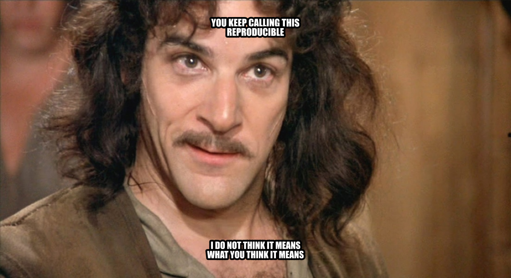

# 32  Collaboration Mechanics

> **TIP:**
>
> **Prerequisites (read first if unfamiliar):** [sec-git-github](#sec-git-github).
>
> **See also:** [sec-project-management](#sec-project-management), [sec-documentation](#sec-documentation), [sec-asking-questions](#sec-asking-questions).

## Purpose



It’s the Thursday before your group project is due. The dashboard says 212 survey responses, and someone is sure the survey had more. The team decided something about test responses, but that was in the group chat three weeks ago, buried under memes. Two of you fixed the same bug on different branches. And the one teammate who knows how to run the cleaning script is at a job interview until tonight.

Nobody here was lazy. This is what happens by default when several people work on the same files: what changed, and why, lives in people’s heads and private messages, where nobody else can find it. Teams that work well aren’t made of smarter people. They have a few repeatable habits that put the work where everyone can see it, in small pieces that are easy to check.

This chapter is about those habits: documentation that lets someone else run your work, issues that track what needs doing, pull requests a reviewer can actually review, comments that help instead of sting, and the small rituals that keep a team in step. It doesn’t teach Git itself (branches, commits, and opening a pull request are in [sec-git-github](#sec-git-github)), and it only touches on a project’s folders and README, which [sec-project-management](#sec-project-management) covers.

## Why read this chapter

- An important decision about your group project lives in someone’s DMs, and now nobody remembers why the team dropped that column.
- Your pull request has sat unreviewed for two weeks, and it might be because it touches 40 files.
- A reviewer left twelve comments, and you can’t tell which ones you must fix before merging and which are just opinions.
- You have to review a classmate’s code and don’t know what to look for, or how to say “this is wrong” without starting a fight.
- The only teammate who could run the pipeline got sick the week of the deadline.
- Every time someone reruns a notebook, the diff is 2,000 lines long and nobody can see what changed.
- “Let’s divide up the work” turned into four people each assuming someone else was writing the conclusion.
- You’d like to contribute to an open-source project and wonder what its maintainers expect from you.

## Running theme: make work visible, small, and easy to review

If your teammates can see what changed, why, and how to check it without asking you, the work survives any one person’s bad week.

## 32.1 Where team work happens

The first time you join a project on GitHub, it can feel like there are too many places to look: the code, the issues, the pull requests and their comments, maybe a project board, and the group chat on top. Which one is the real one? Each has its own job, and most collaboration trouble starts when a team uses one for another’s job: decisions made in chat, tasks tracked in someone’s memory, changes that skip review.

| Surface | What it’s for |
|----|----|
| Repository | The code, notebooks, and docs: what the project actually *is* |
| Issues | Tasks, bugs, questions, and decisions that need tracking over time |
| Pull requests | Proposed changes, reviewed and discussed before they land |
| Review comments | The back-and-forth on specific lines that shaped the final version |
| Project board or milestones | Status at a glance: in progress, blocked, done |
| Chat and meetings | Quick coordination and unblocking, but *not* the record |

That last row is the one teams get wrong most often. Why does writing things down matter so much for a team of four? Because the number of conversations grows faster than the team: four people make six pairs who need to stay in sync, five make ten, and six make fifteen. That growth is one reason for [Brooks’s law](https://en.wikipedia.org/wiki/Brooks%27s_law), from Fred Brooks’s 1975 book *The Mythical Man-Month*: adding people to a late software project makes it later. Shared, written artifacts spare a team most of those conversations.

The surfaces fit together in one short, repeatable loop: **plan in an issue, work on a branch, open a pull request, review and comment, revise, merge, record the outcome, and repeat.** Nearly every healthy project runs some version of it, and the rituals in this chapter exist to make it reliable.

Three roles show up in almost every collaboration. The **author** proposes a change, gives the reviewer the context they need, and responds to feedback. The **reviewer** protects quality, asks questions, and helps less experienced authors learn. The **maintainer** (or lead) sets policies, such as who can approve a merge, breaks ties, and makes sure work gets finished. On a student project, you might play all three in one week.

## 32.2 Documentation as collaboration infrastructure

It’s tempting to treat documentation as a polish pass you do at the end, if there’s time. That gets it backwards. Documentation is what lets other people (and you, three months from now) use the work at all; without it, even a perfect project is a black box only its author can run. Software people call knowledge that lives only in someone’s head [tribal knowledge](https://en.wikipedia.org/wiki/Tribal_knowledge), and the number of teammates who’d have to vanish before a project stalls its [bus factor](https://en.wikipedia.org/wiki/Bus_factor). A student project with a bus factor of one is one bad week away from missing its deadline.

Good documentation does four jobs. It **onboards** a new collaborator, from `git clone` to “I ran the analysis and got the expected output” in under an hour, not an afternoon of messages to the author. It makes the work **reproducible**: how to recreate your environment, data, and results. It keeps a **decision trace**: why you chose one library over another, why a column was dropped, why the analysis stops at a certain date, none of which the code shows. And it covers **operations**: how to build, run, and test the project without guessing.

### A minimum set of files

A useful student project ships with a handful of standard files, each with one job. Most need the first and last; the others earn their place as a team grows.

- **`README.md`** is the front door: what the project is, how to install it, how to run it, and what outputs to expect. If you write only one file, write this one; [sec-project-management](#sec-project-management) has a skeleton.
- **`CONTRIBUTING.md`** tells collaborators how to work with you: branch names, pull requests, style rules, review, and where to ask questions. GitHub [links to it](https://docs.github.com/en/communities/setting-up-your-project-for-healthy-contributions/setting-guidelines-for-repository-contributors) when someone opens an issue or pull request.
- **`CODE_OF_CONDUCT.md`** matters once a project has outside contributors: it sets expectations for respectful collaboration and says how to raise a problem. Many projects [adopt an existing one](https://docs.github.com/en/communities/setting-up-your-project-for-healthy-contributions/adding-a-code-of-conduct-to-your-project), such as the [Contributor Covenant](https://www.contributor-covenant.org/).
- **`DECISIONS.md`**, or a folder of [architecture decision records](https://adr.github.io/), captures consequential choices (“we switched from mean to median imputation because…”) so the reasoning outlives the conversation.
- **A [data dictionary](https://en.wikipedia.org/wiki/Data_dictionary) or codebook** documents every column: its meaning, units, source, and transformations. For a data project, it’s the most useful document after the README.

### Write for a smart stranger

Picture your reader as a competent peer who has never seen your project. They know Python and Git; they don’t know your file paths, your course, or the lab server’s name. That picture alone stops you from writing “activate the environment” and pushes you toward “run `conda activate sales-report`.”

Put the most common task first. Someone opening your README wants to know how to run the thing, not the project’s history. Start with a one-paragraph description, then a “Quick start” block that goes from `git clone` to a finished run in a few commands, then the reference material. Make every command copy-paste runnable, with no hand-waving, and show the output a reader should expect so they can tell they’re on track. [sec-documentation](#sec-documentation) goes deeper.

### Keep it from going stale

Here’s the frustrating part: documentation drifts out of date almost immediately. Errors force you to change the code; nothing forces you to change the docs, so after a few weeks the README is quietly lying. Stale documentation is worse than none, because a reader trusts it.

The fix that works is to treat docs as part of the change. If a pull request changes how the project runs, the same pull request updates the README; if it adds a column, it updates the data dictionary. Put “docs updated” on your pull request checklist, and as a reviewer, treat missing doc updates as a blocker. When you find a gap you can’t fix now, **file an issue**: a tracked issue is a promise to come back, and a gap in your head is not. And once per milestone, clone the repository into a fresh folder, follow the README step by step, and file an issue for every place it’s wrong or unclear. An hour of that a month keeps the docs honest.

## 32.3 Issues: plan work where everyone can see it

Chat is great for “what’s the path to the data?” and terrible for tracking work. Messages scroll away, and decisions made in DMs are invisible to anyone who wasn’t there. Two weeks later nobody remembers why a column was dropped or which model the team chose.

[Issues](https://docs.github.com/en/issues/tracking-your-work-with-issues/about-issues) fix that because they’re **persistent, searchable, and linkable.** Every decision gets a stable URL you can point to, and every question gets a title you can search for six months later. When a teammate asks “didn’t we talk about this?”, you point them to issue \#42 and its whole history: the problem, the options, and why the team chose the one it did. Issues can also be assigned, labeled, and grouped into milestones or boards, which makes them the backbone of lightweight planning: what are we working on this week, and who owns it?

So make it a team rule: any decision that affects the whole project moves into an issue, a pull request comment, or `DECISIONS.md` before the conversation counts as closed. The phrase to practice is “Let me capture this in issue \#X so we don’t lose it.”

### What a good issue contains

A useful issue has five ingredients. The **title** reads as a verb plus an object, “Fix date parser off-by-one on leap years” rather than “date bug”, so someone skimming the list knows what it’s about without clicking. The **context** says why it matters, what goes wrong, and any background a future reader will need. The **definition of done** gives the criteria that let someone close the issue with confidence. The **evidence** is something a reviewer can reproduce: the failing test, the error message, a screenshot, the row of data that triggers the bug. And **labels** mark its type (`bug`, `task`, `question`), its priority if your team uses one, and its area (`data`, `code`, `docs`), so issues can be filtered; GitHub’s docs explain [managing labels](https://docs.github.com/en/issues/using-labels-and-milestones-to-track-work/managing-labels).

``` markdown
**Title:** Fix date parser off-by-one on leap years

## Context
`src/parsers.py:parse_date()` returns 2024-03-01 for the input
"2024-02-29", but the expected result is 2024-02-29. This breaks
row 1423 in the cleaned sales dataset and propagates into the
weekly rollup in notebook `03-aggregate.ipynb`.

## Definition of done
- `parse_date("2024-02-29")` returns the date `2024-02-29`.
- A regression test in `tests/test_parsers.py` covers the
  leap-year case.
- `03-aggregate.ipynb` re-runs cleanly with the fix applied.

## Evidence
From `pytest -k leap` (trimmed):

    E        +  where datetime.datetime(2024, 3, 1, 0, 0) = parse_date('2024-02-29')
    FAILED tests/test_parsers.py::test_leap_year - AssertionError: assert datetim...

**Labels:** `bug`, `priority: high`, `area: data`
```

That shape works for bugs, features, and tasks alike, and any teammate can pick up the issue without asking you anything first. If your team keeps forgetting a part, [issue templates](https://docs.github.com/en/communities/using-templates-to-encourage-useful-issues-and-pull-requests/configuring-issue-templates-for-your-repository) can pre-fill it.

### Break big work into reviewable pieces

Big tasks don’t fit in small pull requests, and small pull requests are what review works on. The skill is turning a multi-day goal into half-day issues that each produce something reviewable. Three ways of splitting cover most cases.

**Split by artifact.** A data project breaks naturally along its pipeline: ingestion, cleaning, analysis, visualization, write-up. Each stage gets its own issue, branch, and pull request. This is the default, and usually the clearest split.

**Split by risk.** Do the uncertain part first. If the whole plan depends on whether a library supports some feature, make finding out its own small early issue (agile teams call this a [spike](https://en.wikipedia.org/wiki/Spike_(software_development))), so you know the answer before you commit to the larger plan.

**Split by reviewability.** Sometimes a stage is still too big to review. Then split it mechanically: “add the function signature and a stub test,” then “implement the function body,” then “wire it into the pipeline.” Each fits in a small pull request, even when the task behind them is large.

## 32.4 What code review is for

If you’ve never reviewed anyone’s code, the request can feel strange: who are you to judge? And as the author, having someone comb through your work line by line can feel like being graded. Both feelings are normal, and both fade once you see what [code review](https://en.wikipedia.org/wiki/Code_review) is for.

It does four jobs at once. It improves **correctness and readability**: catching the bug, the unclear name, the function doing too much. It **catches edge cases**, because fresh eyes see the empty list, the missing key, and the off-by-one. It **spreads knowledge**: the reviewer learns what the author built, and the author learns what the reviewer cares about. And it **keeps changes consistent** with the project’s conventions as more people touch the code. A less experienced reviewer still helps: you don’t need to be an expert to notice that you can’t follow something.

It helps just as much to know what review is *not*. It isn’t a **personal critique**: comments are about the code, not the author. It isn’t a **substitute for running the code**: “two reviewers approved” doesn’t mean “it works.” And it isn’t the place to **redesign the whole system**: if the approach is fundamentally wrong, that conversation belongs in an issue before the code is written. (Nor is review the only way to get a second pair of eyes: in [pair programming](https://en.wikipedia.org/wiki/Pair_programming), two people write the code together and review it as they go.)

### What to look for

When you sit down to review, walk through six questions, roughly in this order:

- **Correctness and clarity:** does the code do what the description says, and is the intent obvious?
- **Verification:** how does the author know it works? Is there a “how to test” section with commands you can run?
- **Reproducibility:** could someone else clone the repository and run the change from start to finish?
- **Documentation:** do the README, docstrings, and comments match the new behavior?
- **Data impacts:** if the change touches data (a new schema, renamed columns, new paths, new assumptions), is that written down?
- **Security and privacy:** any secrets committed by accident, new ways for sensitive data to leak, or commands that need elevated privileges?

Most pull requests need only one or two of these in earnest, but running down the list keeps you from missing the problem that’s easy to spot once you remember to look. Google’s guide to [what to look for in a code review](https://google.github.io/eng-practices/review/reviewer/looking-for.html) is a longer version.

## 32.5 Making your changes easy to review

### One purpose per pull request

The biggest thing that decides how fast your pull request gets merged is how small it is. Reviewers have a limited supply of attention, and a pull request that touches 40 files across three unrelated changes blows through it: the reviewer skims and rubber-stamps, or puts it off until it goes stale. One that touches five files for one clear purpose gets read carefully and merged within a day. Google’s guide makes the same case for [small changes](https://google.github.io/eng-practices/review/developer/small-cls.html): they’re reviewed faster and more thoroughly, and they’re less likely to introduce bugs.

“Small” means **one purpose per pull request**. A bug fix, an unrelated cleanup, and a new feature are three pull requests, not one. Above all, don’t mix a [refactor](https://en.wikipedia.org/wiki/Code_refactoring) (reorganizing code without changing what it does) with new behavior: the reviewer can’t tell which lines just move things around and which change the results, and a bug the refactor introduced hides in the feature’s diff. Deleting dead code or debugging output gets its own small commit or pull request too.

Each purpose gets its own branch, started from `main` ([sec-git-github](#sec-git-github) covers branches and opening pull requests):

``` bash
# Instead of one branch with everything:
#   fix date parser, rename helper functions,
#   add leap-year tests, delete old debug prints
# start three branches, each from main:
git switch -c fix-date-parser main     # bug fix + its regression test
git switch -c rename-parsers main      # pure refactor
git switch -c cleanup-debug main       # delete dead code
```

The `main` at the end of each line matters. Without it, `git switch -c` starts the new branch from whichever branch you’re on, so the second branch would quietly include the first one’s work.

Already opened the giant pull request? Close it and reopen it as several smaller ones. It feels like going backward, but it’s usually the fastest way to get anything merged.

### A description that guides the reviewer

Think of the description as a guided tour, in five parts: a **summary** of what changed; the **motivation**, or a link to the issue that explains it; **how to test**, the exact commands a reviewer can run; **screenshots** for anything visible; and **links** to related issues or discussion. GitHub’s page on [helping others review your changes](https://docs.github.com/en/pull-requests/collaborating-with-pull-requests/getting-started/helping-others-review-your-changes) has more.

``` markdown
## Summary
Fix `parse_date()` to correctly handle Feb 29 on leap years.

## Motivation
Row 1423 of the cleaned sales dataset was being shifted to March 1
because the parser rolled the date forward on leap days. This broke
the weekly rollup notebook. See #42 for the original report.

## How to test
    pytest tests/test_parsers.py -k leap
    jupyter execute notebooks/03-aggregate.ipynb

Both should pass. The notebook's week-9 row should show 387 entries
(was 386 before the fix).

## Related
Closes #42.
```

The “How to test” block is the most valuable part: the reviewer pastes the commands, sees the result you saw, and knows the summary is true. The last line matters too. “Closes \#42” (or “Fixes” or “Resolves”) [links the pull request to the issue](https://docs.github.com/en/issues/tracking-your-work-with-issues/using-issues/linking-a-pull-request-to-an-issue), and GitHub closes the issue automatically when the pull request merges into the default branch. A [pull request template](https://docs.github.com/en/communities/using-templates-to-encourage-useful-issues-and-pull-requests/creating-a-pull-request-template-for-your-repository) fills in these headings for you.

### Review your own work first

Before you ask anyone else to look, spend five minutes reviewing yourself. **Reread your diff on the pull request page,** not just in your editor: seeing it as the reviewer will often surfaces a stray debugging `print` or an accidental change to an unrelated file. **Run a [smoke test](https://en.wikipedia.org/wiki/Smoke_testing_(software)):** run the code, the relevant tests, and the notebook. If you can’t show the change works, the reviewer certainly can’t. **Check that the docs are updated** in the same pull request. And **look for things that shouldn’t be there:** secrets, API keys, large data files, a committed `.venv/` folder. A thirty-second look at `git status` and the pull request’s file list catches nearly all of them.

## 32.6 Reviewing, commenting, and responding

### Say what kind of comment it is

Here’s a situation that frustrates almost every new author: a reviewer leaves twelve comments and doesn’t say which ones matter. Must you fix all twelve, or are some just the reviewer’s taste? A one-word prefix on each comment solves it.

**Blocker** marks something that must be fixed before the merge: a correctness bug, a security problem, broken reproducibility, a crash. **Suggestion** proposes a better way but doesn’t block; the author can take it or leave it. **Question** asks the author to explain the intent before the reviewer can finish (“Is this function supposed to handle missing values?”), and the answer often settles the thread with no code change at all. **Nit** (short for *nitpick*) flags a small style or naming point the reviewer would never hold a merge over; the author is free to ignore it.

With those prefixes, an author can scan fifteen comments, see two blockers, four suggestions, three questions, and six nits, and plan accordingly. Google’s guide to [writing review comments](https://google.github.io/eng-practices/review/reviewer/comments.html) recommends labeling severity too, because without labels “authors may interpret all comments as mandatory.”

### Write comments someone can act on

A good comment points at a specific line, explains *why*, and suggests a direction. “This is wrong” is useless, because the author can’t act on it. Compare: “This raises `KeyError: 'id'` if the CSV starts with a [byte order mark](https://en.wikipedia.org/wiki/Byte_order_mark), because `csv.DictReader` names the first column `'\ufeffid'`. Could you open the file with `encoding='utf-8-sig'`?” That one names the problem, its consequence, and a fix.

Tie each comment to what you’re protecting: correctness, clarity, consistency, reproducibility, security. When the author can see the goal, even a disagreement stays productive, because you’re arguing about the goal rather than about taste. When the intent is unclear, ask rather than prescribe. “What is this branch of the `if` supposed to do?” helps far more than “this is confusing,” because it gives the author something concrete to explain or rewrite ([sec-asking-questions](#sec-asking-questions) has more on framing a good technical question).

``` markdown
**Blocker**: `src/parsers.py` line 47 — this `dropna()` removes any row
with a null in any column, but the upstream data has known nulls in
`notes`. You almost certainly want `dropna(subset=["customer_id"])`
instead, which is what the data dictionary says the key column is.

**Suggestion**: the helper `_coerce_date` at line 31 duplicates the
try/except pattern in `_coerce_time` five lines below. Consider
factoring out a tiny `_safe_parse(parser, value)` helper — non-
blocking, just a cleanup opportunity.

**Question**: at line 62 you fall through to the empty-DataFrame
branch silently. Is that intentional, or should the caller get an
error when `df` is empty?

**Nit**: `fname` → `filename` in the signature would read nicer.
Non-blocking.
```

On GitHub you attach a comment to a line by clicking beside it in the pull request’s *Files changed* tab, and you can send all your comments at once as a single review ([reviewing proposed changes](https://docs.github.com/en/pull-requests/collaborating-with-pull-requests/reviewing-changes-in-pull-requests/reviewing-proposed-changes-in-a-pull-request)). When you know the exact fix, a *suggested change* carries the replacement text, and the author can accept it with one click ([incorporating feedback](https://docs.github.com/en/pull-requests/collaborating-with-pull-requests/reviewing-changes-in-pull-requests/incorporating-feedback-in-your-pull-request); [sec-git-github](#sec-git-github) shows one).

### Tone: critique the code, not the person

Review is emotionally loaded even when nobody means it to be, because criticism of your code feels like criticism of you. Defuse it on purpose. **Assume good intent:** the author had a reason, even if you can’t see it yet, so ask before you conclude. **Talk about the code, not the author:** “this function could be simpler,” not “you overcomplicated this.” The difference looks tiny on the page and feels enormous to the person reading it. **Skip the sarcasm:** a joke that sounds friendly out loud reads as a sneer in writing. And **say what’s good:** “nice refactor here” costs nothing and makes the next review feel like teamwork rather than a trial.

### Keep threads tidy, and close every loop

Put **one concern per thread**, so each can be resolved on its own, and **resolve a thread once it’s addressed**, so the count of unresolved conversations means something (the pull request’s author or anyone with write access can [resolve a conversation](https://docs.github.com/en/pull-requests/collaborating-with-pull-requests/reviewing-changes-in-pull-requests/commenting-on-a-pull-request)). When a thread produces a real decision (“we’ll keep the old behavior for backward compatibility”), **summarize it in the pull request description or `DECISIONS.md`**, because threads on closed pull requests are hard to find.

As the author, close each loop out loud. **Reply to every thread:** “Fixed in commit abc123,” “Kept as is because…,” or just “Good catch, thanks.” Silence leaves the reviewer wondering whether you saw the comment. If you **disagree**, say so, give your reason, and offer an alternative: “I’d rather not rename this, since it matches the upstream API. Would a comment explaining the mapping help?” Disagreement is fine; quietly ignoring a comment is not. And **resist drive-by changes:** fix an unrelated bug you spot during review in a second pull request, or the reviewer can’t tell whether you addressed their comment or added something new.

[Figure fig-github-pr-review-comment](#fig-github-pr-review-comment) shows a whole loop on one small thread: a line comment with a suggested change, a reply that says where the fix went, and the thread resolved. Notice one thing it doesn’t do: the comment carries none of the labels above. The *Suggested change* box hints at what kind of comment this is, but a “**Suggestion**:” prefix would have said so outright.


Figure 32.1: A resolved review thread on a pull request in this book’s own repository, signed out, in September 2026. The reviewer’s comment proposes a change in GitHub’s *Suggested change* box; the author’s reply says where the fix went, because the pull request had already merged; and *Hide resolved* in the header means the thread has been marked resolved and is shown expanded. Claude Code wrote both sides from the maintainer’s account; names and avatars are blurred.

### When review turns into ping-pong

Sometimes a pull request bounces back and forth for a week, and now there are 40 threads and no momentum. Usually nothing was labeled, so every comment felt mandatory and the author is worn out. Labels often turn it into “five blockers to fix; everything else is optional,” and it moves again.

When one disagreement has gone three rounds, stop trading comments and propose a decision: “Let’s go with option A because of X; can we merge and revisit if it causes problems?” Put a time limit on the debate. A tie-breaker from the lead or the instructor beats a pull request that rots for a week. Google’s guide has a page on [handling pushback](https://google.github.io/eng-practices/review/reviewer/pushback.html) from the reviewer’s side.

## 32.7 Ownership, “done,” and handoffs

### Who owns this?

When nobody is assigned to an issue, everyone assumes someone else has it. You’ve probably seen it: an issue labeled “urgent” that sits open for three weeks because it was never clear whose job it was.

The fix is simple and slightly uncomfortable: [assign](https://docs.github.com/en/issues/tracking-your-work-with-issues/using-issues/assigning-issues-and-pull-requests-to-other-github-users) every non-trivial issue to exactly one person. A milestone or feature gets a named **driver**, whose job is to notice when the work is stuck and do something about it. Others can write code for it; the driver keeps it moving.

Larger projects write some of this into settings. A [CODEOWNERS](https://docs.github.com/en/repositories/managing-your-repositorys-settings-and-features/customizing-your-repository/about-code-owners) file names who owns which files, and GitHub requests their review whenever a pull request touches them. [Protected branches](https://docs.github.com/en/repositories/configuring-branches-and-merges-in-your-repository/managing-protected-branches/about-protected-branches) let a maintainer require approvals, or passing checks, before anything merges into `main`.

### A shared definition of done

“Done” isn’t a moment; it’s a checklist. Without a shared one, a pull request merges and only later does someone notice that the docs weren’t updated and a test was skipped. Agree on the list as a team, and apply it to every pull request:

- **Review approvals obtained:** at least one reviewer (or however many your project requires) has actually approved, not just said “looks good.”
- **Tests and smoke checks pass:** automated checks are green; if your project has none, the author has run the tests and the smoke test by hand and says so.
- **Documentation updated:** the README, docstrings, data dictionary, and anything else affected describe the new behavior.
- **Issue linked and closed:** the pull request says `Closes #42`, so merging it closes the issue, and the issue records what changed.

Post the list where everyone sees it (`CONTRIBUTING.md`, a pinned issue, or the pull request template), and treat a pull request that skips an item as unfinished.

### Handoff notes

Long-running work eventually changes hands: the semester ends, someone goes on vacation, the person who owned cleaning moves on to analysis. Without a note, the next person rebuilds the picture from commit messages and guesswork. A handoff note is short and structured: what’s done, what’s in progress, what’s blocked, and the next one or two steps. Leave it in the relevant issue or as a pinned comment on the pull request.

``` markdown
**Handoff — 2025-04-10, Alice → Bob**

## Status
Cleaning pipeline is running on the 2019–2023 slice of the sales
data. Output looks correct on a spot-check of 50 rows.

## In progress
Adding the leap-year regression test — started in PR #87 but not
finished. The test harness needs a fixture for Feb 29 rows.

## Blocked
Waiting on the data dictionary update from the data team (issue #91)
before I can pin the `date` column's expected format.

## Next steps
1. Finish PR #87 (test harness fixture).
2. Re-run `make clean-data` after #91 lands.
3. Start on the 2024 slice.
```

Two minutes on a note at the end of a work session saves the next person an hour of archaeology. It also raises your project’s bus factor, which is the whole point.

## 32.8 Collaborating on notebooks and data

### Notebooks and noisy diffs

If you’ve changed one line of a notebook and seen a diff thousands of lines long, you’ve met the problem. A [Jupyter](https://jupyter.org/) notebook is a JSON file with its outputs (images, tables, printed values) stored inside, so rerunning a cell changes the file even when the code didn’t, and “I changed one function” shows up as a wall of churn nobody can review.

Three habits keep notebooks friendly to collaborators. **Keep outputs small:** a cell that prints thousands of rows puts all of them in the committed file. **Clear outputs before you commit,** either by hand (in JupyterLab, *Kernel \> Restart Kernel and Clear Outputs of All Cells*) or automatically with [nbstripout](https://pypi.org/project/nbstripout/) set up as a pre-commit hook (see [sec-automation](#sec-automation)). And **let the notebook tell the story while reusable code lives in `src/`,** in Python modules the notebook imports; code review then happens on `.py` files that diff cleanly. [sec-git-github](#sec-git-github) and [sec-jupyter](#sec-jupyter) have more.

### Data and model files

Large raw datasets don’t belong in Git ([sec-git-github](#sec-git-github) explains why). **Don’t commit them unless your course or a policy requires it,** and document how to get the data so a collaborator ends up with the same copy. A short `scripts/download_data.py` or a `make data` target beats a committed 500 MB CSV every time.

Trained models, embeddings, and cached features follow the same rule. If the code can rebuild a file, version the code and keep the file in a folder listed in `.gitignore`, such as `models/` or `data/processed/`. If it’s expensive to rebuild (hours of training, or API costs), store it in cloud storage and document how to fetch it. And **trace every figure, table, and number in a report** back to the code and data that produced it.

### Reproducibility as the team’s contract

The test of a collaborative project is simple: **a teammate can clone the repository, set up the environment, run the pipeline, and get the same outputs you got, without asking you anything.** If that isn’t true, the project isn’t really shared; it’s a private workspace with a shared URL. (That’s this chapter’s meme: calling a project [reproducible](https://en.wikipedia.org/wiki/Reproducibility) doesn’t make it so until someone else has reproduced it.)

Build that check into your pull requests. Every pull request that changes how the project runs lists the exact commands under “How to reproduce,” and the reviewer runs them and confirms the output matches, or says where it didn’t. That small contract catches most “works on my machine” bugs before they land.

``` markdown
## How to reproduce
    git clone https://github.com/your-team/sales-report.git
    cd sales-report
    make env
    conda activate sales-report
    make clean-data
    jupyter execute notebooks/03-aggregate.ipynb

Expected: notebook runs to completion with no errors, week-9
row in the summary table shows 387 entries.
```

## 32.9 Team rhythms that don’t eat your week

### Weekly planning

Twenty minutes of planning on Monday, no more, keeps a student project from drifting. Its job is triage: look at the open issues, decide what matters this week, give each an owner, and spot anything blocked on someone outside the team. It isn’t a status report (status lives in issues and pull requests) or a design discussion (that goes better in an issue thread, with more context and less time pressure).

One format that works: walk the board (GitHub [Projects](https://docs.github.com/en/issues/planning-and-tracking-with-projects/learning-about-projects/about-projects) or [milestones](https://docs.github.com/en/issues/using-labels-and-milestones-to-track-work/about-milestones) both work) from “in progress” to “ready” to “backlog,” and ask three questions of each issue: *Is this still the right thing? Who owns it this week? Is it blocked?* End by posting a one-paragraph summary in the project’s pinned issue or chat. That summary becomes the team’s memory of the week.

### Short written updates

Software teams often hold a daily [stand-up meeting](https://en.wikipedia.org/wiki/Stand-up_meeting). For a small student team that’s overkill; a three-line written update does most of the job at a fraction of the cost. Once a day, each person posts what they did, what they’ll do next, and what’s blocking them. The “blocked” line matters most, because it’s how everyone else knows to help.

``` markdown
**Alice — 2025-04-10**
- Yesterday: finished the leap-year fix in PR #87, opened for review.
- Today: starting the 2024 data slice; reading through #91.
- Blocked: waiting on schema sign-off in #91 before I can pin dates.
```

When an update affects someone else’s work, post it in the relevant issue or pull request, so it stays attached to the work it describes instead of scrolling away in chat.

### Retrospectives

At the end of a project, a milestone, or a semester, a short [retrospective](https://en.wikipedia.org/wiki/Retrospective#Software_development) turns pain into improvement. Ask three questions: *What went well? What was painful? What should we change next time?* Keep it to thirty minutes, let everyone speak, and don’t let it turn into blame: the point is the pattern, not the person.

What makes one worth the time is that **every pain point becomes an issue or a documentation change.** “The environment kept breaking” becomes an issue to pin dependencies; “I never knew what was in progress” becomes a commitment to weekly planning. A retrospective with no follow-ups is a gripe session; one that ends with three issues filed is how a team gets better.

## 32.10 Stakes and politics

In 2017, Josh Terrell and colleagues published a [large study of pull requests on GitHub](https://doi.org/10.7717/peerj-cs.111) that compared how often contributions from women and from men were accepted. Overall, women’s pull requests were accepted more often than men’s. But among outsiders to a project whose gender a reviewer could identify, men’s were accepted more often.

Review is where one person decides whether another’s work is good enough, so it carries more weight than its mechanics suggest. Review style is cultural: a comment one reviewer thinks of as direct (“this is wrong”; “why would you do it that way?”) reads as hostile to another, especially across gaps in seniority, age, and English fluency, and written text strips out the tone a face-to-face conversation would carry. That’s why teams that care about [psychological safety](https://en.wikipedia.org/wiki/Psychological_safety) make intent explicit with conventions like the comment labels in this chapter. And who can approve a merge is power. The code owner who must sign off, the senior engineer whose word ends a thread, the maintainer who can approve a pull request into `main`: these are real authority relationships in the form of repository settings. Join an open-source project and you enter someone else’s review hierarchy; set up your own, and you decide whose voices count.

See [sec-artifacts-politics](#sec-artifacts-politics) for the broader framework. The concrete prompt to carry forward: when you write a review comment, ask how it will read to someone with less context, less status, or less English fluency than you have today.

## 32.11 Worked examples

These follow a three-person team cleaning and analyzing a course survey, the same project as the worked examples in [sec-git-github](#sec-git-github).

### Turn a chat question into a good issue

On Monday, the team’s group chat gets this:

> hey the response counts look off?? like the dashboard says 212 but qualtrics said more. can someone look

It’s a real problem, but in this form nobody can act on it: which counts, how far off, off since when? And by Thursday it will have scrolled out of sight. Whoever reads it first turns it into an issue, using the shape from “What a good issue contains” above:

``` markdown
**Title:** Reconcile cleaned response count (212) with the survey export (231)

## Context
The dashboard reports 212 responses. The raw Qualtrics export in
data/raw/ has 231 rows. clean.py drops some rows on purpose (staff
test responses, blank submissions), but we have never checked that
those two steps account for all 19.

## Definition of done
- Each of the 19 dropped rows is explained by a documented rule.
- clean.py logs how many rows each rule drops.
- If any drop is a bug, it is fixed and the dashboard is rerun.

## Evidence
    $ python -c "import pandas as pd; print(len(pd.read_csv('data/raw/survey.csv')))"
    231

**Labels:** `bug`, `area: data`
```

Then reply in the chat with a link to the issue, so the conversation moves there. The rewrite took five minutes, and it did most of the investigation’s thinking: the question is now “which rule drops which rows,” and anyone on the team can pick it up.

### Author a reviewable pull request

Working on that issue, you find the answer. Of the 19 missing rows, 11 are staff test accounts and 4 are blank submissions, both dropped on purpose; the other 4 are real responses with a blank email field, which the staff filter caught by mistake. Along the way you also added the per-rule logging, renamed some columns, and reformatted `clean.py`. The branch now touches 14 files. Before opening a pull request, split it: the reviewer’s job is to check that the fix is right, and every unrelated line makes that harder (see “One purpose per pull request” above).

1.  **The fix:** a pull request that changes the one filter and nothing else.
2.  **The logging:** a second, which finishes the issue’s definition of done.
3.  **The renames:** a third, later, on their own. And the reformatting needs no pull request at all if everyone runs the same formatter (see [sec-linting](#sec-linting)).

The first pull request’s description tells the reviewer what to check and how:

``` markdown
## Summary
Keep responses with a blank email; drop only staff test accounts.

## Motivation
The staff filter matched blank emails too, dropping 4 real
responses. Restores 4 of the 19 missing rows in #12.

## How to test
    python clean.py
data/processed/survey.csv should have 216 rows (it had 212).

## Related
Part of #12.
```

“Part of \#12,” not “Closes \#12”: the issue also asks for the logging, and it should stay open until that merges too. (A pull request whose description says “Closes \#12” closes the issue automatically when it merges.)

### Perform a constructive code review

You’re reviewing a teammate’s pull request that adds a satisfaction score. One line in it computes the score, and the first comment that comes to mind is:

> this is wrong, you can’t average likert items like that

It’s true and useless: it doesn’t say what is wrong, why it matters, or what to do, and its tone invites an argument rather than a fix. Rewritten with the labels from “Say what kind of comment it is” above, the review becomes four comments, each on its own line of the diff:

``` markdown
**Blocker**: line 31 averages the five satisfaction items, but
items 2 and 4 are reverse-coded (1 = very satisfied). As written,
a very satisfied respondent scores 3.4 instead of 5. Reverse items
2 and 4 (6 - value) before averaging; the codebook marks which ones.

**Question**: line 35 drops respondents who skipped any item.
Is that intended? It removes 23 people; averaging the items each
person answered would keep them.

**Suggestion**: the score could live in a function in src/ so the
dashboard and the notebook use the same definition. Non-blocking.

**Nit**: `sat_scr` → `satisfaction_score`. Non-blocking.
```

(Reverse-coded items are common in [Likert scales](https://en.wikipedia.org/wiki/Likert_scale): some questions are worded the other way round, so that a respondent who agrees with everything doesn’t push the score up.) End with something true and specific about what works (“the new tests for the score are exactly what this needed”), and approve once the blocker is fixed. The author now knows that one thing must change, one needs an answer, and two are optional.

### Close the loop after merge

When the last pull request for issue \#12 merges, three small things finish the job. **Update the documentation** the change affects: the README’s list of cleaning rules gains “responses with a blank email are kept.” **Close the issue with a summary,** so anyone who finds it later gets the answer without reading every pull request:

``` markdown
All 19 rows accounted for: 11 staff test accounts and 4 blank
submissions, dropped on purpose, and 4 real responses with a blank
email, dropped by mistake. Those 4 are restored (#14), and clean.py
now logs how many rows each rule drops (#15). Dashboard rerun:
216 responses.
```

**Open an issue for anything you found but didn’t fix,** such as “the Qualtrics export includes preview responses; should we filter those?”, and link it from the summary. [Figure fig-github-pr-review-comment](#fig-github-pr-review-comment) shows the same habit at the scale of one comment: the reply says where the fix went, and the thread is resolved.

## 32.12 Templates

### Template A: PR checklist

    ## PR Checklist

    * [ ] Linked issue(s)
    * [ ] Summary and motivation included
    * [ ] How to test included
    * [ ] Docs updated (README/notes)
    * [ ] No secrets or large accidental files
    * [ ] Smoke test run

### Template B: Review comment format

    Type: Blocker / Suggestion / Question / Nit
    What I see:
    Why it matters:
    Suggested change:

### Template C: Decision record (lightweight)

    Decision:
    Date:
    Context:
    Options considered:
    Chosen option:
    Rationale:
    Consequences:

### Template D: CONTRIBUTING basics

    * How to set up environment
    * Branch naming and PR policy
    * Review expectations
    * Style/testing expectations
    * Where to ask questions

## 32.13 Exercises

1.  Write a README for a small class project, then hand it to a classmate and watch (silently) while they try to run the project from it. Fix every place they got stuck.

2.  Turn three vague tasks from a group chat or a to-do list into well-scoped issues, each with a definition of done.

3.  Open a pull request with a clear description and a “How to test” section a reviewer can paste.

4.  Review a peer’s pull request using the four labels; request one change and ask one clarifying question.

5.  Close an issue with a summary of what changed, what remains, and how to reproduce the result.

## 32.14 One-page checklist

- Work is tracked in issues and pull requests, not only in chat.

- Documentation exists and changes in the same pull request as the code.

- Pull requests are small, have one purpose, and include “how to test.”

- Reviews are respectful, actionable, and labeled.

- Every issue has one owner; decisions are recorded and threads are resolved.

- After merge, issues are closed with a clear summary and links.

## 32.15 Quick reference: collaboration norms

- Prefer artifacts over memory.

- Prefer clarity over speed.

- Prefer small, reversible changes.

- Ask questions early; write decisions down.

> **NOTE:**
>
> - **GitHub Docs**, [Pull requests](https://docs.github.com/en/pull-requests) — the official guides to opening, reviewing, and merging pull requests, with a quickstart for each.
> - **Google**, [Engineering Practices: Code Review](https://google.github.io/eng-practices/review/) — Google’s public guide to what reviewers should look for and how fast they should respond; the closest thing to a textbook for code review.
> - **Conventional Comments**, [Conventional Comments](https://conventionalcomments.org/) — a lightweight convention for labeling review comments (`praise:`, `nitpick:`, `suggestion:`, and more) so their intent is obvious.
> - **Amy Edmondson**, [*The Fearless Organization*](https://fearlessorganization.com/) — the standard book on psychological safety; the research behind the “review style is cultural” point in “Stakes and politics” above.
> - **The Recurse Center**, [Social rules](https://www.recurse.com/social-rules) — short, explicit conversational norms (“no feigned surprise,” “no well-actually’s”) that improve the climate around technical collaboration.
> - **Camille Fournier**, [*The Manager’s Path*](https://www.oreilly.com/library/view/the-managers-path/9781491973882/) — a durable book on engineering management; especially good on how senior engineers build healthy review and mentorship cultures.
> - **David A. Wheeler**, [Why Open Source Software](https://dwheeler.com/oss_fs_why.html), and **Karl Fogel**, [*Producing Open Source Software*](https://producingoss.com/) — two free, durable references on open-source projects, including the relationship between maintainers and contributors.
