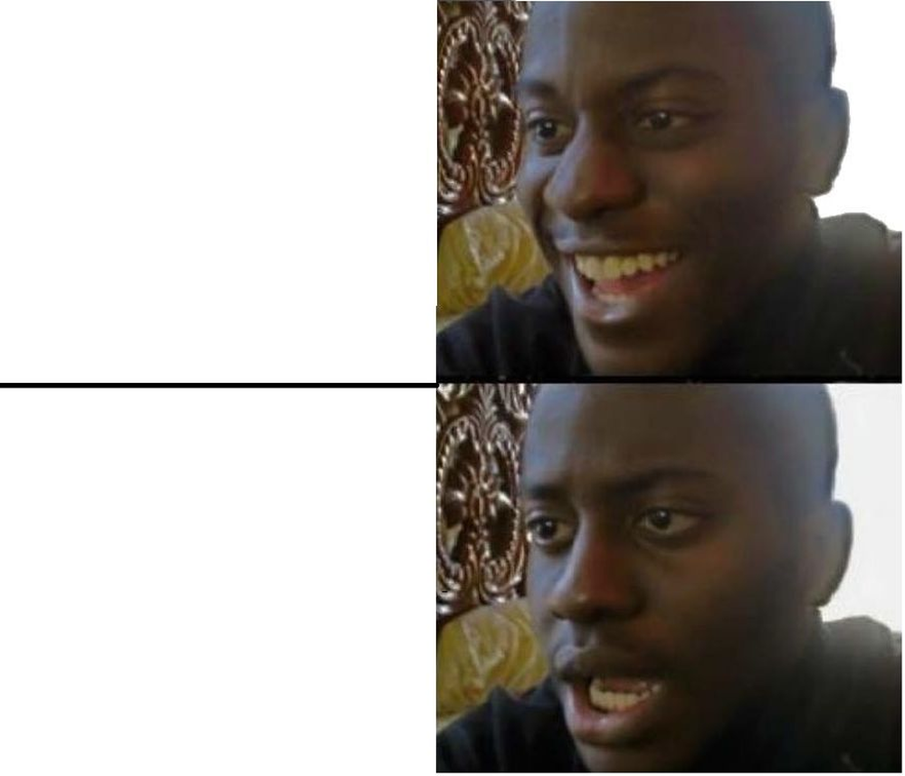

# 28  How to Present

> **TIP:**
>
> **Prerequisites (read first if unfamiliar):** [sec-writing-manuscripts](#sec-writing-manuscripts).
>
> **See also:** [sec-writing-thesis](#sec-writing-thesis), [sec-latex](#sec-latex), [sec-jupyter](#sec-jupyter), [sec-scripts-vs-notebooks](#sec-scripts-vs-notebooks).

## Purpose



It’s the night before your capstone presentation. Your team has a ten-minute slot and thirty-one slides, most of them paragraphs copied out of the final report. You run through it once, out loud, and it takes nineteen minutes. Tomorrow half the class will be watching over Zoom, and nobody on the team has tried sharing a screen yet.

If that sounds familiar, you’re in good company. Almost nobody is taught how to give a talk; you’re just told to give one. And a talk isn’t a paper read aloud: your audience can’t reread a confusing sentence, flip back to a figure, or slow you down. The habits that make a good paper (completeness, careful qualifications, every result included) make a slow, crowded talk. The fix isn’t charisma. It’s a handful of moves anyone can learn: decide what the audience should leave knowing, make slides that show evidence instead of paragraphs, rehearse against a clock, and have a plan for questions, nerves, and the technology.

This chapter covers those moves for the talks you’ll actually give: class presentations, capstone demos, poster sessions, lightning talks, a first conference talk, and perhaps later a thesis defense. It leans throughout on the best free resource on the subject, Patrick Winston’s lecture [*How to Speak*](https://ocw.mit.edu/courses/res-tll-005-how-to-speak-january-iap-2018/), which he gave at MIT every January for over forty years. Writing the paper behind a talk is [sec-writing-manuscripts](#sec-writing-manuscripts); the thesis itself is [sec-writing-thesis](#sec-writing-thesis). You don’t need to have given a talk before, only to be willing to practice out loud.

## Why read this chapter

- Your ten-minute presentation ran eighteen minutes in rehearsal, and you can’t tell which slides to cut.
- Your slides are your paper chopped into bullet points, and you can feel the audience reading ahead instead of listening to you.
- Your heart pounds and your voice wobbles for the first minute, and “just be confident” hasn’t helped.
- Someone asked a question you couldn’t answer, you froze, and you’d like a sentence ready for next time.
- You clicked **Share Screen** in Zoom and the class saw your group chat, or a blank window, or nothing at all.
- You have a poster session or capstone expo coming up and no idea what to do for two hours next to a board.
- Your instructor keeps saying “sentence headlines” and “accessible colors,” and you’d like to see what that means on an actual slide.

## Running theme: tell them what they’ll know at the end that they don’t know now, then deliver it

Patrick Winston’s advice was to open with an *empowerment promise*: tell people what they’ll know at the end that they didn’t know at the beginning. Make that promise in your first minute, spend the middle keeping it, and close by showing that you did.

## 28.1 Why a talk isn’t a paper read aloud

A reader controls the pace, rereads the hard paragraph, and keeps the figure beside the prose. A listener gets each sentence once, at your speed, next to whatever is on the screen right now. That’s why pasting your paper into slides produces the talks everyone dreads.

The first consequence is that you’ll present far less than you know. There’s no reliable formula for how many ideas an audience can absorb, but the answer is always “fewer than the speaker thought.” If your project has twelve findings and you have fifteen minutes, pick the two or three that carry the story, and leave the rest for questions or a backup slide. Cutting feels like hiding your work. It’s actually how any of it gets remembered.

The second is that you’ll say your main point more than once. Winston’s heuristic was to “cycle” on your idea, going around it three times, because at any moment, by his estimate, about 20% of the room has drifted off. He also recommended *verbal punctuation*, saying out loud where you are (“That’s the method; now the first result”), so people who drifted can get back on. It feels repetitive when you’re talking. From the audience it feels like being looked after.

The third is that a talk needs a story, not a table of contents: a question the audience cares about, what you did to answer it, what you found, and why it matters, with each part making the listener want the next.

## 28.2 Know which kind of talk you’re giving

The same talk doesn’t work in every room. Before you open a slide tool, find out the format, the time limit, and whether questions come out of your time. These are the kinds you’re most likely to meet.

**Class presentation.** Usually five to fifteen minutes, often as a group, with a rubric that tells you what the audience is listening for. In a group, decide who says what, rehearse the hand-offs (“Maya’s going to show you what we found”), and pass the clicker along with the floor so nobody has to keep saying “next slide, please.”

**Capstone demo.** Live demos fail in front of audiences with uncanny reliability: the Wi-Fi drops, an API key expires, the data takes a minute longer to load than at home. Record a video of the demo working the night before, and put screenshots of the key moments in your slides.

**Lightning talk.** A [lightning talk](https://en.wikipedia.org/wiki/Lightning_talk) lasts a few minutes, and some formats advance your slides for you: [PechaKucha](https://en.wikipedia.org/wiki/PechaKucha) is 20 slides at 20 seconds each, and [Ignite](https://en.wikipedia.org/wiki/Ignite_(event)) is 20 slides at 15 seconds each. One idea, one figure. A lightning talk is an advertisement: its job is to make someone want to find you afterward.

**Conference or symposium talk.** Usually 10 to 20 minutes plus a few minutes of questions, a format undergraduate research symposia often share. About one slide per minute is a healthy default, and the structure is a compressed paper that ends on what you contributed.

**Poster.** At a [poster session](https://en.wikipedia.org/wiki/Poster_session), the poster should make its argument without you and work better with you: big text, few words, one or two figures that carry the result. The event sets the size and orientation, so check before you design. Then prepare a thirty-second [elevator pitch](https://en.wikipedia.org/wiki/Elevator_pitch) for people walking past and a two-minute tour for people who stop. You’ll give them dozens of times, mostly to one person at a time, so stand beside the poster rather than in front of it.

**Lab meeting or works-in-progress talk.** Informal, and where the real critique happens. Say at the start what feedback you want (framing, method, or slide-level edits).

**Thesis defense or job talk.** A defense presents to a committee that has read your [thesis](https://en.wikipedia.org/wiki/Thesis); the talk summarizes, and the questions are the substance (see [sec-writing-thesis](#sec-writing-thesis)). A faculty job talk runs 45 to 60 minutes across several projects; in Winston’s account, the people hiring want to see within about five minutes that you have a vision and have done something toward it.

## 28.3 Know who’s in the room

Before you draft a slide, name your audience, because the same result needs a different explanation for each of these.

**Specialists** share your vocabulary, so you can move quickly through motivation and spend your time on what’s new (though they rarely share your exact sub-topic). **Technical generalists** (your data science class, a department colloquium) are comfortable with numbers and code but come from different corners: define jargon the first time, spend longer on why the question matters, and label every axis in plain words. **General audiences** (family, a public event, students from other majors at a capstone expo) need no jargon at all, an analogy, and one vivid example.

Explaining to outsiders is harder than it sounds because of the [curse of knowledge](https://en.wikipedia.org/wiki/Curse_of_knowledge): once you understand something, it’s hard to remember not understanding it. Try the talk on a friend outside your field; every place they frown is a step you skipped. In a mixed room of generalist classmates and a specialist instructor, pitch to the classmates: the instructor won’t mind a clear explanation, and the classmates will be lost without one.

## 28.4 Slides that help instead of compete

The core problem with most slides is simple: people can’t read and listen at the same time. Winston’s version is that we have only one language processor, so a slide full of sentences makes the audience choose between reading it and hearing you, and they usually read. Slides, he said, should be condiments to what you’re saying, not the main event.

**Cut everything that isn’t signal.** Every element on a slide either carries information or competes with it, like a [signal-to-noise ratio](https://en.wikipedia.org/wiki/Signal-to-noise_ratio). Clip art, busy templates, a footer with the talk’s title, and a logo on every slide are noise. [Edward Tufte](https://en.wikipedia.org/wiki/Edward_Tufte), who coined the word [chartjunk](https://en.wikipedia.org/wiki/Chartjunk) for decoration that gets in the way of data, wrote a short, sharp essay arguing that PowerPoint’s defaults push speakers toward bullet outlines at the expense of evidence.[^1]

**Make every headline a sentence.** Replace the topic title with the claim: not “Results” but “Civility rose 18% in the month after the policy change.” That’s the heart of the [assertion-evidence approach](https://www.craftscicom.org/ae_tutorial.html) developed by Michael Alley at Penn State: a sentence headline stating the slide’s message, supported by visual evidence (a chart, a diagram, a photo) instead of bullets. In [studies by Alley and colleagues](https://www.assertion-evidence.com/research-papers.html), audiences who saw assertion-evidence slides understood and remembered the material better than audiences who heard the same words over topic-and-bullets slides. It helps you, too: if you can’t write the sentence, you don’t yet know what the slide is for.

**Show figures, not paragraphs.** The strongest slides are one figure, a sentence headline, and a couple of labels on the chart itself; the weakest are five full-sentence bullets read aloud. Your paper’s figures usually need rework: bigger labels, fewer panels, and the line that matters in a strong color while the rest fade to gray.

**Make type bigger than feels natural.** Treat 24 points as the floor for anything the audience should read, axis labels included. Winston went further, agreeing with an audience suggestion of 40 to 50 points and warning that at 35 you’re probably starting to cram in words. His test for a deck that’s too heavy is to print it and lay the pages on a table, where walls of text are obvious at a glance.

**Choose colors that work for everyone.** Among people of Northern European descent, up to [1 in 12 men and 1 in 200 women](https://en.wikipedia.org/wiki/Color_blindness) have red-green color vision deficiency, so in a lecture hall of 100, a few people probably can’t tell your red line from your green one. ColorBrewer’s “colorblind safe” filter[^2] and the [viridis family](https://matplotlib.org/stable/users/explain/colors/colormaps.html) of colormaps are good defaults, and where color carries meaning, add a second cue (a label, a line style). Contrast matters as much as hue, since projectors wash colors out. The web accessibility standard asks for a [contrast ratio of at least 4.5:1](https://www.w3.org/WAI/WCAG22/Understanding/contrast-minimum.html) for normal text and 3:1 for large text; slide text is usually large, but aim for 4.5:1 anyway. [WebAIM’s contrast checker](https://webaim.org/resources/contrastchecker/) tells you in seconds whether that pale gray on white passes.

**Point with the slide, not a laser.** Winston called the laser pointer a crime, because using it turns your back to the audience. Put a numbered arrow on the slide instead and say “look at arrow one.” The same goes for animations: a build that adds the second line to a chart helps; a spinning logo doesn’t.

Two books go much deeper: Garr Reynolds, *Presentation Zen*,[^3] and Nancy Duarte, *slide:ology*.[^4] Both argue for high-image, low-text slides, with many examples (see Further reading).

## 28.5 Structuring a fifteen-minute talk

Fifteen minutes is the slot you’ll get most often, and it’s shorter than it sounds. Here’s a shape to start from; treat the minutes as a budget, not a script:

- *Minute 0–1: Empowerment promise.* What will the audience know at the end?
- *Minutes 1–3: Motivation.* Why this question matters, with one memorable example.
- *Minutes 3–4: Research question.* The question, stated cleanly.
- *Minutes 4–6: Method.* What you did, at a level the audience can follow.
- *Minutes 6–10: Results.* Two or three findings, one main figure each.
- *Minutes 10–12: Takeaway.* What it means, and its limits, briefly.
- *Minutes 12–13: Contributions.* End on what you did.

That’s thirteen minutes; the other two are slack, and you’ll need them. Every talk runs longer in the room than in rehearsal (you pause, you point, someone laughs).

Most student talks end on a “Thank you!” or “Questions?” slide that stays up through the whole question period. Winston called ending on “thank you” a weak move, because it suggests the audience stayed out of politeness. His alternative is a final slide titled *Contributions*, listing what you did, left up while people ask questions and file out. It’s the slide they’ll look at longest, so make it the one you most want remembered.

## 28.6 Rehearse out loud

Here’s the uncomfortable truth behind this chapter’s meme: a talk you’ve rehearsed only in your head hasn’t been rehearsed. Thinking through a slide takes ten seconds; saying it takes a minute.

**Say it out loud, standing, with your slides,** at least twice, and time every run. Aim to finish 10 to 20% under the limit, since the room will add time.

**Record yourself once and watch it.** It’s painful and more useful than anything else here: you’ll hear [filler words](https://en.wikipedia.org/wiki/Filler_(linguistics)) you didn’t know you used, and see yourself talking to the screen. PowerPoint’s [Speaker Coach](https://support.microsoft.com/en-us/office/rehearse-your-slide-show-with-speaker-coach-cd7fc941-5c3b-498c-a225-83ef3f64f07b) will even count your fillers and flag when you’re reading the slide.

**Give it to at least one human,** who will catch the undefined jargon and the unreadable chart. And **practice the transitions,** because talks break down between slides more often than on them. A clean transition is one sentence that sets up what’s next: “Now that you know how we measured civility, here’s what happened after the rule change.”

If you’re running long, cut whole slides rather than talking faster. And once your timing is steady and your transitions smooth, stop: more runs tend to make a talk stiffer. Memorize the first two sentences and the last one, and let the middle be spoken rather than recited.

## 28.7 Handling questions

The question period is the part students dread most, because you can’t script it. You can have a few moves ready.

**Repeat or rephrase the question.** It buys you a few seconds, makes sure everyone heard it, and lets the questioner say “no, what I meant was…” before you answer the wrong thing.

**“I don’t know” is a real answer.** Experienced audiences trust a clean “I don’t know” far more than a bluff they can see through. Make it useful: “I don’t know; we didn’t look at that. My guess would be X, and it’s a good idea for the next version.” Memorize that sentence, and the question you can’t answer stops being a disaster.

**Assume good faith, out loud.** When a question lands harshly, answer the strongest reasonable version of it (the [principle of charity](https://en.wikipedia.org/wiki/Principle_of_charity)), calmly. If the questioner was only being aggressive, the room will see it; if there was a real concern under the tone, addressing it earns respect.

**Land the plane.** Some questioners have a comment that’s turning into a speech. Step in politely (“Let me make sure I address what I think you’re asking…”) and turn it back into a question.

Put a few backup slides after your final slide for the questions you can predict. And if nobody asks anything, it usually isn’t a verdict; people need a few seconds of silence to form a question, so give them those seconds before you wrap up.

## 28.8 Nerves

Fear of public speaking is common enough to have its own name, [glossophobia](https://en.wikipedia.org/wiki/Glossophobia), a form of [stage fright](https://en.wikipedia.org/wiki/Stage_fright). For many people the nerves never fully go away; experienced speakers learn to work with them.

**Call it excitement.** “Calm down” is hard to do on command with your heart racing. The psychologist Alison Wood Brooks found that people who reappraised their anxiety as excitement, even just by saying “I am excited” out loud, [felt more excited and performed better](https://pubmed.ncbi.nlm.nih.gov/24364682/) (on tasks including public speaking) than people who tried to calm down. It costs nothing to try.

**Slow your breathing.** For a minute before you start, breathe in for four counts, hold for four, out for four, hold for four (sometimes called box breathing), or just make each exhale longer than the inhale. It won’t make the nerves vanish, but it gives your body something to do, and nobody can tell you’re doing it.

**Know the room and the first thirty seconds.** Winston’s advice was to “case” the room ahead of time, the way a bank robber would: find it, see where you’ll stand, test the projector and clicker. Then memorize your opening sentences cold. The first half-minute is the hardest; a minute in, the talk usually starts carrying you.

## 28.9 Presenting over Zoom and in hybrid rooms

When a remote talk goes wrong, it’s usually in the first thirty seconds, while everyone watches you hunt for the right button. A five-minute test the day before catches most of it.

**Test screen sharing ahead of time.** On a Mac, the first time you share, macOS asks you to allow Zoom under **System Settings → Privacy & Security → Screen & System Audio Recording**, and then to restart Zoom ([Zoom’s instructions](https://support.zoom.com/hc/en/article?id=zm_kb&sysparm_article=KB0064868)). Finding that out mid-presentation is a classic way to lose your first five minutes, so start a meeting with just yourself and share for real.

**Share the window, not the screen.** Sharing your whole screen shares your group chat and every notification. Share only the slideshow window, and turn on Do Not Disturb or Focus mode. If you use presenter view on one monitor, check what the audience actually sees; it’s easy to share your speaker notes instead of your slides. If you play a video, turn on the option to share its sound.

**Put the camera at eye level and look at it.** Stack books under your laptop if you have to. Remote viewers feel eye contact when you look at the lens, not at their faces.

**Have a fallback.** Keep a PDF of your slides ready, so a host can share it for you, or you can drop it in the chat and say “I’m on slide 4.”

For hybrid rooms, size type for the back row and pick contrast that survives video compression. Use the microphone even in a small room (the remote audience and the recording depend on it), repeat every question from the room, and ask someone to watch the chat for remote questions.

## 28.10 Choosing a slide tool

Any [presentation program](https://en.wikipedia.org/wiki/Presentation_program) can make a good talk or a bad one, and knowing yours well matters more than which one it is. **PowerPoint, Keynote, and Google Slides** are what most people use, and they’re fine; for group work, pick one everyone can edit. **Beamer**, the LaTeX presentation class, is strong for math-heavy talks, and [sec-latex](#sec-latex) has a starter talk using the clean [metropolis theme](https://ctan.org/pkg/beamertheme-metropolis). **Quarto slides** (reveal.js)[^5] suit anyone who already writes in Quarto or Jupyter ([sec-jupyter](#sec-jupyter), [sec-scripts-vs-notebooks](#sec-scripts-vs-notebooks)): slides are plain [Markdown](../chapters/appendix-glossary.llms.md#term-markdown) that can include code and its output. Each `##` heading starts a slide, and a `.notes` block holds speaker notes:

``` markdown
---
title: "Moderation and civility"
author: "Your Name"
format: revealjs
---

## Civility rose 18% after the rule change


::: {.notes}
Point at the dashed line: that's the day the rule changed.
:::

## Three contributions

- A measure of civility built with the community
- Evidence that the off-the-shelf classifier missed half the change
- Data and code, ready to reuse
```

`quarto render talk.qmd` produces `talk.html`, which opens in any browser; press **S** for a speaker view with your notes and a timer. Quarto’s guide to [presenting reveal.js slides](https://quarto.org/docs/presentations/revealjs/presenting.html) shows how to print the deck to PDF, and Quarto can also produce [PowerPoint and Beamer](https://quarto.org/docs/presentations/) from similar source.

Whatever you use, export a PDF backup, since it opens on any computer. And don’t switch tools the week before an important talk; the tool is the smallest of your problems.

## 28.11 Stakes and politics

Watch the question period at the end of your next department talk, and count who raises a hand. When Alecia Carter and colleagues did this at almost 250 academic seminars in ten countries, women in the audience asked fewer questions than men, both in total and in proportion to how many women were in the room; and when a man asked the first question, women asked proportionally fewer ([Carter et al., 2018](https://journals.plos.org/plosone/article?id=10.1371/journal.pone.0202743)). Women more often said they hadn’t worked up the nerve, but the first-question pattern suggests the room’s setup matters too.

Questions are where a lot of reputations get made, so who feels able to speak there is not a small thing, and the rest of the format carries similar defaults. Fast back-and-forth rewards people for whom quick replies in English come easily, and can read a careful pause as not knowing. A polished deck reflects talent and also time, design tools, and people to rehearse with. A conference abroad assumes travel money, a passport that gets visas, and someone to cover caregiving. And a speaker who never describes their charts aloud, in a room without captions or a working microphone, quietly shuts out audience members who are blind, low-vision, or hard of hearing; the W3C’s guide to [accessible presentations](https://www.w3.org/WAI/teach-advocate/accessible-presentations/) covers the fixes, most of which cost nothing.

See [sec-artifacts-politics](#sec-artifacts-politics) for the broader framework. The concrete prompt to carry forward: when you present, describe your figures out loud and use the microphone, and when you ask a question or chair a session, notice who hasn’t spoken yet and make room for them.

## 28.12 Worked examples

### A fifteen-minute conference talk, slide by slide

A hypothetical talk, “Civility After Moderation Policy Changes,” for a fifteen-minute slot: eleven slides in the talk, one backup slide, and about two and a half minutes of slack. Most headlines are full sentences stating a claim.

| Slide and headline | Time | What it does |
|----|----|----|
| 1\. Title slide | 0:30 | Title, authors, collaborators, venue; no clutter. |
| 2\. When a subreddit changes its rules, what happens to civility? | 0:45 | Empowerment promise. |
| 3\. Volunteer moderators run most of Reddit, and nobody knows if their rule changes work. | 1:30 | Motivation, with one memorable example. |
| 4\. We study one rule change, with a similar community for comparison. | 1:00 | Question and design at a glance. |
| 5\. We compare both communities before and after, with two civility measures. | 1:45 | Method, with one diagram. |
| 6\. Civility rose 18% in the four weeks after the rule change. | 2:00 | Main result; one big chart. |
| 7\. The off-the-shelf classifier missed half the change. | 1:30 | Second result, side by side. |
| 8\. Labels written with the community caught what the classifier missed. | 1:00 | Third result, brief. |
| 9\. Off-the-shelf classifiers underestimate community-specific norms. | 1:00 | Takeaway in one sentence. |
| 10\. We studied one community for one month. | 0:30 | Limitations: honest and brief. |
| 11\. Contributions: a measure, a method, and data others can reuse. | 1:00 | The closer, left up during questions. |
| 12\. Backup: the placebo test. | Q&A | Shown only if someone asks. |

Slides 1 to 11 add up to 12:30. Collaborators are thanked on the first slide, where Winston suggests they go, so the last slide can be about the work.

### Before and after: redesigning a slide

*Before.* A slide titled “Findings” with five full-sentence bullets in 12-point type, the university logo in the top right, a slide number in the corner, and the lab’s name watermarked across the background.

*After.* The headline reads “Civility rose 18% in the four weeks after the rule change.” Below it is a single line chart with two lines (the community that changed its rules and the comparison community), a dashed vertical line at the date of the change, and labeled axes. The lines are labeled directly, in colorblind-safe colors with different line styles. No watermark, no logo, no slide number.

The before slide asks the audience to remember everything. The after slide asks them to remember one number, and they can: 18%.

### Answering a skeptical question

*Question from the audience:* “I’m not convinced your effect is real. Couldn’t this just be regression to the mean? Did you do any kind of placebo test?”

*Reply:* “That’s a fair worry. Let me make sure I have it: you’re asking whether civility might have bounced back on its own, say because the rule change came right after an unusually bad stretch. Two things speak to that. Civility in the months before the change wasn’t unusually low for that community. And we ran the same analysis with a fake rule-change date six months earlier and found no effect there. I have that on a backup slide, and I’m happy to go through it afterward.”

The reply restates the concern in plain words ([regression toward the mean](https://en.wikipedia.org/wiki/Regression_toward_the_mean): an extreme stretch tends to be followed by a more ordinary one), points to specific evidence (a placebo test, common in [difference-in-differences](https://en.wikipedia.org/wiki/Difference_in_differences) designs), and offers to continue later, so the question period doesn’t become a two-person seminar. If you *hadn’t* run that test, the honest reply is just as short: “We haven’t ruled that out. A placebo test on an earlier date is the right check, and I’ll add it.”

## 28.13 Templates

A talk outline to paste into your slide tool’s notes before you design anything:

``` markdown
# {Talk title}

Audience: {specialist | generalist | general}
Length: {15} min talk + {5} min questions
Slide count: {12}
Empowerment promise: at the end you'll know {X}.

1. Title (and collaborators).
2. Empowerment promise.
3. Motivation.
4. Research question.
5. Method.
6. Result 1 (main).
7. Result 2.
8. Result 3 (brief).
9. Takeaway.
10. Limitations.
11. Contributions (stays up during questions).
12+. Backup slides for predictable questions.
```

A pre-talk checklist:

Slides on your laptop, plus a PDF copy on a USB stick or in the cloud.

The right adapter for the projector (HDMI, USB-C; check ahead).

Clicker tested, with a spare battery.

Screen sharing tested on this computer, if anyone is remote.

Notifications off; Do Not Disturb or Focus mode on.

Phone fully silent (a buzzing phone on a lectern is loud).

Water within reach.

Speaker notes printed or on a second device.

First sentences memorized cold.

## 28.14 Exercises

1.  Take a slide deck (yours, or a public one) and rate every slide from 0 to 3 for signal to noise. Redesign the three worst with sentence headlines and a figure instead of bullets.
2.  Plan and give a five-minute lightning talk on one of your projects. Record it, watch it back, and name three concrete improvements.
3.  Run the text and background colors of one of your decks through a contrast checker, and fix any pair below 4.5:1.
4.  Swap slides with a classmate and give each other five specific, slide-level edits.
5.  Watch Patrick Winston’s *How to Speak* and write a one-page reflection on which heuristics you’ll use in your next talk.
6.  Write your answer to the question you most fear being asked about your project, and practice saying it out loud until it takes under thirty seconds.

## 28.15 One-page checklist

- Did you name your audience and pitch to them?
- Does your first minute make an empowerment promise?
- Is every headline a full sentence stating the takeaway?
- Is everything the audience should read at least 24 points?
- Do your colors pass a contrast check and still work without color?
- Do figures carry the argument, not bullet lists?
- Did you rehearse out loud, on your feet, with the slides, and time it?
- Did you leave about two minutes of slack?
- Did you test screen sharing, and do you have a PDF backup?
- Does your final slide name your contributions?

## 28.16 Quick reference: timing across formats

| Format     | Talk      | Q&A       | Slides |
|------------|-----------|-----------|--------|
| Lightning  | 5 min     | 0–2 min   | 5–20   |
| Class      | 5–15 min  | 2–5 min   | 5–15   |
| Conference | 10–20 min | 5 min     | 10–18  |
| Defense    | 30–45 min | 60–90 min | 25–35  |
| Job talk   | 45–60 min | 30 min    | 30–45  |

> **NOTE:**
>
> - **Patrick Winston**, [How to Speak (video)](https://www.youtube.com/watch?v=Unzc731iCUY) and its [transcript](https://ocw.mit.edu/courses/res-tll-005-how-to-speak-january-iap-2018/bc92763ffa0dad0ecafe44967e834e16_Unzc731iCUY.pdf) — the classic lecture on giving talks; one hour that repays itself on your next presentation.
> - **Edward Tufte**, [*The Cognitive Style of PowerPoint*](https://www.edwardtufte.com/book/the-cognitive-style-of-powerpoint-pitching-out-corrupts-within-ebook/) — a short, opinionated essay on bullet-point culture; read it before any deck-heavy talk.
> - **Garr Reynolds**, [*Presentation Zen*](https://www.presentationzen.com/) — the standard reference for simple, image-led slides built around one idea each.
> - **Nancy Duarte**, [*slide:ology*](https://www.duarte.com/books/slideology/) — design-grounded guidance on visual hierarchy, typography, and storytelling in slides.
> - **Cynthia Brewer**, [ColorBrewer](https://colorbrewer2.org/) — research-backed color palettes with a colorblind-safe filter; the right starting point when you pick colors for charts and slides.
> - **W3C**, [Web Content Accessibility Guidelines (WCAG 2.2)](https://www.w3.org/TR/WCAG22/) — the accessibility standard behind this chapter’s contrast ratios, also useful for alt text and captions.
> - **ACM SIGACCESS**, [Accessible presentation guide](https://www.sigaccess.org/welcome-to-sigaccess/resources/accessible-presentation-guide/) — practical guidance for accessible talks (microphones, captions, describing visuals) that picks up the access gaps in “Stakes and politics” above.

[^1]: The essay, *The Cognitive Style of PowerPoint*, is sold as a short ebook (see Further reading). Tufte’s site has a free excerpt, [PowerPoint Does Rocket Science](https://www.edwardtufte.com/notebook/powerpoint-does-rocket-science-and-better-techniques-for-technical-reports/), about the NASA slides that reviewers of the [Columbia accident](https://en.wikipedia.org/wiki/Space_Shuttle_Columbia_disaster) criticized.

[^2]: ColorBrewer was designed by the Penn State geographer [Cynthia Brewer](https://en.wikipedia.org/wiki/Cynthia_Brewer) for choosing map colors; the same palettes work for charts and slides.

[^3]: Reynolds’s book grew out of his Presentation Zen blog, which he started in 2005.

[^4]: Duarte’s first book, published in 2008. She worked with Al Gore on the slide show behind the documentary *An Inconvenient Truth*.

[^5]: <https://quarto.org/docs/presentations/revealjs/>
