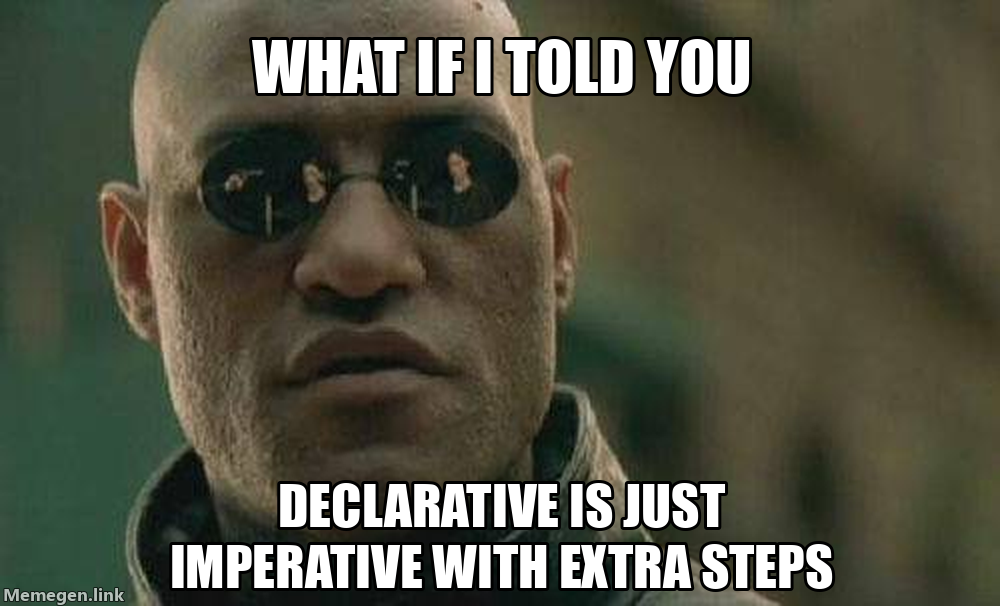

# 23  SQL Basics

> **TIP:**
>
> **Prerequisites (read first if unfamiliar):** [sec-tabular-data](#sec-tabular-data).
>
> **See also:** [sec-pandas-basics](#sec-pandas-basics), [sec-data-file-formats](#sec-data-file-formats), [sec-http-apis](#sec-http-apis).

## Purpose



Sooner or later, the data you need won’t come as a CSV. Your internship gives you a database login, or your lab keeps its survey responses in a `.db` file, and someone says “just pull what you need with SQL,” as if that were one step.

The good news: [SQL](https://en.wikipedia.org/wiki/SQL) is a small language for how much it does. A handful of keywords cover most of what an analyst writes, and if you know pandas, you know the ideas under other names. The hard part is a few rules that, when you break them, give you a wrong answer instead of an error: how missing values compare, what `COUNT` counts, and what a join does when a key repeats.

This chapter builds a tiny practice database and runs every query against it, surprises included. You’ll filter, sort, summarize, and join; run SQL from Python with [SQLite](https://www.sqlite.org/docs.html) and DuckDB; move results into pandas; and keep your code safe from SQL injection. Designing databases, tuning slow ones, and running a server such as [PostgreSQL](https://www.postgresql.org/docs/current/tutorial.html) come later.

## Why read this chapter

- Someone handed you a `.db` file or a database login, and “just write a query” was the whole instruction.
- You wrote `WHERE city = NULL`, got zero rows back, and you know for a fact that some cities are missing.
- Your query stopped with `column "name" must appear in the GROUP BY clause`, and you can’t tell what it wants.
- You joined two tables, your revenue total went up, and you’d like to know which rows got counted twice.
- Your code builds queries with f-strings, and it fell over the first time it met a customer named O’Brien.
- You mix up `WHERE` and `HAVING`, or `COUNT(*)` and `COUNT(city)`, and get believable wrong numbers instead of errors.
- You know pandas and want to know when SQL is the better tool, and how to move results between the two.

## Running theme: SQL is a declarative language, so describe what you want, not how

In Python you tell the computer *how*: loop over the rows, check each one, append the keepers. In SQL you describe the answer (“orders over \$20, biggest first”), and the database’s [query planner](https://en.wikipedia.org/wiki/Query_optimization) works out how to get it. Letting go of the “how” is most of what makes a [declarative language](https://en.wikipedia.org/wiki/Declarative_programming) feel different.

## 23.1 What a relational database is

A [relational database](https://en.wikipedia.org/wiki/Relational_database) is a set of tables, much like a set of DataFrames, that are linked to each other. Instead of one sheet where every order repeats the customer’s name and city, customers and orders get tables of their own, connected by a shared column. The idea comes from [Edgar F. Codd](https://en.wikipedia.org/wiki/Edgar_F._Codd)’s 1970 paper on the [relational model](https://en.wikipedia.org/wiki/Relational_model), written at IBM, where SQL was developed a few years later. Here’s this chapter’s database, made up and tiny so you can check every answer by eye:

``` text
customers
+-------------+-------+---------+
| customer_id | name  |  city   |
+-------------+-------+---------+
| 1           | Alice | Boulder |
| 2           | Bob   | Denver  |
| 3           | Carol | Boulder |
| 4           | Dana  | NULL    |
+-------------+-------+---------+

orders
+----------+-------------+--------+------------+
| order_id | customer_id | amount |    date    |
+----------+-------------+--------+------------+
| 101      | 1           | 29.99  | 2024-03-01 |
| 102      | 2           | 15.5   | 2024-03-02 |
| 103      | 1           | 42.0   | 2024-03-03 |
| 104      | 3           | 8.25   | 2024-03-03 |
| 105      | 1           | 61.0   | 2024-03-05 |
| 106      | NULL        | 12.0   | 2024-03-06 |
+----------+-------------+--------+------------+
```

`customer_id` is the [primary key](https://en.wikipedia.org/wiki/Primary_key) of `customers`: no two customers share one. In `orders` it’s a [foreign key](https://en.wikipedia.org/wiki/Foreign_key) pointing at whoever placed the order, so one customer can have many orders. Two rows make trouble on purpose, because real data does: Dana has no city, and order 106 (a guest checkout) has no customer. Both gaps are `NULL`, and they’re behind most of this chapter’s surprises.

Splitting data this way is called [normalization](https://en.wikipedia.org/wiki/Database_normalization): when Alice moves, you change one row, not every order she placed. The price is that most questions need the tables put back together, which is what `JOIN` is for.

### Build the practice database

Save this script as `make_shop_db.py` and run it with `python make_shop_db.py`. It builds `shop.db` from scratch, so rerun it whenever you’ve made a mess.

``` python
import sqlite3
from contextlib import closing
from pathlib import Path

Path("shop.db").unlink(missing_ok=True)  # start fresh every time

customers = [
    (1, "Alice", "Boulder"),
    (2, "Bob", "Denver"),
    (3, "Carol", "Boulder"),
    (4, "Dana", None),  # None in Python becomes NULL in SQL
]
orders = [
    (101, 1, 29.99, "2024-03-01"),
    (102, 2, 15.50, "2024-03-02"),
    (103, 1, 42.00, "2024-03-03"),
    (104, 3, 8.25, "2024-03-03"),
    (105, 1, 61.00, "2024-03-05"),
    (106, None, 12.00, "2024-03-06"),  # a guest checkout: no customer
]

with closing(sqlite3.connect("shop.db")) as conn:
    conn.executescript("""
        CREATE TABLE customers (
            customer_id INTEGER PRIMARY KEY,
            name        TEXT NOT NULL,
            city        TEXT
        );
        CREATE TABLE orders (
            order_id    INTEGER PRIMARY KEY,
            customer_id INTEGER REFERENCES customers (customer_id),
            amount      REAL,
            date        TEXT
        );
    """)
    conn.executemany("INSERT INTO customers VALUES (?, ?, ?)", customers)
    conn.executemany("INSERT INTO orders VALUES (?, ?, ?, ?)", orders)
    conn.commit()  # without this, the inserts vanish when the connection closes
```

The `?` marks are placeholders, filled in from the lists; they matter again when we get to SQL injection. And don’t skip `conn.commit()`: `sqlite3` holds your changes in a pending transaction and throws them away if the connection closes first, leaving two empty tables and no error.

To type queries, open the [SQLite shell](https://www.sqlite.org/cli.html) with `sqlite3 shop.db` (many Macs and Linux machines have it; sqlite.org has downloads for the rest), or run them from Python, as shown later. The results here are what the shell prints after these two settings; the second shows missing values as `NULL` rather than a blank you could miss:

``` text
$ sqlite3 shop.db
sqlite> .mode table
sqlite> .nullvalue NULL
```

If you press Enter and get a `...>` prompt instead of results, the shell is waiting for the semicolon that ends every statement. Type `;` and press Enter.

## 23.2 `SELECT ... FROM`: the basic query

Every query starts by naming the columns you want and the table they’re in:

``` sql
SELECT name, city
FROM customers;
```

``` text
+-------+---------+
| name  |  city   |
+-------+---------+
| Alice | Boulder |
| Bob   | Denver  |
| Carol | Boulder |
| Dana  | NULL    |
+-------+---------+
```

`SELECT *` returns every column. It’s handy for a quick look, but in a script name the columns you need, because `*` changes what your query returns whenever the table’s [schema](../chapters/appendix-glossary.llms.md#term-schema) changes. Keywords aren’t case-sensitive (capitals are just a habit that makes queries easier to scan), and line breaks are up to you.

One rule trips up nearly everyone who comes from Python: **text values go in single quotes.** `'Boulder'` is text; `"Boulder"`, in double quotes, is the *name* of a column or table. SQLite hides the mistake by treating a double-quoted name that matches no column as text, a behavior it lists among its [quirks](https://www.sqlite.org/quirks.html#dblquote), so the habit works right up until it doesn’t. DuckDB stops with `Binder Error: Referenced column "Boulder" not found in FROM clause!`, PostgreSQL says `column "Boulder" does not exist`, and even SQLite gets `WHERE name = "name"` wrong: it compares each customer’s name with itself and returns all four.

## 23.3 `WHERE`: filtering rows

`WHERE` keeps the rows that match a condition. Combine conditions with `AND`, `OR`, and `NOT`, and add parentheses when you mix `AND` with `OR`, since `AND` binds more tightly. Here are the orders over \$20 from March 2 on:

``` sql
SELECT *
FROM orders
WHERE amount > 20
  AND date >= '2024-03-02';
```

``` text
+----------+-------------+--------+------------+
| order_id | customer_id | amount |    date    |
+----------+-------------+--------+------------+
| 103      | 1           | 42.0   | 2024-03-03 |
| 105      | 1           | 61.0   | 2024-03-05 |
+----------+-------------+--------+------------+
```

That date comparison works only because of how the dates are written. SQLite has [no date type](https://www.sqlite.org/datatype3.html#date_and_time_datatype), so they’re plain text, and text written year-first ([ISO 8601](https://en.wikipedia.org/wiki/ISO_8601)) sorts in date order. Written US-style, the comparison quietly fails: `'03/02/2024' >= '2024-01-01'` is false, because `0` sorts before `2`.

| Operator | Meaning |
|----|----|
| `=`, `<>` or `!=` | equals, not equals |
| `<`, `<=`, `>`, `>=` | comparison (numbers, ISO dates, text) |
| `BETWEEN x AND y` | inclusive range |
| `IN ('a', 'b', 'c')` | matches any value in the list |
| `LIKE 'B%'` | text pattern: `%` is any run of characters, `_` is one character |
| `IS NULL`, `IS NOT NULL` | missing, not missing |

Details differ between databases: SQLite’s [`LIKE`](https://www.sqlite.org/lang_expr.html#like) ignores case for plain English letters, so `name LIKE 'c%'` finds Carol, while PostgreSQL’s finds nobody.

### The `NULL` gotcha

This one catches everyone. You want the customers with no city, so you write the obvious thing:

``` sql
SELECT * FROM customers WHERE city = NULL;
```

You get nothing back: no rows, no error, and Dana is sitting right there without a city. The reason is that [`NULL`](https://en.wikipedia.org/wiki/Null_(SQL)) isn’t a value. It means *unknown*, and any comparison with an unknown is itself unknown, even `NULL = NULL`:

``` sql
SELECT NULL = NULL, NULL <> 'Boulder', 1 + NULL;
```

``` text
+-------------+-------------------+----------+
| NULL = NULL | NULL <> 'Boulder' | 1 + NULL |
+-------------+-------------------+----------+
| NULL        | NULL              | NULL     |
+-------------+-------------------+----------+
```

SQL has three truth values, true, false, and unknown ([three-valued logic](https://en.wikipedia.org/wiki/Three-valued_logic)), and `WHERE` keeps a row only when its condition is true. To ask about missing values, use the operators made for it: `WHERE city IS NULL` finds Dana, and `IS NOT NULL` finds everyone else.

The sneakier version gives you a plausible answer instead of an empty one. `WHERE city <> 'Boulder'` returns Bob alone, because whether Dana’s unknown city is “not Boulder” is also unknown. If you want the unknowns too, say so: `WHERE city <> 'Boulder' OR city IS NULL`. Whenever a column can be NULL, decide which side of the line the unknowns belong on.

## 23.4 `ORDER BY` and `LIMIT`

A table has no built-in order: without `ORDER BY`, rows come back in whatever order suits the database, which can change as the table grows. Sorting is ascending unless you add `DESC`, `LIMIT` caps the rows returned, and `OFFSET` skips some first, for paging through results:

``` sql
SELECT * FROM orders
ORDER BY amount DESC
LIMIT 3;                 -- the three biggest: 105, 103, 101

SELECT * FROM orders
ORDER BY date, order_id
LIMIT 2 OFFSET 2;        -- skip two rows, return the next two: 103, 104
```

Why sort by `order_id` too? Orders 103 and 104 share a date, so `ORDER BY date` alone doesn’t settle their order, and a row can land on two pages or none. Give any sort you page through a unique tiebreaker.

## 23.5 Aggregates and `GROUP BY`

Most questions worth asking are summaries: how many, how much, on average. An [aggregate function](https://en.wikipedia.org/wiki/Aggregate_function) collapses many rows into one value:

| Function               | What it does                       |
|------------------------|------------------------------------|
| `COUNT(*)`             | number of rows                     |
| `COUNT(col)`           | number of non-NULL values in `col` |
| `SUM(col)`             | total                              |
| `AVG(col)`             | mean                               |
| `MIN(col)`, `MAX(col)` | smallest, largest                  |

Without `GROUP BY`, an aggregate covers the whole table, so `SELECT COUNT(*) AS n, SUM(amount) AS total FROM orders;` returns a single row: 6 orders, 168.74 in total. `AS` names the output column.

### `COUNT(*)` and `COUNT(column)` aren’t the same

They look interchangeable, and on most tables they agree, which is why the difference bites late. `COUNT(*)` counts rows, `COUNT(city)` counts rows where `city` isn’t NULL, and `COUNT(DISTINCT city)` counts the different non-NULL values:

``` sql
SELECT COUNT(*) AS n_rows,
       COUNT(city) AS with_city,
       COUNT(DISTINCT city) AS cities
FROM customers;
```

``` text
+--------+-----------+--------+
| n_rows | with_city | cities |
+--------+-----------+--------+
| 4      | 3         | 2      |
+--------+-----------+--------+
```

Three right answers to three different questions. `SUM` and `AVG` skip NULLs too, so `AVG` is the average of the values you have. The worked example “Counting orders per customer, including zero” shows the wrong count giving a wrong answer without a word of complaint.

### Grouping

With `GROUP BY`, the aggregates run once per group. Here are orders and revenue per customer:

``` sql
SELECT customer_id, COUNT(*) AS n_orders, SUM(amount) AS total
FROM orders
GROUP BY customer_id;
```

``` text
+-------------+----------+--------+
| customer_id | n_orders | total  |
+-------------+----------+--------+
| NULL        | 1        | 12.0   |
| 1           | 3        | 132.99 |
| 2           | 1        | 15.5   |
| 3           | 1        | 8.25   |
+-------------+----------+--------+
```

Look at the first row: SQL gathered the NULL keys into a group of their own. pandas’ `groupby` leaves them out unless you pass `dropna=False`, one of the silent row losses [sec-tabular-data](#sec-tabular-data) warns about.

### The `GROUP BY` error

Here’s the error from the top of the chapter. You’re counting customers per city, and you decide to show their names too:

``` sql
-- BAD: name is neither grouped nor aggregated
SELECT city, name, COUNT(*) AS n
FROM customers
GROUP BY city;
```

DuckDB refuses with `Binder Error: column "name" must appear in the GROUP BY clause or must be part of an aggregate function.`, and PostgreSQL’s message is nearly the same. It sounds like bureaucracy until you think about what you asked for. Grouping makes each city one row, and Boulder has two customers, so whose name goes in Boulder’s row? SQLite doesn’t ask; it picks one, a documented behavior it calls [bare columns](https://www.sqlite.org/lang_select.html#bareagg):

``` text
+---------+-------+---+
|  city   | name  | n |
+---------+-------+---+
| NULL    | Dana  | 1 |
| Boulder | Alice | 2 |
| Denver  | Bob   | 1 |
+---------+-------+---+
```

Now Alice seems to be two customers. The rule, in every database: **each column in `SELECT` is either in `GROUP BY` or inside an aggregate.** Group by it too (`GROUP BY city, name`), or aggregate it: `GROUP_CONCAT(name)` in SQLite or `string_agg(name, ',')` in DuckDB and PostgreSQL lists the names as `Alice,Carol`, and `MIN(name)` works when every row in the group has the same value.

## 23.6 `HAVING`: filtering groups

To find customers with more than one order, you’d naturally try `WHERE COUNT(*) > 1`, and SQLite stops with `misuse of aggregate: COUNT()` (PostgreSQL: `aggregate functions are not allowed in WHERE`). The reason is the order SQL works in. You write `SELECT` first, but conceptually the database takes `FROM`, then `WHERE`, `GROUP BY`, `HAVING`, `SELECT`, and last `ORDER BY` and `LIMIT`. `WHERE` sees single rows before any groups exist; [`HAVING`](https://en.wikipedia.org/wiki/Having_(SQL)) filters whole groups afterwards. You’ll often use both. “Among orders of \$30 or more, which customers placed more than one?”:

``` sql
SELECT customer_id, COUNT(*) AS n_orders
FROM orders
WHERE amount >= 30
GROUP BY customer_id
HAVING COUNT(*) > 1;
```

It returns customer 1, with 2 orders. `WHERE` dropped small orders one by one, `GROUP BY` gathered the rest, and `HAVING` kept groups with more than one row. Rows go through `WHERE`; groups go through `HAVING`.

## 23.7 `JOIN`: combining tables

Normalization split customers and orders apart; a [join](https://en.wikipedia.org/wiki/Join_(SQL)) puts them back together. Here is each order with the name and city of whoever placed it:

``` sql
SELECT o.order_id, o.amount, c.name, c.city
FROM orders o
JOIN customers c ON o.customer_id = c.customer_id;
```

``` text
+----------+--------+-------+---------+
| order_id | amount | name  |  city   |
+----------+--------+-------+---------+
| 101      | 29.99  | Alice | Boulder |
| 102      | 15.5   | Bob   | Denver  |
| 103      | 42.0   | Alice | Boulder |
| 104      | 8.25   | Carol | Boulder |
| 105      | 61.0   | Alice | Boulder |
+----------+--------+-------+---------+
```

`orders o` and `customers c` are short aliases, so `o.amount` means `orders.amount`, and the prefix says which table’s `customer_id` you mean. `ON` says how to pair rows.

Now count: six orders went in and five came out. A plain `JOIN` is an **inner join**, keeping only rows that find a partner, and order 106 has none. (Dana, with no orders, is missing too.) For “every order, with customer details where they exist,” use a `LEFT JOIN`, which keeps every row of the first table and fills gaps with NULL; this returns all six orders, with a `NULL` name for 106:

``` sql
SELECT o.order_id, o.amount, c.name
FROM orders o
LEFT JOIN customers c ON o.customer_id = c.customer_id;
```

| Type | Keeps |
|----|----|
| `JOIN` or `INNER JOIN` | only rows that match in both tables |
| `LEFT JOIN` | every row of the left table, NULL where the right has no match |
| `RIGHT JOIN` | every row of the right table |
| `FULL OUTER JOIN` | every row of both |

Inner and left joins cover nearly everything (SQLite only added `RIGHT` and `FULL OUTER` in version 3.39, in 2022). When the key has the same name in both tables, `USING (customer_id)` can replace the `ON` clause, as later examples do, and you get one `customer_id` column instead of two.

### When a join multiplies rows

A join pairs each left row with *every* matching right row, so a key that appears twice on the right doubles its rows, and every sum over them. It’s the pandas merge trap from [sec-tabular-data](#sec-tabular-data), with the same defense: count rows before and after, and check that the key is unique where you assume it is.

``` sql
SELECT customer_id, COUNT(*) AS n
FROM customers
GROUP BY customer_id
HAVING COUNT(*) > 1;
```

An empty result is what you want. A declared primary key guarantees it, but tables you’re handed often declare none. pandas’ `validate="many_to_one"` runs this check for you; in SQL you run it yourself. The worked example “A join that counted Alice twice” shows what skipping it costs.

## 23.8 Running SQL from Python

### `sqlite3`: a database in the standard library

SQLite is a whole database in one file, with no server to run, and Python comes with the `sqlite3` module for talking to it (see the official [`sqlite3` tutorial](https://docs.python.org/3/library/sqlite3.html#tutorial)). Every script has this shape:

``` python
import sqlite3
from contextlib import closing

with closing(sqlite3.connect("shop.db")) as conn:
    rows = conn.execute("""
        SELECT customer_id, COUNT(*) AS n_orders
        FROM orders
        GROUP BY customer_id
        ORDER BY n_orders DESC
    """).fetchall()

for row in rows:
    print(row)
```

``` text
(1, 3)
(3, 1)
(2, 1)
(None, 1)
```

Rows come back as tuples, with `None` for NULL. (The three groups with one order each tie, so their order isn’t fixed.)

Two snags catch people here. Many tutorials write `with sqlite3.connect("shop.db") as conn:` and assume the connection closes at the end of the block. It doesn’t: that block commits or rolls back your changes, and in the Python docs’ words it “neither implicitly opens a new transaction nor closes the connection.” [`contextlib.closing`](https://docs.python.org/3/library/contextlib.html#contextlib.closing), as above, is what closes it. The other snag is a typo: `sqlite3.connect("shpo.db")` quietly creates a new, empty database, and your query fails with `no such table: orders` while you stare at a table you know exists. To read an existing file, open it read-only, and a wrong name fails at once with `unable to open database file`:

``` python
conn = sqlite3.connect("file:shop.db?mode=ro", uri=True)
```

### From SQL to a pandas DataFrame

For analysis you usually want a DataFrame, and [`pd.read_sql_query`](https://pandas.pydata.org/docs/reference/api/pandas.read_sql_query.html) gives you one. Let the database do the filtering and joining, and bring back only the slice you need:

``` python
import sqlite3
from contextlib import closing

import pandas as pd

with closing(sqlite3.connect("shop.db")) as conn:
    df = pd.read_sql_query(
        """
        SELECT o.order_id, o.amount, c.name, c.city
        FROM orders o
        JOIN customers c USING (customer_id)
        WHERE o.date >= '2024-03-02'
        """,
        conn,
    )

print(df)
```

``` text
   order_id  amount   name     city
0       102   15.50    Bob   Denver
1       103   42.00  Alice  Boulder
2       104    8.25  Carol  Boulder
3       105   61.00  Alice  Boulder
```

From here it’s ordinary pandas (see [sec-pandas-basics](#sec-pandas-basics)). pandas accepts a `sqlite3` connection directly; other databases, such as PostgreSQL, usually go through SQLAlchemy. One surprise: an integer column that contains NULLs, like `orders.customer_id`, arrives as floats (`1.0`, `NaN`), because a NumPy integer column can’t hold a missing value.

### Never build a query with an f-string

When a query depends on a variable, such as a city someone typed, an f-string seems to work:

``` python
city = "Boulder"
conn.execute(f"SELECT * FROM customers WHERE city = '{city}'").fetchall()
# [(1, 'Alice', 'Boulder'), (3, 'Carol', 'Boulder')]
```

Then a value contains a quote mark. Look up the name `O'Brien` this way and Python builds `WHERE name = 'O'Brien'`, which SQLite rejects with `sqlite3.OperationalError: near "Brien": syntax error`. That’s the friendly failure. The unfriendly one is someone typing this as their city:

``` python
city = "x' OR '1'='1"
conn.execute(f"SELECT * FROM customers WHERE city = '{city}'").fetchall()
# [(1, 'Alice', 'Boulder'), (2, 'Bob', 'Denver'), (3, 'Carol', 'Boulder'), (4, 'Dana', None)]
```

The input rewrote your query into “city is `x`, or one equals one,” true for every row. That’s [SQL injection](https://en.wikipedia.org/wiki/SQL_injection), the joke in xkcd’s [Bobby Tables comic](https://xkcd.com/327/) and the cause of real data breaches. The fix is a **placeholder**: put `?` where the value goes and pass the values separately, as a tuple:

``` python
conn.execute("SELECT * FROM customers WHERE city = ?", (city,)).fetchall()
# []
```

The value never becomes part of the SQL, so the attack string is just a city nobody lives in, and `O'Brien` is just a name. See the Python docs on [placeholders](https://docs.python.org/3/library/sqlite3.html#sqlite3-placeholders) and OWASP’s [prevention cheat sheet](https://cheatsheetseries.owasp.org/cheatsheets/SQL_Injection_Prevention_Cheat_Sheet.html), and use placeholders for every value, even ones you “know” are safe.

Two snags. Leave the comma off `(city,)` and Python passes a plain string, which counts as one value per character: `Incorrect number of bindings supplied. The current statement uses 1, and there are 7 supplied.` And placeholders stand for values only, never table or column names (`SELECT * FROM ?` is a syntax error); if a script must choose a table, check the name against a list you wrote.

### DuckDB: SQL on files and DataFrames

[DuckDB](https://duckdb.org/docs/stable/clients/python/overview) also runs inside Python with no server (`python -m pip install duckdb`), but it’s built for analysis, and it runs SQL directly on CSV and Parquet files and pandas DataFrames, just by naming them ([sec-data-file-formats](#sec-data-file-formats) uses it on a file too big to load). Export the orders with `sqlite3 -header -csv shop.db "SELECT * FROM orders" > orders.csv`, and join that file to a DataFrame:

``` python
import duckdb
import pandas as pd

customers = pd.DataFrame({
    "customer_id": [1, 2, 3, 4],
    "name": ["Alice", "Bob", "Carol", "Dana"],
    "city": ["Boulder", "Denver", "Boulder", None],
})

duckdb.sql("""
    SELECT c.name, COUNT(*) AS n_orders, SUM(o.amount) AS total
    FROM 'orders.csv' o
    JOIN customers c USING (customer_id)
    GROUP BY c.name
    ORDER BY total DESC
""").show()
```

``` text
┌─────────┬──────────┬────────┐
│  name   │ n_orders │ total  │
│ varchar │  int64   │ double │
├─────────┼──────────┼────────┤
│ Alice   │        3 │ 132.99 │
│ Bob     │        1 │   15.5 │
│ Carol   │        1 │   8.25 │
└─────────┴──────────┴────────┘
```

Swap `.show()` for `.df()` to get a DataFrame back (see DuckDB’s guide to [SQL on pandas](https://duckdb.org/docs/stable/guides/python/sql_on_pandas)). DuckDB is also stricter than SQLite, a kindness while you learn: it caught the double quotes and the ungrouped column earlier.

## 23.9 SQL or pandas?

You don’t have to pick a side. SQL earns its place when the data lives in a database: it can discard most rows and do the joins before anything reaches your laptop, which matters when full tables won’t fit in memory, and a teammate who doesn’t read Python can still review a query. pandas is better once the data is in memory and modest in size: reshaping with `pivot` and `melt`, plotting, cleaning messy strings, building features, exploring in a notebook. The usual pattern uses both: SQL selects and joins, `read_sql_query` hands over the result, and pandas does the rest.

Check your numbers when you cross over, because the two treat missing values differently. SQL groups NULL keys together; pandas’ `groupby` drops them. SQL never matches NULL to NULL in a join; pandas’ [`merge`](https://pandas.pydata.org/docs/reference/api/pandas.DataFrame.merge.html) does, which its docs warn “is different from usual SQL join behaviour.” And `WHERE city <> 'Boulder'` leaves Dana out, while `customers[customers["city"] != "Boulder"]` keeps her.

## 23.10 SQL ↔︎ pandas translation table

Here `t` is a table and `df` holds the same data as a DataFrame; each SQL piece goes in its usual place in a full query. pandas’ own [comparison with SQL](https://pandas.pydata.org/docs/getting_started/comparison/comparison_with_sql.html) has many more examples.

| SQL                          | pandas                                 |
|------------------------------|----------------------------------------|
| `SELECT * FROM t`            | `df`                                   |
| `SELECT a, b`                | `df[["a", "b"]]`                       |
| `WHERE a > 5`                | `df[df["a"] > 5]`                      |
| `WHERE a IS NULL`            | `df[df["a"].isna()]`                   |
| `ORDER BY a DESC`            | `df.sort_values("a", ascending=False)` |
| `LIMIT 10`                   | `df.head(10)`                          |
| `COUNT(*)`                   | `len(df)`                              |
| `COUNT(x)`                   | `df["x"].count()`                      |
| `AVG(x)`                     | `df["x"].mean()`                       |
| `GROUP BY k` with `COUNT(*)` | `df.groupby("k").size()`               |
| `GROUP BY k` with `SUM(x)`   | `df.groupby("k")["x"].sum()`           |
| `JOIN t2 USING (k)`          | `df.merge(df2, on="k")`                |
| `LEFT JOIN t2 USING (k)`     | `df.merge(df2, on="k", how="left")`    |
| `SELECT DISTINCT k`          | `df["k"].unique()`                     |

## 23.11 Stakes and politics

For decades, U.S. federal forms had no box for people with roots in the Middle East or North Africa: under the government’s race and ethnicity standards, someone whose family came from Lebanon, Egypt, or Iran was counted as White, whether or not they saw themselves that way. In March 2024, the Office of Management and Budget [revised those standards](https://en.wikipedia.org/wiki/Race_and_ethnicity_in_the_United_States_census) to add a Middle Eastern or North African category. That’s a schema change, one new allowed value in a column, and it took years because agencies, surveys, and funding formulas were built on the old list.

The tables you design or query make the same kind of choice on a smaller scale. A required `first_name` and `last_name` pair fits some [naming traditions](https://www.w3.org/International/questions/qa-personal-names) and not others. A `gender` column that allows two values records everyone else as missing or wrong. A `country` column limited to a fixed list of [ISO 3166](https://en.wikipedia.org/wiki/ISO_3166-1) codes has taken a position on disputed places before anyone asks a question.

Once a schema is in use it tends to stay, because every dashboard and pipeline downstream builds in its assumptions; changing a column costs far more than choosing one did. A schema also makes the questions it was designed for cheap and the rest expensive, and expensive questions often go unasked. The politics sit in choices that look like data types (which columns are `NOT NULL`, which values are allowed, what counts as one person), and the cost of not fitting falls on whoever doesn’t fit, not on whoever designed the table.

See [sec-artifacts-politics](#sec-artifacts-politics) for the broader framework. The concrete prompt to carry forward: when you read a schema, ask whose categories it embeds and what kinds of people, places, or events would not fit its columns cleanly.

## 23.12 Worked examples

### Top customers by revenue

``` sql
SELECT c.name, SUM(o.amount) AS total
FROM orders o
JOIN customers c USING (customer_id)
WHERE o.date >= '2024-03-01'
GROUP BY c.name
HAVING SUM(o.amount) > 10
ORDER BY total DESC
LIMIT 10;
```

``` text
+-------+--------+
| name  | total  |
+-------+--------+
| Alice | 132.99 |
| Bob   | 15.5   |
+-------+--------+
```

Read it in the order the database works: from orders joined to customers, keep rows dated March 1 or later, group by name, keep groups whose total is over 10, sort biggest first, return at most ten. Carol’s \$8.25 fell below the `HAVING` line, and the guest order never survived the inner join. On a real table, group by `c.customer_id, c.name`, since two customers can share a name.

### Customers with no orders

``` sql
SELECT c.customer_id, c.name
FROM customers c
LEFT JOIN orders o ON c.customer_id = o.customer_id
WHERE o.order_id IS NULL;
```

This returns Dana alone. The `LEFT JOIN` keeps every customer, with NULL in every `o.` column for those who never ordered, and `WHERE o.order_id IS NULL` keeps only those. Finding rows with *no* match this way is called an anti-join; it’s how you find students who never submitted or sensors that never reported.

### Counting orders per customer, including zero

You want a count for every customer, Dana’s zero included, so you use a `LEFT JOIN` and reach for `COUNT(*)`:

``` sql
SELECT c.name,
       COUNT(*) AS count_star,
       COUNT(o.order_id) AS n_orders
FROM customers c
LEFT JOIN orders o USING (customer_id)
GROUP BY c.customer_id, c.name;
```

``` text
+-------+------------+----------+
| name  | count_star | n_orders |
+-------+------------+----------+
| Alice | 3          | 3        |
| Bob   | 1          | 1        |
| Carol | 1          | 1        |
| Dana  | 1          | 0        |
+-------+------------+----------+
```

`COUNT(*)` says Dana placed one order. She didn’t: the left join gave her one row full of NULLs, and `COUNT(*)` counts rows. `COUNT(o.order_id)` counts actual orders. After a left join, count a column from the right-hand table.

### A join that counted Alice twice

Someone hands you a `contacts` table, and Alice has two email addresses in it:

``` sql
CREATE TABLE contacts (customer_id INTEGER, email TEXT);
INSERT INTO contacts VALUES
    (1, 'alice@example.com'),
    (1, 'alice.w@example.org'),
    (2, 'bob@example.com'),
    (3, 'carol@example.com');
```

You join orders to contacts to send receipts, checking revenue before and after:

``` sql
SELECT COUNT(*) AS n_rows, SUM(amount) AS revenue
FROM orders;

SELECT COUNT(*) AS n_rows, SUM(o.amount) AS revenue
FROM orders o
JOIN contacts k USING (customer_id);
```

``` text
+--------+---------+
| n_rows | revenue |
+--------+---------+
| 6      | 168.74  |
+--------+---------+
+--------+---------+
| n_rows | revenue |
+--------+---------+
| 8      | 289.73  |
+--------+---------+
```

Two things happened. Each of Alice’s three orders matched both her addresses, so her \$132.99 counted twice, and the guest order, with no contact, fell out of the inner join and took \$12 with it. Eight rows and \$289.73 look like a busy week, not a bug; checking `contacts` for repeated keys first would have caught it. Join only the tables a question needs (revenue doesn’t need emails), or cut the many side to one row per key first, for instance with `SELECT customer_id, MIN(email) AS email FROM contacts GROUP BY customer_id`.

### Run a SQL query and chart the result

``` python
import sqlite3
from contextlib import closing

import matplotlib.pyplot as plt
import pandas as pd

with closing(sqlite3.connect("shop.db")) as conn:
    daily = pd.read_sql_query(
        """
        SELECT DATE(date) AS day, SUM(amount) AS revenue
        FROM orders
        WHERE date >= '2024-01-01'
        GROUP BY day
        ORDER BY day
        """,
        conn,
        parse_dates=["day"],
    )

print(daily)
daily.plot(x="day", y="revenue", figsize=(10, 4))
plt.show()
```

``` text
         day  revenue
0 2024-03-01    29.99
1 2024-03-02    15.50
2 2024-03-03    50.25
3 2024-03-05    61.00
4 2024-03-06    12.00
```

The database adds up each day’s orders, which on a real table might mean millions of rows; pandas turns `day` into real dates with `parse_dates` and draws the chart. Each tool does the part it’s best at.

## 23.13 Templates

**A query function with placeholders:**

``` python
import sqlite3
from contextlib import closing

import pandas as pd

def query(sql, params=None, db="shop.db"):
    """Run one query and return the result as a DataFrame."""
    with closing(sqlite3.connect(db)) as conn:
        return pd.read_sql_query(sql, conn, params=params)

top = query(
    "SELECT * FROM orders WHERE amount > ? ORDER BY amount DESC LIMIT ?",
    params=(20, 2),
)
```

**A first look at an unfamiliar SQLite database:**

``` sql
-- 1. What tables are here? (sqlite_schema is a newer name for sqlite_master)
SELECT name FROM sqlite_master WHERE type = 'table';

-- 2. What columns does a table have?
PRAGMA table_info(orders);

-- 3. How big is it?
SELECT COUNT(*) FROM orders;

-- 4. What do the first 5 rows look like?
SELECT * FROM orders LIMIT 5;
```

Every database has its own version of the first two. In DuckDB they’re `SHOW TABLES;` and `DESCRIBE orders;`, and in the `sqlite3` shell `.tables` and `.schema orders` do the same job. [`PRAGMA table_info`](https://www.sqlite.org/pragma.html#pragma_table_info) also shows which column is the primary key and which can’t be NULL.

## 23.14 Exercises

1.  Download the sample [Chinook SQLite database](https://github.com/lerocha/chinook-database) (or any other small public dataset). Write a `SELECT` that lists the ten longest tracks.
2.  Using the same database, count the tracks in each genre and sort the genres from most tracks to fewest.
3.  Join two tables on a shared key. Before running it, write down how many rows it should return; then check with `COUNT(*)`.
4.  Write a `LEFT JOIN` plus `IS NULL` query that finds customers with no purchases (or whatever the equivalent is in your dataset).
5.  Write a function `customers_in(city)` that returns a DataFrame of customers in that city, using a `?` placeholder. Call it with `"O'Brien"` and `"x' OR '1'='1"`; neither should break it.
6.  Find a column with NULLs and compare `COUNT(*)`, `COUNT(col)`, and `COUNT(DISTINCT col)`. What does each number mean?
7.  Translate a pandas pipeline you’ve already written into SQL (or compare `.describe()` with SQL’s `COUNT`, `AVG`, `MIN`, and `MAX`). Confirm the numbers agree; if they don’t, look first at how each handles missing values.

## 23.15 One-page checklist

- Text values in single quotes; double quotes only for table and column names.
- `IS NULL` and `IS NOT NULL`, never `= NULL`; decide which side of `<>` the NULLs belong on.
- `COUNT(*)` counts rows; `COUNT(col)` counts non-NULL values.
- Every column in `SELECT` is in `GROUP BY` or inside an aggregate.
- `WHERE` filters rows; `HAVING` filters groups.
- Give `ORDER BY` a unique tiebreaker before paging with `LIMIT` and `OFFSET`.
- `INNER JOIN` keeps matches only; `LEFT JOIN` keeps every row of the left table.
- Count rows before and after every join, and check the join key for repeats.
- From Python, pass values with `?` placeholders, never f-strings.
- Call `conn.commit()` after changing data, and close connections with `contextlib.closing`.
- Load results into pandas with `pd.read_sql_query` for plotting and reshaping.
- For anything beyond this chapter, your database’s own documentation is the authority (see [sec-reading-docs](#sec-reading-docs)).

> **NOTE:**
>
> - **SQLite**, [SQL language reference](https://www.sqlite.org/lang.html) — the grammar SQLite actually implements, small enough to read end to end.
> - **PostgreSQL Global Development Group**, [PostgreSQL documentation](https://www.postgresql.org/docs/current/) — the manual for a widely used open-source database server, for when you outgrow a single file.
> - **ThoughtSpot (formerly Mode)**, [SQL Tutorial for Data Analysis](https://www.thoughtspot.com/sql-tutorial) — a free, beginner-friendly tutorial with practice exercises you run in the browser against real data.
> - **Python docs**, [`sqlite3` module](https://docs.python.org/3/library/sqlite3.html) — the standard library’s SQLite interface, with how-to guides on placeholders, transactions, and type conversion.
> - **Markus Winand**, [Use The Index, Luke!](https://use-the-index-luke.com/) — a free book on indexes and query performance, for the day your queries get slow.
> - **Patrick McKenzie**, [Falsehoods Programmers Believe About Names](https://www.kalzumeus.com/2010/06/17/falsehoods-programmers-believe-about-names/) — the classic list of assumptions that “first name, last name” schemas get wrong; read it before you design a table of people.
> - **DuckDB**, [Documentation](https://duckdb.org/docs/) — the analysis-focused engine that queries Parquet, CSV, and DataFrames from inside Python; the natural next step after `sqlite3`.
