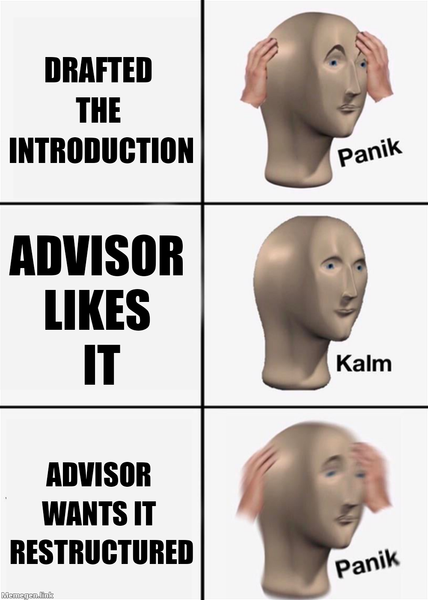

# 26  How to Write Scholarly Manuscripts

> **TIP:**
>
> **Prerequisites (read first if unfamiliar):** [sec-reading-scholarship](#sec-reading-scholarship), [sec-asking-questions](#sec-asking-questions).
>
> **See also:** [sec-writing-thesis](#sec-writing-thesis), [sec-latex](#sec-latex), [sec-git-github](#sec-git-github), [sec-project-management](#sec-project-management), [sec-ai-llm](#sec-ai-llm).

## Purpose



Here’s how a first paper usually starts. A class project went well, or your summer research produced something real, and your advisor says, “This could be a paper.” You open a blank document, type a title, and stare at it. You have results and a folder of notebooks, but no idea which section to write first or what a paper is supposed to sound like. When you finally send a draft, it comes back with one question in the margin: “What’s the contribution?”

If that’s where you are, you’re in good company. Nobody is born knowing how to write a paper, and most of the rules are unwritten. None of it is mysterious, though. A manuscript is a small contract with a busy reader: you promise something new, evidence that it’s true, and a clear account of both, and they give you their attention for as long as you keep earning it.

This chapter covers academic prose, the structure of an empirical paper, choosing a venue, anonymous review, sharing credit, and answering reviews without losing your nerve. It’s written for a first manuscript (a class paper, an honors thesis chapter, a lab’s conference submission), and the craft scales to a CHI paper or a journal article. It pairs with [sec-reading-scholarship](#sec-reading-scholarship), since writing well is partly reading well in reverse; a whole thesis is in [sec-writing-thesis](#sec-writing-thesis), and typesetting in [sec-latex](#sec-latex).

## Why read this chapter

- You have results from a class project or a summer research program, a blank file called `paper_draft.docx`, and no idea which section to write first.
- Your advisor keeps asking “what’s the contribution?”, and you’re not sure what kind of answer they want.
- Someone told you to “send it to CHI” (or to a journal), and you don’t know how venues differ or how to pick one.
- The call for papers says submissions must be anonymized, and you’re not sure how to cite your own poster from last year.
- Your first reviews arrived, one of them stings, and you have to write a response letter that doesn’t sound defensive.
- You and a labmate both did a lot of the work, and nobody has said out loud how author order gets decided.
- You’d like an AI tool to tighten your prose, and you want to know what your venue says you have to disclose.

## Running theme: write for a tired, smart, skeptical reader who has thirty other papers in their stack

Your reader is capable and busy: they want your contribution on page one, evidence that it’s real by page three, and enough by page five to decide whether to cite you, so make each of those easy to find.

## 26.1 What scholarly writing is for

Most first drafts are diaries: everything you tried, in order, false starts included. A paper is an *argument* instead: here is what we found, here is the evidence, and here is why it matters, told as cleanly as if you’d known it from the start, even though you didn’t.

That’s also the answer to the question in your advisor’s margin. A **contribution** is what a reader knows, or can do, after reading your paper that they couldn’t before. “We studied X” is a topic, and “we collected data on X” is a method; a contribution sounds more like “volunteer moderators’ rule changes reduced incivility within a month, and standard toxicity classifiers underestimated the change.” In HCI, Jacob Wobbrock and Julie Kientz’s 2016 essay “Research contributions in human-computer interaction” names seven kinds (empirical findings, artifacts such as systems, methods, theory, datasets, surveys of a field, and opinion), and asking “which kind is mine?” often gets a stuck draft moving. If you can’t yet state yours in two sentences, that’s normal; work it out before you polish anything.

Two companions are worth finding early. Wendy Belcher’s *Writing Your Journal Article in Twelve Weeks*[^1] is a workbook that takes you from rough draft to submission a week at a time. Pat Thomson’s blog *patter*[^2] is a long-running, warm voice on what academic writing actually feels like. Read both while you draft, not after.

## 26.2 Style: the conventions of academic prose

What throws people first is that academic writing isn’t the same as good general writing. The vivid metaphors and unannounced transitions that make a magazine feature sing can get you in trouble in a research paper, where readers expect you to tell them where they are, how sure you are, and plainly what you did. Once you know the conventions, they feel less like a cage and more like a shared shorthand.

**Most empirical papers share a skeleton,** called [IMRaD](https://en.wikipedia.org/wiki/IMRAD): Introduction, Methods, Results, and Discussion. Human-computer interaction (HCI) papers often use a variant: Introduction, Related Work, Method, Findings, Discussion, and Implications. Theory papers and humanities pieces are organized by their argument rather than a formula. When you read a paper, notice its skeleton; when you write, borrow the skeleton of the venue you’re aiming for.

**Tell the reader where they are.** Each section should say in its first sentence or two what it’s about to do: “In this section we describe the corpus and how we cleaned it.” After that, each paragraph’s [topic sentence](https://en.wikipedia.org/wiki/Topic_sentence) carries the argument, and transitions are explicit: “Having shown X, we now turn to Y.” It feels heavy-handed to write; to a reader skimming thirty papers, it’s a gift.

**Match your confidence to your evidence.** Academic prose [hedges](https://en.wikipedia.org/wiki/Hedge_(linguistics)): “our results suggest” rather than “prove,” “consistent with” rather than “shows.” Hedging isn’t timidity; it’s honesty about what kind of claim you’re making. Hedge inferences, and state direct observations directly (“we collected 4,200 posts”). You’ll rarely meet a reviewer who asks you to change *suggest* to *prove*; you’ll often meet one who asks the reverse.

**At the sentence level, favor people doing things.** “We collected 4,200 posts” beats “data collection yielded 4,200 posts.” Turn [nominalizations](https://en.wikipedia.org/wiki/Nominalization), nouns built out of verbs, back into verbs: “we measured” beats “we performed measurements of.” Vary sentence length; one short sentence after three long ones reads as emphasis. For a quick self-check, paste a paragraph you’re stuck on into Helen Sword’s free Writer’s Diet test[^3] and see whether it reads as “flabby or fit.”

## 26.3 Audience awareness

The same finding can become three different papers. A study of how people search for health information could go to CHI, whose readers want to know what it means for designing systems; to *JASIST* (the *Journal of the Association for Information Science and Technology*), whose readers look for a contribution to theories of information behavior; or to *Big Data & Society*, whose readers care about the critical and social stakes. Same data, three audiences, three abstracts. So before you draft, ask who the reader is and how *they* would describe your contribution.

That question should drive your introduction. It’s tempting to treat the introduction as background, but it’s the contract: by its end, the reader should know what problem you’re solving, why it’s hard, how you approached it, and what you contribute. A common HCI shape gives each question one paragraph; use it until you have a reason not to (the first worked example shows it).

## 26.4 Conferences vs. journals (in information-science-adjacent fields)

If “publication” means “journal article” where you come from, computing’s conferences will surprise you. In HCI and much of information science, [conference proceedings](https://en.wikipedia.org/wiki/Conference_proceeding) are archival, peer-reviewed, and count as primary research: CHI, CSCW, ICWSM, FAccT, the ASIS&T Annual Meeting, JCDL, and the iConference all publish full papers. In the social sciences next door, the [journal](https://en.wikipedia.org/wiki/Academic_journal) article is still the main currency, and students here often publish in both.

**Conferences run on a calendar.** CHI 2027’s [call for papers](https://chi2027.acm.org/authors/papers/) set a deadline of September 10, 2026, asked for a single-column format, encouraged 5,000 to 8,000 words, and warned that papers over 12,000 words could be desk-rejected if the length wasn’t justified. Reviews come back November 5, promising papers get four weeks to revise and resubmit, and final decisions arrive December 17: about fourteen weeks in all. CSCW papers appear in the journal *Proceedings of the ACM on Human-Computer Interaction* (PACM HCI); its [2026 call](https://cscw.acm.org/2026/papers.html) asked for 5,000 to 12,000 words, and decisions came as much as ten months after the May deadline. From 2027, CSCW is [moving to rolling submissions](https://cscw.acm.org/2026/rolling.html) with no fixed deadline.

**Journals run on their own schedule.** *TOCHI* (*ACM Transactions on Computer-Human Interaction*), *JASIST*, *Information, Communication & Society*, *New Media & Society*, *Big Data & Society*, and *PNAS Nexus* take submissions year-round. Many count everything toward their limits: *New Media & Society*’s [guidelines](https://www.sagepub.com/docs/default-source/msg/submission-guidelines_-new-media-society_-sage-journals.pdf?sfvrsn=159a8c8e_4) set a target of 8,000 words including notes and references, and *Big Data & Society* allows up to 10,000. They’re slower, too: a [2013 study](https://helda.helsinki.fi/handle/10138/157324) found average times from submission to publication ranging from about nine months in chemistry to eighteen in business and economics, and more than one round of revision is common. The Quick reference at the end of this chapter puts the two side by side.

## 26.5 Picking a venue

Choosing a venue feels like it needs insider knowledge, but three questions get you most of the way. *Where do the papers you cite most often appear?* If half your bibliography is CHI papers, your paper probably wants to be one. *Where does your advisor publish?* They know the editors, the reviewers, and the unwritten norms. *What are you optimizing for?* A conference is faster; a journal gives room for depth and theory; an [open access](https://en.wikipedia.org/wiki/Open_access) journal in a neighboring field reaches readers outside computing.

The most common mistake is to write the paper first and pick the venue after. Reverse it: pick the venue, read three papers it recently accepted, and write to their conventions of length, citation density, and how boldly to claim.

**Posting a preprint is normal now.** A [preprint](https://en.wikipedia.org/wiki/Preprint) is a public copy of your paper posted before or during review, on a server such as arXiv[^4] for computing or SocArXiv[^5] for the social sciences. One snag catches students: arXiv [requires an endorsement](https://info.arxiv.org/help/endorsement.html) before your first submission, which goes quickest if you register with your university email. Venues differ: CHI doesn’t discourage preprints but warns that they make anonymity harder, and CSCW’s 2026 call allowed them but asked authors not to publicize them during review. Check the current policy when you submit.

**Be wary of flattering email invitations** to publish in a journal you’ve never heard of, for a fee. Many come from [predatory publishers](https://en.wikipedia.org/wiki/Predatory_publishing) that take your money without real peer review. If you haven’t seen a venue cited in your field, ask your advisor or a librarian first.

## 26.6 Drafting and revising

A first draft should be ugly. The writer [Anne Lamott](https://en.wikipedia.org/wiki/Anne_Lamott) titled a chapter of her 1994 book *Bird by Bird* after exactly that idea (you can guess the adjective), and it applies to papers as much as novels. The blank page is where most first papers stall, and a bout of [writer’s block](https://en.wikipedia.org/wiki/Writer%27s_block) isn’t a sign you can’t do this. The workflow many researchers settle on keeps you moving by never asking you to write and polish at once.

**Start with an outline.** Two pages of sections and paragraphs, with a one-line stub for each paragraph’s topic sentence (the template below is a start). This is where you decide what the paper is about, and a stub is much easier to delete than two polished pages.

**Write the methods first.** You already know what you did, so it’s the easiest section to draft. The introduction depends on knowing your contribution, which sometimes only becomes clear once the results are written up.

**Write a fat draft, then cut.** Get the whole arc onto the page before polishing any of it. Many students spend two weeks perfecting the introduction and never finish the discussion; polishing goes quickly at the end and slowly at the start.

**Show your drafts early.** Belcher’s “writing partners” idea is sound: a half-hour swap of pages with one peer each week does more for your writing than ten hours alone. [sec-collaboration](#sec-collaboration) has the etiquette.

**Keep the manuscript under version control.** A `manuscript/` folder with `main.tex`, `references.bib`, and the figures, tracked in Git, lets you get back yesterday’s version and see what a co-author changed. See [sec-git-github](#sec-git-github) for the workflow and [sec-latex](#sec-latex) for what belongs in `.gitignore`.

## 26.7 Authorship and author order

Author order is one of research’s most awkward conversations, and it usually happens too late, after everyone has their own sense of who did what. Have it when you start drafting, and again when roles change.

Part of the confusion is that the rules differ by field. [Some fields](https://en.wikipedia.org/wiki/Academic_authorship#Order_of_authors_in_a_list) list authors by how much they contributed, biggest first; mathematics and economics often go alphabetically; biologists have traditionally put the head of the lab last. HCI and information science usually order by contribution, often with the advisor last, but labs differ, so ask how yours does it.

Two tools help. The [CRediT taxonomy](https://credit.niso.org/) names 14 kinds of contribution (conceptualization, data curation, formal analysis, software, writing the original draft, and so on), and many journals now ask who did which. Listing them for your project turns “who did more?” into a concrete comparison. And an [ORCID iD](https://orcid.org/) is a free, permanent identifier that keeps your papers attached to you even if your name is common or changes; ACM venues ask every author for one at acceptance, so register now.

Adding someone who didn’t contribute ([honorary authorship](https://en.wikipedia.org/wiki/Honorary_authorship)) and leaving off someone who did are both problems that research-ethics guidance, such as COPE’s in Further reading, warns against.

## 26.8 Preparing for anonymous review

Most HCI venues hide authors’ names from reviewers (double-blind [peer review](https://en.wikipedia.org/wiki/Scholarly_peer_review)), so the paper is judged rather than the famous lab or unknown student behind it. The details change yearly, and the current call for papers binds you, not a senior student’s memory of the rules.

The part that confuses almost everyone is self-citation. It seems as if you should hide your earlier papers, but CHI’s [anonymization policy](https://chi2027.acm.org/chi-anonymization-policy/) says the opposite: cite them normally, in the third person (“As described by Chetty et al. \[10\],” not “As described in our previous work \[10\]”), and it treats any reference marked “anonymous” as grounds for desk rejection. FAccT’s [author guide](https://facctconference.org/2026/authorguide.html) and CSCW’s call ask for the same third-person style.

Everything else that identifies you comes out: names and affiliations in the title and header (CHI notes that changing the text color doesn’t count) and in the file’s metadata; acknowledgments that name people, grants, or partner organizations (FAccT asks you to leave out acknowledgments, author contributions, and positionality statements until acceptance); and details that point to you, such as the university where you ran the study, your ethics board’s approval, a photo of your face, or a link to a public GitHub repository whose commit history carries your name. CHI desk-rejects papers whose supplementary materials or links break anonymity, so put code in anonymized supplementary files.

If you write in LaTeX, the ACM’s [acmart](https://ctan.org/pkg/acmart) class does much of this for you. CHI’s [publication formats page](https://chi2027.acm.org/chi-publication-formats/) gives the options for an anonymous submission: `manuscript` for the single-column layout, `review` for line numbers, and `anonymous` to hide the authors. In anonymous mode the `acks` environment disappears, and `\anon` swaps a phrase for a placeholder:

``` latex
\documentclass[manuscript,review,anonymous]{acmart}
% ...
We deployed \anon[System~X]{Civilify}, a moderation assistant built at
\anon{the University of Colorado Boulder}.

\begin{acks}
We thank the r/example moderators. Funded by NSF grant 1234567.
\end{acks}
```

Compiled, the author block reads “Anonymous Author(s),” the sentence reads “We deployed System X, a moderation assistant built at ANONYMIZED,” and the acknowledgments are gone. Drop `anonymous` for the camera-ready version and everything comes back.

## 26.9 Reading reviews and responding

Some reviews will be helpful, some will misread your paper, and one will probably ask for an experiment that would be a whole second paper. The first time a stranger picks your work apart, it feels personal, and a harsh line can set off every doubt about whether you belong ([impostor syndrome](https://en.wikipedia.org/wiki/Impostor_syndrome), and it’s very common). So read the reviews once for the feelings, and don’t respond. Wait a day, then do a working second read.

On the second read, sort each comment. *Substantive* comments need new analysis or writing. *Clarification* comments mean a reader misunderstood you, which is a writing problem, not a research problem: make the paper clearer rather than arguing. *Stylistic* comments are usually small and worth doing. *Mistaken* comments, where the reviewer is simply wrong on a fact, are rarer than they first seem, and they call for a polite, specific correction in the response letter, never a snarky footnote.

Then draft the response letter. The usual format goes reviewer by reviewer: quote each comment word for word, give your response, and point to exactly where the change appears in the revision (“see §3.2, lines 145–158”; line numbers are one reason to submit with acmart’s `review` option). Editors and reviewers both read this letter, and a clean, point-by-point one makes saying yes easy.

The hardest comments aren’t the harsh ones but the half-right ones, where the reviewer has spotted a real problem and proposed a fix that won’t work. Acknowledge the problem, propose a *different* fix that does work, and explain why. The third reply in the response-letter example below shows how.

## 26.10 R&R, accept, reject: what to do next

**Major revision** (often called R&R, for revise and resubmit) means the paper has promise and real work to do. Treat the revision as a new draft and budget time for it: CHI 2027 allows four weeks, and journals often allow longer. Don’t plan on adding authors partway through; CHI’s call says the author list can’t change after the submission deadline, and other venues have similar rules. Before resubmitting, reread every original comment against your revision and check that the letter answers each one.

**Minor revision** is faster, with the same kind of letter and much less new analysis. At CHI, a paper whose first-round reviews are strong enough to earn minor revisions will likely be accepted.

**Accept.** Celebrate. Then read the [camera-ready](https://en.wikipedia.org/wiki/Camera-ready) instructions twice. For ACM venues they include the final template and ACM’s TAPS production system, a rights form, an ORCID iD for every author, and deadlines for supplementary materials. [sec-latex](#sec-latex) covers the template mechanics.

**Reject.** It happens to everyone, including the researchers you most admire. Don’t send the same draft straight somewhere else: sort the reviews into comments about the paper and comments about fit with that venue, fix the paper-level problems, and re-aim the framing. A rejection from CHI doesn’t mean one from *JASIST*; the readers differ, and so should the framing.

## 26.11 Writing with AI

[sec-ai-llm](#sec-ai-llm) has the fuller discussion of AI tools; for manuscripts, the binding rule is your venue’s policy, and policies differ. The ACM’s authorship policy, which covers CHI, CSCW, and FAccT, lets you use generative AI but requires you to disclose it (usually in the acknowledgments) and says an AI can’t be an author. Venues can add to that: CSCW’s 2026 call required LLM-generated text to be clearly marked, and FAccT’s 2026 author guide prohibited LLM-generated text in papers while allowing limited, disclosed help with grammar and formatting. Check the current call when you submit.

Confidentiality runs both ways. The ACM’s peer-review policy bars reviewers from uploading your submission into an AI tool that doesn’t promise confidentiality. Give the reviews you receive the same courtesy, and think twice before pasting an unpublished manuscript into a tool that may keep what you paste.

Used carefully, they help with mechanical work: catching nominalizations, trimming a wordy paragraph, rephrasing an awkward sentence, turning a Markdown table into LaTeX. The argument and the contribution are yours.

## 26.12 Stakes and politics

Say you spent a summer on a research project and wrote most of the analysis code, while a graduate student in the lab wrote the literature review. When the paper is drafted, you’re the fourth of five authors, and nobody explained why. Maybe there’s a good reason, maybe not. Either way, author order is how academic labor gets counted, and those counts compound: they shape who gets into graduate school, who gets hired, and whose name people remember. The conventions differ by field, and they differ by power, which is why disputes over a senior name on a paper a student drafted keep recurring.

Citation works the same way. The [Matthew effect](https://en.wikipedia.org/wiki/Matthew_effect) describes credit flowing to people who already have it, and [Matilda effects](../chapters/appendix-glossary.llms.md#term-matilda-effect) (the under-citation of women, scholars of color, and scholars outside dominant networks) are well documented and persistent. The genre itself is a filter, too. IMRaD, the literature review that funnels toward a gap, and the “novel finding plus evidence” framing are the conventions of particular communities, and scholars writing in a second language or trained in other rhetorical traditions pay a translation cost before they start. Reviewers and editors add their own training and networks, and null results and replications face tougher odds ([publication bias](https://en.wikipedia.org/wiki/Publication_bias)). None of this means you shouldn’t write papers. It means knowing what kind of social system you’re submitting to.

See [sec-artifacts-politics](#sec-artifacts-politics) for the broader framework. The concrete prompt to carry forward: when you choose what to cite, who to credit, and what to call a “contribution,” you are participating in a status system, so be deliberate about how.

## 26.13 Worked examples

### From outline to introduction

You’re turning a class paper into a CHI submission. The topic: whether a change in moderation policy affected civility on a subreddit. Here is the four-paragraph introduction shape from “Audience awareness,” applied.

*Paragraph 1, the problem.* “Online platforms increasingly use moderation interventions to shape user behavior. The relationship between policy changes and user-level outcomes (civility, retention, polarization) is not well understood, especially on platforms run by volunteer moderators rather than centralized teams.”

*Paragraph 2, why it’s hard.* “Measuring civility at scale is difficult. Existing toxicity classifiers vary widely in how they handle community-specific norms, and naturalistic studies of moderation are confounded by selection: communities that change moderation policy differ from those that don’t.”

*Paragraph 3, our approach.* “In this paper, we study a single subreddit before and after a publicly announced policy change, using a [difference-in-differences](https://en.wikipedia.org/wiki/Difference_in_differences) design with a matched comparison community. We measure civility using both an off-the-shelf classifier and a community-grounded annotation set.”

*Paragraph 4, contributions.* “We make three contributions. First, we show that moderator-led policy changes have measurable effects on civility within the first month. Second, we demonstrate that off-the-shelf classifiers underestimate change because they miss community-specific norms. Third, we provide a replication-ready code and data release that enables follow-on work on volunteer-run platforms.”

Notice what isn’t there: a literature review, which is the next section. A reader who stops after these four paragraphs still knows what the paper claims.

### Anonymizing a paragraph for CHI

You’re submitting to CHI. Here’s a paragraph before and after anonymization. (The system, the citation, and the repository are made up for this example.)

*Before:* “We deployed Civilify, a Reddit moderation assistant developed at the University of Colorado Boulder. As described in our prior work \[12\], Civilify uses a transformer-based classifier to flag rule-breaking comments before they are posted. The system is open-source and available at `https://github.com/our-lab/civilify`.”

*After:* “We deployed \[System X\], a Reddit moderation assistant. As described by Rivera et al. \[12\], \[System X\] uses a transformer-based classifier to flag rule-breaking comments before they are posted. The system is open-source; an anonymized copy of the code is included in the supplementary materials.”

The system’s name and the university are gone, because either would lead a reviewer straight to your lab. The self-citation became third person, while reference \[12\] stays complete in the bibliography, as CHI’s policy asks. And the GitHub link, whose commit history would name you, became an anonymized copy in the supplementary materials. Then finish the checklist (the `anonymous` option, the acknowledgments, the PDF’s metadata), and restore everything for the camera-ready version.

### Drafting a response letter to a major revision

Three reviewer comments and their replies, in the standard format.

> **R2.1: “The classifier validation in §3.2 is undersold. The agreement statistics with the human coders are reported but no confusion matrix is provided, which makes it hard to evaluate the classifier’s behavior on the minority class.”**
>
> *We thank R2 for this comment. We agree that the original §3.2 underspecified the classifier’s behavior on the minority “uncivil” class. In the revised manuscript, we have added Table 2 (a full confusion matrix) and revised §3.2 to discuss precision and recall on the minority class explicitly. See §3.2, lines 287–312, and Table 2.*

> **R2.2: “The DiD identification assumption is not adequately defended. What is the parallel-trends evidence?”**
>
> *We agree this needs strengthening. We have added a new Figure 4 showing pre-treatment trends in the outcome for the treated and matched-comparison communities, with formal placebo tests in the new Appendix B. The discussion in §4.1 (lines 410–438) now references this evidence directly.*

> **R3.4: “The authors should run the same analysis on a second subreddit to demonstrate generalizability.”**
>
> *We appreciate the suggestion. A second-site replication is beyond the scope of this paper — selecting a comparable second site involves substantive curatorial work that would itself constitute a separate study. We have, however, expanded the limitations section (§6, lines 612–630) to discuss the single-site nature of the study explicitly and to flag a multi-site replication as the natural next step.*

The first two replies are straightforward: the reviewer asked for evidence (a [confusion matrix](https://en.wikipedia.org/wiki/Confusion_matrix), a parallel-trends check), and the authors added it and said where. The third is the half-right comment handled well. The reviewer is right that a single-site study has limits; they’re wrong that a second site is a quick fix. The reply acknowledges the concern, offers a different fix (an explicit limitations discussion), and points to future work. Editors read replies like this as professional and complete.

## 26.14 Templates

A manuscript outline (paste into `outline.md` at the top of every new paper):

``` markdown
# {Working title}

**Target venue:** {CHI 2027 / TOCHI / etc.}
**Target word count:** ~{8000}
**Target submission:** {YYYY-MM-DD}
**Co-authors:** {names}
**Author order agreed:** {yes, or who will decide and when}

## Contribution (one paragraph, written before any prose)

...

## Outline

### 1. Introduction (~800 words)
- Para 1: problem
- Para 2: why hard
- Para 3: our approach
- Para 4: contributions

### 2. Related work (~1200 words)
- Theme A
- Theme B
- Gap

### 3. Method (~1500 words)
...

### 4. Findings/Results (~2500 words)
...

### 5. Discussion (~1200 words)
...

### 6. Limitations and future work (~500 words)
...
```

A reviewer-response-letter skeleton:

``` markdown
# Response to reviewers — {Paper title} ({Venue} submission ID #####)

## Summary of revisions

- {Bullet list of the major changes, with section pointers.}

## Reviewer 1

### R1.1
> {Verbatim reviewer comment in block quote.}

We thank the reviewer for...

We have addressed this in §X, lines NNN–NNN.

### R1.2
...

## Reviewer 2
...
```

A submission-day checklist:

Manuscript anonymized (names, affiliations, identifying acknowledgments, identifying URLs, PDF metadata).

Self-citations in the third person, with full references (no “anonymous” references).

Template compliance (for CHI, `acmart` with `[manuscript,review,anonymous]`).

Within the venue’s length guidance.

References complete; bibliography compiles cleanly.

Figures embedded at intended size; captions complete; alt text where required.

Supplementary materials anonymized and submitted separately if needed.

AI-use disclosure per the current call for papers.

Final commit pushed to Git; submitted PDF archived.

## 26.15 Exercises

1.  Take a 200-word paragraph from a past assignment and rewrite it in academic prose: concrete subjects, hedging where appropriate, signposting at the start, no nominalizations. Compare the versions.
2.  Pick a published CHI paper. Using only the abstract, write a 100-word “contribution paragraph,” and decide which of Wobbrock and Kientz’s seven contribution types it is.
3.  Compare CHI’s call for papers with the author guidelines of a journal in your area, in a one-page table covering scope, length, review, anonymization, and timeline.
4.  Take one of your own writing samples (a class paper, a thesis chapter) and anonymize it for review under CHI’s policy. Have a classmate try to identify you.
5.  For a project you’re working on with others, list each person’s contributions using the 14 CRediT roles. Does the list suggest the same author order you’d assumed?
6.  Take a real or instructor-provided reviewer comment and draft a 150-word response that quotes the comment, addresses it, and points to a specific section of a hypothetical revision.

## 26.16 One-page checklist

- Did you pick the venue *before* you started drafting?
- Can you state your contribution in two sentences?
- Does the introduction state the problem, the difficulty, the approach, and the contributions, in that order?
- Does every section start with a sentence that says what the section is doing?
- Are claims hedged where they are inferential and direct where they are observational?
- Did you write methods before introduction?
- Have you agreed on author order with your co-authors, and does everyone have an ORCID iD?
- Are figures and tables readable at print size?
- Did you anonymize per your venue’s current policy, citing yourself in the third person?
- Does the bibliography compile cleanly with stable citation keys (see [sec-reading-scholarship](#sec-reading-scholarship))?
- Is the manuscript under version control with the `.bib` file (see [sec-git-github](#sec-git-github))?
- Did you check the AI-disclosure policy in the current call for papers?

## 26.17 Quick reference: conference vs. journal in HCI/IS

The conference figures are from the CHI 2027 and CSCW 2026 calls; journals vary more, so check each one’s author guidelines.

|  | Conference (CHI, CSCW, FAccT) | Journal (TOCHI, JASIST, *NM&S*) |
|----|----|----|
| Length | CHI: 5,000–8,000 words encouraged; CSCW: 5,000–12,000 | Set by each journal; *NM&S*: 8,000 including references |
| Timeline | CHI: about 14 weeks to decision; CSCW: up to about 10 months | Average 9–18 months to publication, by field |
| Reviewers | Program committee members plus external reviewers | An editor plus, usually, two or three reviewers |
| Revisions | One or two rounds, then a final decision | Often more than one round |
| Published in | Proceedings (PACM HCI for CSCW) | A journal issue, often online first |
| Anonymity | Strict; the current call binds | Varies; check the journal |
| Preprints | Allowed; CSCW asks you not to publicize | Usually allowed; check |

> **NOTE:**
>
> - **Wendy Laura Belcher**, [*Writing Your Journal Article in Twelve Weeks*](https://press.uchicago.edu/ucp/books/book/chicago/W/bo26985005.html) (University of Chicago Press, 2nd ed., 2019) — the standard structured workbook for taking a draft from idea to submission, one week at a time.
> - **William Strunk and E. B. White**, [*The Elements of Style*](https://www.bartleby.com/lit-hub/the-elements-of-style/) — the classic American style guide; brief, opinionated, and worth rereading every year, even where you disagree with it.
> - **Helen Sword**, [*Stylish Academic Writing*](https://www.hup.harvard.edu/file/feeds/PDF/9780674064485_sample.pdf) and the [Writer’s Diet test](https://writersdiet.com/writing-test/) — research-grounded advice on cutting bloat from academic prose, plus a free tool that diagnoses any paragraph you paste into it.
> - **Pat Thomson**, [*patter*](https://patthomson.net/) — a long-running blog of practical, kind writing advice for academics; especially good on revision and on answering reviewers.
> - **ACM**, [Master Article Template](https://www.acm.org/publications/proceedings-template) — the official LaTeX and Word templates for ACM venues; pairs with [sec-latex](#sec-latex).
> - **Committee on Publication Ethics**, [Authorship and contributorship](https://publicationethics.org/authorship) — the standard guidance on who should be named as an author and how contributions should be reported; useful when a co-authorship conversation gets hard.
> - **Jordan D. Dworkin et al.**, [The extent and drivers of gender imbalance in neuroscience reference lists](https://doi.org/10.1038/s41593-020-0658-y) (*Nature Neuroscience*, 2020) — a careful study showing that reference lists cite papers led by men more than expected, and that the gap is growing; a concrete case of the citation politics in “Stakes and politics.”

[^1]: The second edition (University of Chicago Press, 2019) is the one to look for; it’s listed in Further reading at the end of this chapter.

[^2]: Thomson is Professor Emerita of Education at the University of Nottingham and has supervised more than sixty PhDs, so her advice comes from a lot of drafts. The blog is linked in Further reading.

[^3]: The test takes a sample of 100 to 1,000 words and highlights five kinds of words that weigh prose down: forms of *to be*, “zombie nouns” (nominalizations), prepositions, “ad-words” (adjectives and adverbs), and *it*, *this*, *that*, and *there*. It’s linked, with Sword’s book, in Further reading.

[^4]: <https://arxiv.org/>

[^5]: <https://osf.io/preprints/socarxiv>
