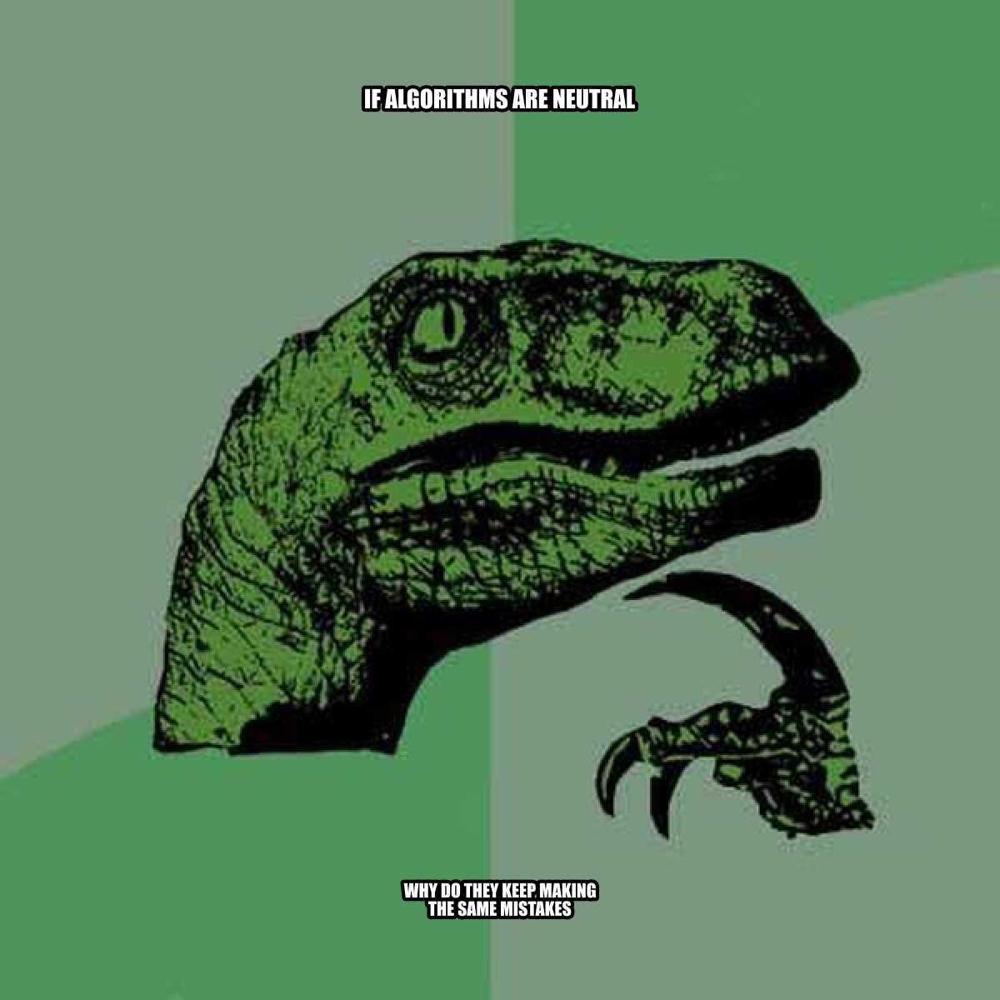

# 8  Artifacts Have Politics

> **TIP:**
>
> **Prerequisites:** none — this chapter can be read as a standalone reflection on the other chapters in Part I.
>
> **See also:** [sec-ai-llm](#sec-ai-llm), [sec-evaluating-ai](#sec-evaluating-ai), [sec-documentation](#sec-documentation), [sec-secrets](#sec-secrets).

## Purpose

The rest of this handbook is a *how-to*. This chapter asks a different kind of question: *whose* trade is computing, *whose* values are baked into its tools, and *whose* problems have shaped them? Every piece of software you use was built by specific people, funded by specific institutions, and constrained by specific laws. Knowing the history of those choices is part of being a competent practitioner — not so that you become cynical, but so that you recognize your position as a participant in a long, contested, still-unfolding story.

## Learning objectives

By the end of this chapter, you should be able to:

1.  Explain Winner’s thesis in your own words and apply it to a technology you use daily.
2.  Identify three competing value systems that have shaped computing — national-security, commercial-monopoly, and hacker-counterculture — and give a concrete example of each.
3.  Trace the gender history of computing from the female “computers” of the 1940s to today’s underrepresentation patterns.
4.  Explain how race and ethnicity have been embedded in computational systems, with a specific example.
5.  Describe how computing built for a US/English-speaking/high-bandwidth context fails users elsewhere.
6.  Summarize how modern states use computing for censorship, surveillance, and social control.
7.  Summarize the practical significance of the CFAA, Section 230, the DMCA, and GDPR for an ordinary developer.
8.  Apply a short checklist before adopting, advocating for, or building a new technology.

------------------------------------------------------------------------

## 8.1 Technology is never neutral

The title comes from Langdon Winner’s 1980 essay “Do Artifacts Have Politics?” ([Winner 1980](#ref-winner1980artifacts)), which argued that technologies embed political choices — sometimes deliberately, sometimes by accident — and that you cannot reason about them honestly without naming those choices. Forty-five years later, the argument is more urgent, because the artifacts in question now mediate the majority of public life.

Winner distinguished two ways a technology can be political. The first is *by design*: a system can be built to reinforce or constrain a particular social arrangement. His famous example was a set of Long Island parkway overpasses built under Robert Moses in the 1920s, whose clearances were too low for public buses. The effect — possibly intentional, certainly durable — was that the beaches at the end of those parkways were easier to reach by private car than by bus, and therefore easier to reach by the car-owning middle class than by the bus-riding poor. The bricks “had politics” not because they were made of political material but because their physical shape performed social sorting that a policy memo might have had trouble getting passed.

The second way is *inherently*: some technologies tend toward one social arrangement regardless of who deploys them. His canonical example was nuclear power, which he read as pushing toward centralized, hierarchical governance because the fuel is hazardous, the plants are few and large, and the facilities must be defended. A solar panel on a roof is compatible with more distributed organization. Winner was careful not to claim that technologies determine society outright; he claimed that they load the dice.

Both readings apply directly to software. Proprietary operating systems with locked-down updates “have politics” the way the Moses overpasses did: someone decided which applications you may install and which modifications void your warranty, and that decision is now literally built into the machine you are holding. Large language models “have politics” in both senses at once — their training corpora encode specific linguistic and cultural defaults by design, and their economics push inherently toward a small number of very large deployers. The question to keep in your back pocket is not just *what does this artifact do?* but *what does it do besides its stated function?*

## 8.2 Three origin stories

Modern computing has three distinct ancestral traditions whose values are not fully compatible, and every serious fight about the shape of the field is downstream of which tradition is winning.

### The national-security tradition

It is hard to overstate how much of modern computing grew directly out of the United States Cold War military budget. The [ENIAC](https://en.wikipedia.org/wiki/ENIAC), completed in 1946, was commissioned by the Army’s Ballistic Research Laboratory to compute artillery firing tables. After the war, the money changed labels but did not go away. Paul Edwards’s *The Closed World* ([Edwards 1996](#ref-edwards1996closed)) is the standard account of how Cold War anxiety about bombers, missiles, and nuclear command-and-control created a decades-long flood of funding for digital computing, real-time operating systems, networking, graphics, and human-computer interaction. Most of the concepts you take for granted like interactive computing, the mouse, the graphical interface, the computer network have a SAGE, ARPA, or RAND ancestor.

The [ARPANET](https://en.wikipedia.org/wiki/ARPANET), ancestor of the internet, was built with military communication resilience in mind and funded because the US Department of Defense wanted resource-sharing across expensive academic research computers. TCP/IP, DNS, and email technologies trace back to ARPA. That provenance shaped what kinds of problems got attention and which did not. “Resilient packet delivery between trusted institutional peers” received excellent engineering; “how do we authenticate billions of strangers on a hostile network” received almost none. The web has been bolting on cryptography, identity, and trust ever since and is still not done.

The surveillance half of the story is harder to separate from the rest than textbooks pretend. The [2013 Snowden disclosures](https://en.wikipedia.org/wiki/Snowden_disclosures) revealed NSA programs collecting telephony metadata on most US calls, tapping transatlantic fiber-optic cables, and in at least one documented case nudging a commercial cryptographic standard toward a design that made it easier to break. The response from the tech industry was a broad shift toward default encryption: HTTPS coverage of the web went from roughly half of page loads in 2013 to more than 95% by 2023. That shift is one of the clearer cases where “technology is political” cuts both ways — a state surveillance regime triggered a commercial re-engineering of default protections that then constrained future surveillance.

### The commercial-monopoly tradition

Once you understand that computing came out of military spending, the second thing to understand is that it almost immediately became one of the most concentrated industries in history. The history of computing documents a recurring pattern of a dominant firm emerges, regulators eventually notice, an antitrust case drags on for years, a consent decree reshapes the industry, and a new dominant firm emerges in the gap.

AT&T, through most of the twentieth century, was a single regulated monopoly that also funded Bell Labs — arguably the most generative research lab in the history of computing, responsible for the transistor, information theory, the C programming language, and Unix. A 1956 antitrust consent decree barred AT&T from the computer business, which is why Unix was initially licensed cheaply to universities and became the genetic material for most modern operating systems. IBM’s antitrust exposure in the 1970s — combined with IBM’s fateful decision to source the operating system for its first PC from an outside vendor — is how a small Seattle company called Microsoft came to own the dominant PC franchise. Microsoft’s 1990s antitrust case concluded just as competition moved to search, which Google was winning, and then to mobile, which Apple and Google split.

Today’s dominant platforms are under antitrust scrutiny in the US, the EU, and several Asian jurisdictions. The EU’s [Digital Markets Act](https://en.wikipedia.org/wiki/Digital_Markets_Act) (2022) is the first serious attempt to regulate “gatekeeper” platforms directly rather than case by case. Dominant computing firms accumulate power faster than regulators can respond, and the firms that benefit most from remediation often become dominant in the next round. When “the platform” makes a rule — no guns in marketplace listings, apps must use our payment processor, no training models on our API without a license — that rule has roughly the force of law for hundreds of millions of people, made without any of the democratic accountability we expect of laws.

### The hacker-counterculture tradition

Alongside the military-funded and commercial-monopoly stories, a third tradition has always been running. Steven Levy’s *Hackers* ([Levy 1984](#ref-levy1984hackers)) popularized the “[hacker ethic](https://en.wikipedia.org/wiki/Hacker_ethic)” — information should be free, authority should be mistrusted, access to computers should be unlimited, judge people by what they can do rather than by credentials. The ethic emerged in student labs at MIT in the 1960s, traveled west with the Homebrew Computer Club in the 1970s, and shaped the culture of the early personal computer industry.

Fred Turner’s *From Counterculture to Cyberculture* ([Turner 2006](#ref-turner2006counterculture)) tells a more uncomfortable version of the story: that a libertarian, anti-institutional strand of 1960s counterculture merged with Cold War systems thinking to produce the rhetoric of the commercial web — “information wants to be free,” “the net interprets censorship as damage and routes around it.” That rhetoric was partly right and partly wildly optimistic about how power would actually redistribute once everyone was online.

The institutional heir of the hacker ethic is free software, organized around Richard Stallman’s [GNU project](https://en.wikipedia.org/wiki/GNU) (1983) and its moral claim that software users should have four freedoms: to run a program for any purpose, to study and modify it, to redistribute it, and to redistribute modifications. The Linux kernel (1991) combined with the GNU userland tools produced the first complete free Unix-like operating system, and today Linux runs most of the public internet, most smartphones via Android, and most high-performance computing. The result is an ecosystem in which most of the world’s critical infrastructure is maintained by a handful of unpaid volunteers whose burnout is a recurring security crises like the \[2014 Heartbleed vulnerability(https://en.wikipedia.org/wiki/Heartbleed)\] in OpenSSL.

## 8.3 Who computing was built for — and who got left out

### Gender

If you learned computing history from a standard textbook, you probably learned it as a procession of men. That procession is historically false in a specific and instructive way: for the first several decades of the field, programming was a low-status, majority-female profession, and the current gender composition of computing is the result of a documentable *reversal*, not an unchanged baseline.

Until the mid-twentieth century, a “computer” was a person — usually a woman — who performed numerical calculations by hand. The six people hired to program the ENIAC in 1946 were all women. Their work was considered clerical and went uncredited in the press coverage that celebrated the machine and the hardware men who built it. Their contributions were largely recovered only in the 1980s. Ada Lovelace (1815–1852) had described the first algorithm intended for a machine a century earlier. Grace Hopper led the team that built the first compiler (1952) and was the driving force behind COBOL. Dorothy Vaughan, Mary Jackson, and Katherine Johnson — the Black women mathematicians at NASA Langley — did the calculations that put John Glenn in orbit and Apollo 11 on the moon. These names are a small sample; Nathan Ensmenger’s *The Computer Boys Take Over* ([Ensmenger 2010](#ref-ensmenger2010computerboys)) and Mar Hicks’s *Programmed Inequality* ([Hicks 2017](#ref-hicks2017programmed)) document many more.

The reversal from female-majority to male-majority programming happened roughly between 1960 and 1985. As programming became economically important, professional societies, aptitude tests, and computer science departments adopted credentialing practices that systematically advantaged men. In the UK, government policy deliberately drove women out of the field in the name of “professionalizing” it, with catastrophic consequences for the British computing industry. In the US, the percentage of computer science bachelor’s degrees awarded to women peaked near 37% in 1984 and fell to about 18% in the late 2000s. The underrepresentation pattern shows up today in pay gaps, in higher attrition rates from industry, and in the demographics of venture-capital funding. *Data Feminism* ([D’Ignazio and Klein 2020](#ref-dignazio2020data)) offers a useful framework of who is counted in datasets, who is counting, and who benefits from the counting, treating those questions as inseparable from the techniques of data analysis themselves.

### Race and algorithmic bias

Computing systems are often described as “objective” in contrast to fallible human judgment. The empirical record does not support that claim. A long body of evidence shows that computational systems regularly encode and amplify the biases of the societies that build them; sometimes through training data that reflects historical discrimination, sometimes because the problem was framed to make bias inevitable, sometimes because the humans deploying the system pointed it at the people they were already policing.

Latanya Sweeney showed in 2013 that Google search queries for “Black-identifying” first names returned advertisements suggesting arrest records at significantly higher rates than queries for “white-identifying” first names ([Sweeney 2013](#ref-sweeneyDiscriminationOnlineAd2013)). ProPublica’s 2016 “Machine Bias” investigation ([Angwin et al. 2016](#ref-angwin2016machinebias)) found that COMPAS, a risk-assessment tool used in some US criminal courts, had a false-positive rate roughly twice as high for Black defendants as for white defendants. The resulting academic debate showed that common notions of fairness in classification are mathematically incompatible for groups with different base rates — you cannot satisfy equal false-positive rates, equal false-negative rates, and equal calibration simultaneously unless the underlying base rates are equal. This is not a technical defect but a structural property that forces a *choice* about which kind of fairness you prioritize, and that choice is political, not technical.

Joy Buolamwini and Timnit Gebru’s “Gender Shades” study (2018) ([Buolamwini and Gebru 2018](#ref-buolamwini2018gendershades)) found that three commercial face-analysis APIs worked best on lighter-skinned men and worst on darker-skinned women, with error rates differing by up to 34 percentage points. Ruha Benjamin’s *Race After Technology* ([Benjamin 2019](#ref-benjamin2019race)) coined the term “the New Jim Code” for the way ostensibly neutral algorithmic systems reproduce older racial structures through proxies: ZIP code for race, “neighborhood reputation” for redlining, “risk scores” for who the police already bother. If you train a classifier on historical arrest data, you have built a classifier that predicts *who gets arrested*, not *who commits crimes*, and you have laundered a pattern of historical policing into a model that future policing will cite as evidence.

## 8.4 Computing beyond the West

Most computing tools were designed for a particular kind of user: an English-speaking adult with a high-speed internet connection, a modern device, reliable electricity, and access to financial services like credit cards. That profile describes a small fraction of the world’s population.

[Unicode](https://en.wikipedia.org/wiki/Unicode) encodes more than 150,000 characters across more than 150 scripts, but the quality of support varies by several orders of magnitude. Languages that use right-to-left scripts, complex combining marks, or tonal diacritics still trip over layout, font-rendering, and search-index bugs in 2020s software. Languages spoken by millions of people but not official state languages are often effectively invisible to the machine-learning pipelines that will decide what “all languages” means for the next decade. Large language models are especially stark: the fraction of their training data in any given language approximates the existing power distribution of the internet, not the distribution of speakers.

“Always online” is a US and European default, not a global one. Intermittent connectivity, expensive bandwidth, and small data caps are the norm for a majority of internet users. The conventions of modern web development — large JavaScript bundles, image-heavy pages, cloud-first architectures that fail closed when the cloud is unreachable — systematically disadvantage users on mobile data in places where mobile data is expensive. Couldry and Mejias’s term “data colonialism” ([Couldry and Mejias 2019](#ref-couldry2019costs)) describes how datasets collected in the Global South are often processed, monetized, and turned into products by companies headquartered in the Global North, with revenue accruing to the companies and almost none returning to the communities whose data was extracted.

The practical habit to develop: whenever you see the words “the user” or “users” or “everyone,” stop and ask which user, where, speaking what language, on what device, on what connection, under which legal regime. If the honest answer is “a college student in California on campus wifi on a MacBook,” say so explicitly.

## 8.5 States, surveillance, and digital authoritarianism

If computing has politics, states have noticed. Over the past two decades, a playbook has emerged for using networked computing to shore up state power — filtering information, tracking dissidents, automating identification of protesters, and nudging public discourse through computational propaganda.

China’s [Great Firewall](https://en.wikipedia.org/wiki/Great_Firewall) is the most studied state-level filtering system in the world. Its technical components include DNS poisoning, IP blocking, deep packet inspection, and keyword filtering; its institutional components require platforms to comply quickly with content takedown requests, coupled to a real-name identity regime for users. The point is to make reaching foreign information costly enough to move most users onto domestic platforms where moderation can be applied directly. In this it has largely succeeded. Russia’s [SORM](https://en.wikipedia.org/wiki/SORM) regime requires all telecom and internet providers to install equipment giving state security services real-time access to their traffic — surveillance built into the network at the protocol level, not an ad-hoc practice. Iran, Belarus, Ethiopia, Myanmar, and India (the world leader in subnational shutdowns for several years) have all used targeted internet disconnection during protests.

The 2013 Snowden disclosures showed that democratic governments have also built mass surveillance capabilities that most of their voters did not know about. The line between authoritarian and democratic uses of these capabilities is real but harder to draw than it looks from either side. The question to keep asking is not “is this country authoritarian” but “what is this specific capability, who has it, what oversight exists, and what happens when it is misused?” Tufekci’s *Twitter and Tear Gas* ([Tufekci 2017](#ref-tufekci2017twitter)) is useful here for the subtler point that network effects change the politics of protest themselves — it is easier than ever to organize a march, and harder than ever to sustain the institutions that turn a march into lasting change.

## 8.6 Hidden labor and material costs

The shiny surface of a modern platform sits on top of a great deal of human labor that is usually invisible and usually underpaid. Mary Gray and Siddharth Suri’s *Ghost Work* ([Gray and Suri 2019](#ref-gray2019ghost)) documents how gig workers’ “employers” are, formally, algorithms: apps that assign tasks, set routes, time bathroom breaks, and deactivate accounts without appeal. The legal fight over whether gig workers are employees or independent contractors is really a fight about which twentieth-century labor protections carry over into algorithmically managed work.

Content moderation is invisible labor of a different kind. When a platform removes a violent post, the decision is usually made by a human moderator working for a subcontractor in the Philippines, Kenya, India, Poland, or Ireland, reviewing thousands of traumatic items a day. Lawsuits have documented rates of post-traumatic stress disorder comparable to those of combat veterans. Training-data labeling — the work of labeling images, transcribing audio, and ranking model outputs for reinforcement learning — flows through similar pipelines, often for pennies per task. The workers who make AI possible are rarely credited, rarely well-compensated, and rarely in a position to refuse.

Computing also consumes physical resources on a scale that is no longer hypothetical. Data centers already account for a meaningful fraction of global electricity use, and large language model training and inference have pushed that share sharply upward since 2020. A single large data center can use millions of gallons of water per day for cooling. The semiconductors in a modern server distill a global supply chain: silicon wafers from Taiwan and South Korea, specialty metals from mines in the Democratic Republic of Congo and Chile, assembly in factories in China and Vietnam. At the other end of the life cycle, discarded equipment goes to e-waste streams often exported to informal recycling operations in West Africa and South Asia, where workers extract valuable metals under conditions with predictable health and environmental consequences. Crawford’s *Atlas of AI* ([Crawford 2021](#ref-crawford2021atlas)) makes the case that treating AI as “just software” obscures an enormous and growing physical footprint.

The habit to develop: ask where the externalities live. When you use a cloud service, you are outsourcing the electricity, the water, the minerals, the e-waste, and the labor to somewhere else. That outsourcing is not automatically bad, but it becomes bad when it lets you stop thinking about the costs. When you use a large language model, you are outsourcing the labor of labeling training data to a global gig workforce. When you use a social media platform, you are outsourcing the labor of content moderation to underpaid workers in the Global South. When you use a cloud provider, you are outsourcing the electricity and water for cooling to whatever data center is nearest. Those are all real costs that someone pays, and they are all part of the politics of the artifact.

## 8.7 Key laws every developer should know

Computing does not exist outside law. Every platform, protocol, and data flow is constrained by statutes whose history is worth knowing even if you never plan to become a lawyer.

**The Computer Fraud and Abuse Act (CFAA, 1986)** is the primary US federal statute on computer crime. Its ambiguous core — it is a crime to “access a computer without authorization” or to “exceed authorized access” — has been the subject of three decades of litigation and has been applied to activities ranging from breaking into bank servers to scraping publicly visible web pages. [Aaron Swartz](https://en.wikipedia.org/wiki/Aaron_Swartz), who used MIT’s network to download academic articles from JSTOR and was charged under the CFAA with counts carrying potential decades of prison time, took his own life in 2013 while his case was still pending. The gap between “the system let me do this” and “I had authorization to do this” is where most legal trouble in computing lives.

**Section 230 of the Communications Decency Act (1996)** is 26 words long — “No provider or user of an interactive computer service shall be treated as the publisher or speaker of any information provided by another information content provider” — and those 26 words are the legal foundation of the modern social internet. They mean that if you run a platform, you are not liable for what your users post the way a newspaper publisher would be. Wikipedia, YouTube, Reddit, Yelp, and every comment section exist in their current form because of Section 230. It is also why every platform’s moderation decisions are simultaneously important and under-accountable: the platforms make rules that function like speech law for hundreds of millions of people, without democratic process or, usually, meaningful appeal.

**The Digital Millennium Copyright Act (DMCA, 1998)** has two halves that matter for developers. The first is the notice-and-takedown safe harbor — the legal machinery that makes YouTube’s Content ID system possible, and the machinery most abused by fraudulent takedown notices. The second is the anti-circumvention provision (Section 1201), which makes it illegal to circumvent a technological measure controlling access to a copyrighted work. This is why you cannot run alternative firmware on your smart thermostat, why manufacturers restrict third-party repair, and why security research on medical devices and cars requires a Copyright Office exemption renewed every three years.

**The GDPR (European Union, 2018)** is the most important privacy legislation in the world because it is enforceable. Its core ideas — you need a documented legal basis to process personal data, people have rights to access and delete their data, breach notification is required within 72 hours, fines run up to 4% of global annual revenue — have reshaped how web services handle personal data globally. The GDPR applies extraterritorially: if you process data of people in the EU, you are in scope regardless of where your company is headquartered. This is why every US website grew a cookie banner in 2018. The **EU AI Act (2024)** extends similar logic to AI systems, sorting them into risk tiers with different compliance requirements, and its extraterritorial reach will likely make it the global default for AI regulation.

The broader takeaway: your day-to-day engineering decisions are shaped by laws passed in specific years, for specific reasons, and could have been passed differently. When a product’s behavior does not match what you think “should” be possible — you cannot export your data, a search result disappears for EU users, you cannot scrape a public page — there is usually a specific statute responsible, and looking it up is a normal part of being a literate practitioner.

> **NOTE:**
>
> - Langdon Winner, [*Do Artifacts Have Politics?*](https://www.jstor.org/stable/20024652) (1980) — the essay that gives this chapter its title; short, durable, and the single most-cited starting point for thinking about technology and values.
> - Safiya Umoja Noble, [*Algorithms of Oppression*](https://nyupress.org/9781479837243/algorithms-of-oppression/) — how commercial search reinforces racial and gender bias; a book-length companion to the COMPAS / Sweeney material in this chapter.
> - Cathy O’Neil, [*Weapons of Math Destruction*](https://weaponsofmathdestructionbook.com/) — readable, case-study-driven survey of opaque algorithms in hiring, credit, education, and policing; a good first book for students new to the field.
> - Carissa Véliz, [*Privacy is Power*](https://www.carissaveliz.com/books) — argues for privacy as a collective good, not just a personal preference; a useful counterweight to “I have nothing to hide” framings.
> - [ACM Code of Ethics and Professional Conduct](https://www.acm.org/code-of-ethics) — the computing profession’s ethical framework for the kinds of decisions this chapter describes; worth re-reading once a year.
> - [Distributed AI Research Institute (DAIR)](https://www.dair-institute.org/) — Timnit Gebru’s research organization; a current and ongoing source on AI labor, bias, and accountability.
> - [Data & Society](https://datasociety.net/) — independent research institute publishing on the social implications of data-centric technologies; their reports are short, current, and well-suited to course discussion.

## 8.8 A checklist for artifacts with politics

Before you adopt, advocate for, or build a technology, ask:

- **Origin.** Who built this? Who paid for it? Whose problem were they solving?
- **Values.** What values are encoded in the defaults? What would it mean to flip each default?
- **Beneficiaries.** Who benefits most from this working as designed? Who benefits least?
- **Burden.** Who pays the cost when it fails — or when it works correctly but hurts someone?
- **Representation.** Whose data is in the training set? Whose language is the interface in? Whose infrastructure does it assume?
- **Labor.** What human labor is hidden inside the automated parts? Where, under what conditions?
- **Material.** What physical resources does it consume? Where does the waste go?
- **Power.** Who can change the rules? Who can appeal?
- **Law.** What statutes shape what this thing can and cannot do?
- **History.** What did the world look like before this technology? Could the losses have been avoided?
- **Your role.** When you use this tool, what are you endorsing? When you build on it, what are you perpetuating?

You will not have good answers to all of these for any given technology. The discipline is in asking them, and in noticing the ones you cannot answer — because those are the places where the politics of the artifact are hiding in plain sight.

------------------------------------------------------------------------

## 8.9 Quick reference: timeline of key events

| Year | Event |
|----|----|
| 1815–1852 | Ada Lovelace writes the first algorithm intended for a machine. |
| 1890s–1940s | “Human computers,” mostly women, perform large-scale calculations at observatories, census bureaus, and wartime ballistic labs. |
| 1946 | ENIAC becomes operational; its first six programmers are women, uncredited at the time. |
| 1947 | Grace Hopper’s team records a moth in a Mark II relay — the canonical “computer bug.” |
| 1956 | AT&T consent decree bars Bell from the computer business; Bell Labs licenses Unix cheaply to universities. |
| 1969 | ARPANET’s first packets transmitted; DOJ files antitrust case against IBM. |
| 1980 | Langdon Winner publishes “Do Artifacts Have Politics?” in *Daedalus*. |
| 1983 | Richard Stallman launches the GNU Project. |
| 1984 | Peak of women’s share of US computer-science bachelor’s degrees (~37%). |
| 1986 | Computer Fraud and Abuse Act (CFAA) passed. |
| 1991 | Linus Torvalds releases Linux. |
| 1996 | Section 230 of the Communications Decency Act passed; HIPAA passed. |
| 1997 | Latanya Sweeney re-identifies the Massachusetts governor from “anonymized” medical records. |
| 1998 | Digital Millennium Copyright Act (DMCA) passed. |
| 2013 | Aaron Swartz dies while awaiting CFAA trial; Edward Snowden’s disclosures published. |
| 2016 | ProPublica’s “Machine Bias” report on COMPAS; Cambridge Analytica uses Facebook data in US and UK elections. |
| 2018 | GDPR takes effect; Buolamwini & Gebru publish “Gender Shades.” |
| 2021 | Log4Shell vulnerability in Log4j; *Van Buren* narrows CFAA. |
| 2022 | EU Digital Markets Act and Digital Services Act passed; ChatGPT released. |
| 2024 | EU AI Act adopted; XZ Utils backdoor caught. |

Angwin, Julia, Jeff Larson, Surya Mattu, and Lauren Kirchner. 2016. *Machine Bias: There’s Software Used Across the Country to Predict Future Criminals. And It’s Biased Against Blacks.* ProPublica. <https://www.propublica.org/article/machine-bias-risk-assessments-in-criminal-sentencing>.

Benjamin, Ruha. 2019. *Race After Technology: Abolitionist Tools for the New Jim Code*. Polity.

Buolamwini, Joy, and Timnit Gebru. 2018. “Gender Shades: Intersectional Accuracy Disparities in Commercial Gender Classification.” *Proceedings of the 1st Conference on Fairness, Accountability and Transparency* 81: 77–91. <https://proceedings.mlr.press/v81/buolamwini18a.html>.

Couldry, Nick, and Ulises A. Mejias. 2019. *The Costs of Connection: How Data Is Colonizing Human Life and Appropriating It for Capitalism*. Stanford University Press.

Crawford, Kate. 2021. *Atlas of AI: Power, Politics, and the Planetary Costs of Artificial Intelligence*. Yale University Press.

D’Ignazio, Catherine, and Lauren F. Klein. 2020. *Data Feminism*. MIT Press.

Edwards, Paul N. 1996. *The Closed World: Computers and the Politics of Discourse in Cold War America*. MIT Press.

Ensmenger, Nathan. 2010. *The Computer Boys Take over: Computers, Programmers, and the Politics of Technical Expertise*. MIT Press.

Gray, Mary L., and Siddharth Suri. 2019. *Ghost Work: How to Stop Silicon Valley from Building a New Global Underclass*. Houghton Mifflin Harcourt.

Hicks, Marie. 2017. *Programmed Inequality: How Britain Discarded Women Technologists and Lost Its Edge in Computing*. MIT Press.

Levy, Steven. 1984. *Hackers: Heroes of the Computer Revolution*. Doubleday.

Sweeney, Latanya. 2013. “Discrimination in Online Ad Delivery.” *Communications of the ACM* 56 (5): 44–54.

Tufekci, Zeynep. 2017. *Twitter and Tear Gas: The Power and Fragility of Networked Protest*. Yale University Press.

Turner, Fred. 2006. *From Counterculture to Cyberculture: Stewart Brand, the Whole Earth Network, and the Rise of Digital Utopianism*. University of Chicago Press.

Winner, Langdon. 1980. “Do Artifacts Have Politics?” *Daedalus* 109 (1): 121–36.
