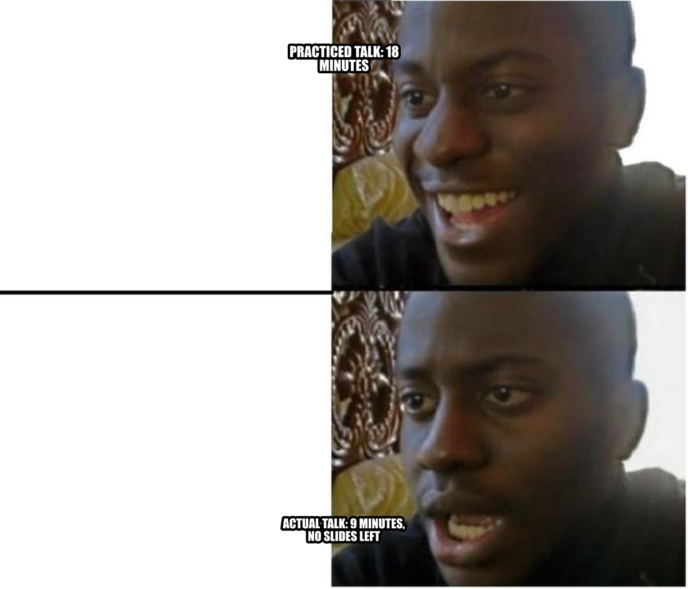

# 28  How to Present

> **TIP:**
>
> **Prerequisites (read first if unfamiliar):** [sec-writing-manuscripts](#sec-writing-manuscripts).
>
> **See also:** [sec-writing-thesis](#sec-writing-thesis), [sec-latex](#sec-latex), [sec-jupyter](#sec-jupyter), [sec-scripts-vs-notebooks](#sec-scripts-vs-notebooks).

## Purpose



A talk is not a paper read aloud. The medium is different, the attention budget is different, and the conventions that work in print fail in front of an audience. Slides full of text put audiences to sleep. Reading from notes turns a fifteen-minute talk into the longest fifteen minutes of the room’s life. Trying to cram every result onto every slide is a recipe for an audience that remembers nothing.

This chapter is a practical guide to designing, rehearsing, and delivering academic talks of the kinds you will actually have to give: a five-minute lightning talk in your first year, a fifteen-minute conference talk, a forty-five-minute job talk, a half-hour thesis-defense presentation, a poster, a lab meeting. The principles transfer across the genres; the specifics adjust. The single best free resource on this material is Patrick Winston’s MIT lecture *How to Speak* ([^1] / video at <https://www.youtube.com/watch?v=Unzc731iCUY>); watch it before you give your next talk.

This chapter, like the others in [sec-writing-manuscripts](#sec-writing-manuscripts) and [sec-writing-thesis](#sec-writing-thesis), is about communication craft. It does not assume you have given a talk before. It does assume you are willing to rehearse.

## Learning objectives

By the end of this chapter, you should be able to:

1.  Identify the genre of presentation you are giving — lightning talk, conference talk, lab meeting, job talk, defense, poster — and design accordingly.

2.  Analyze your audience (technical specialist / technical generalist / general public) and pitch your talk to them.

3.  Apply slide-design principles: high signal-to-noise, large readable type, color and contrast that work for everyone in the room, figures rather than walls of text.

4.  Plan a fifteen-minute conference talk to time, including Q&A.

5.  Rehearse productively, handle Q&A — including hostile questions — and manage nerves.

6.  Adapt a talk for virtual or hybrid delivery.

## Running theme: tell them what they’ll know at the end that they don’t know now — then deliver it (after Patrick Winston)

A talk is a promise. Open with what the audience will know at the end. Spend the middle delivering on that promise. Close by naming what you delivered. Anything else is decoration.

## 28.1 Why talks are not papers read aloud

A reader controls the pace; a listener does not. A reader can re-read a confusing paragraph; a listener cannot. A reader has the figure on the page next to the prose; a listener has whatever you put on the screen. These differences are large enough that the same content needs a different shape for each medium.

A useful rule of thumb: an audience can absorb roughly one new idea per minute of presentation. A fifteen-minute talk has fifteen ideas in it, at most. If your paper has thirty findings, you are not presenting all thirty in fifteen minutes; you are presenting three or four, and the rest can be discussed in Q&A.

Patrick Winston’s *How to Speak* is required viewing because it codifies the heuristics nobody teaches explicitly. Three of his ideas to internalize before reading the rest of this chapter: the *empowerment promise* opener (in the first thirty seconds, tell the audience what they’ll be able to do or understand at the end), the importance of having a clear and memorable *story* the audience can take away, and the idea that the close of a talk should be a *contribution*, not a “thank you, any questions?”

## 28.2 Genres of academic talk

The same talk does not work in every room. The major genres:

**Lightning / 5-minute talk.** One slide per minute, one idea, one figure. The lightning talk is an ad — its job is to get someone interested enough to talk to you afterwards. Don’t try to present a paper in five minutes; pitch it.

**Conference talk (15–20 minutes plus 5 minutes Q&A).** The most common academic talk. Roughly twelve to fifteen slides for a fifteen-minute talk; one minute per slide is a healthy default. The structure mirrors a paper but compressed: motivation, research question, method, results, takeaway. End on the contribution.

**Job talk (45–60 minutes plus 30 minutes Q&A).** A research-narrative talk that ranges across multiple projects. The audience is mixed — some are in your subfield, most are not — and the talk is as much about you as a researcher as it is about any single project. Roughly thirty to forty-five slides. Spend more time on motivation than you would for a conference talk.

**Lab meeting / works-in-progress.** Informal. State at the start what kind of feedback you want — high-level framing, methodological critique, slide-level edits. Lab meetings are where the substantive critique happens before a paper goes to review; they are also where you find out you have been describing the project wrong all along.

**Poster.** A self-contained argument that can be read without you, but is much better with you. The poster is structured like a paper compressed onto one page: motivation, method, key result, takeaway. Big text. Few words. One or two figures that carry the argument. Spend most of your time at the poster talking to one person at a time, not standing back from it.

**Thesis defense (30–45 minutes presentation, 60–90 minutes Q&A).** A defense is a conversation with your committee, who has read the document. The presentation summarizes; the Q&A is the substance. Surprises are rare if your advisor has done their job.

## 28.3 Audience analysis

Before you draft a slide, name your audience. Three clean cases.

**Specialists in your subfield.** They share your jargon, your citations, your sense of what matters. You can move quickly through motivation; you should spend more time on novel methods and contributions. Be careful: even specialist audiences do not all share the same sub-sub-specialty. The reviewer-2 question in your audience is real.

**Technical generalists.** A CS or information-science department audience: technical, quantitative, but spanning HCI, ML, theory, systems, and more. The most common job-talk audience. Define jargon the first time you use it. Spend more time on motivation. Use figures with numbers labeled clearly. Make your contribution legible to someone who doesn’t read your venue’s papers.

**General audiences.** Undergraduates, the public, family. Drop the jargon entirely. Use analogies. The contribution has to be expressed without specialist vocabulary. This is harder than it looks, and a useful exercise even when you are not giving a public talk — if you can’t explain your work to an undergraduate, you don’t yet understand it.

## 28.4 Slide design

This is the longest section of the chapter because it is where the most preventable mistakes happen.

**Signal-to-noise ratio.** Every element on a slide either carries information or distracts from it. Distracting elements include: decorative clip art, busy templates, footers with the talk’s title on every slide, page numbers, and your university’s full logotype on every slide. Edward Tufte’s critique of PowerPoint ([^2]) is short and worth reading; the core idea is that the medium pushes you toward bullet lists at the expense of evidence.

**One idea per slide.** A slide should be readable in five seconds and take one minute to talk through. The heading should be a full sentence that states the takeaway — not “Results” but “Civility increased by 18% in the month after the policy change.” The audience should remember the heading even if they remember nothing else.

**Type.** Minimum 24 point. Aim for 30 point or larger for body text. Sans-serif fonts project better. If you are pasting in a figure with axis labels, make sure the labels are readable from the back of the room. The single most common slide problem is type that is too small.

**Color and accessibility.** Aim for contrast ratios that work on a projector and for audience members with color vision deficiencies. WCAG-style 4.5:1 contrast is a usable target. Use colorblind-safe palettes — ColorBrewer ([^3]) and Viridis are the go-to defaults. Where color encodes meaning, also use shape or pattern, so the slide remains legible if someone can’t distinguish the colors.

**Figures over text.** The strongest slides are a figure with a sentence-long heading and one or two annotation labels. The weakest are five bullet points read aloud verbatim. If you must show text, make it parsimonious: a single sentence, a short quote, three terse bullets at most.

**Builds and animations.** Use sparingly. A single build that reveals a curve being added to a chart is good. A spinning logo is bad. Animations should serve the argument; if removing them doesn’t change what the audience understands, remove them.

Two excellent books on slide craft if you want more: Garr Reynolds, *Presentation Zen* ([^4]), and Nancy Duarte, *slide:ology* ([^5]). Both argue for high-image, low-text slides; both have many examples.

## 28.5 Structuring a fifteen-minute talk

A workable shape for a fifteen-minute conference talk:

- *Minute 0–1: Empowerment promise.* What will the audience know at the end?
- *Minutes 1–3: Motivation.* Why this question matters. One memorable example.
- *Minutes 3–4: Research question.* The question, stated cleanly.
- *Minutes 4–7: Method.* What you did, at a level the audience can follow.
- *Minutes 7–12: Results.* Two or three findings. One main figure per finding.
- *Minutes 12–14: Discussion / takeaway.* What this means for the field. Limitations briefly.
- *Minutes 14–15: Contribution.* End on the contribution slide, not “thank you, any questions?”

Build in two minutes of slack. You will go over otherwise.

## 28.6 Practicing

Talks improve linearly with rehearsal up to a point and quickly past it. The minimum useful rehearsal regimen:

- Out loud. On your feet. With your slides.
- Time yourself. Aim ten to twenty percent under the limit; you will go over in the room.
- Record yourself once and watch it. This is painful and very useful. You will discover verbal tics you didn’t know you had, and you will see whether your slides land.
- Practice in front of one human at least twice. Their feedback is more honest than your own self-review.
- Practice the *transitions* between slides; that is where most talks break down. The clean version of a transition is a single sentence — “Now that we have the method, let’s look at the results” — that primes what’s coming.

Rehearsal stops being useful once your transitions are smooth and your timing is reliable. Beyond that, more rehearsal makes the talk stiffer, not better.

## 28.7 Handling Q&A

Q&A is half the assessment in a talk. Three rules.

**Repeat the question.** Buys you a few seconds, ensures the audience heard it, and gives the questioner a chance to clarify if you misheard.

**“I don’t know” is a valid answer.** So is “that’s outside the scope of this work but it is a good question for future work.” Specialists prefer honest “I don’t know” to bluffing.

**Hostile questions: assume good faith publicly.** Even when the question lands harshly, respond to the strongest reasonable version of it. If the questioner was being aggressive, the audience will see that more clearly when you are calm. If the questioner had a real concern under the aggression, addressing it earns you respect.

There is a fourth, less famous rule: **land the plane.** Some questioners do not actually have a question; they have a comment that turns into a five-minute statement. When this happens, you can interrupt politely — “Let me see if I can address what I think you’re asking” — and turn it back into a question. The chair of the session will appreciate it.

## 28.8 Nerves

Nerves are normal. They do not go away with experience; experienced presenters have learned to use the energy. Two practical tools.

*Cognitive reframing.* The physiological state of anxiety is the same as the physiological state of excitement — racing heart, shallow breath, attention narrowing. Telling yourself “I am excited” instead of “I am nervous” actually changes how you feel. There is psychology research on this; for our purposes, it works.

*Box breathing.* Before the talk, slow your breathing: four seconds in, hold four, four out, hold four. Repeat for a minute. This activates the parasympathetic nervous system and reduces the cortisol spike.

The first thirty seconds are the hardest. Memorize the opening sentence cold. After the first minute, the talk usually carries you.

## 28.9 Virtual and hybrid talks

Virtual talks are now common enough to design for explicitly.

*Camera at eye level.* Stack books under your laptop if you have to. A camera looking up at you from a desk is unflattering and reads as informal.

*Look at the camera, not the participants.* The audience experiences eye contact when you look at the lens. This feels unnatural at first.

*Single window.* Close your inbox, your chat, everything. Treat the call like a stage.

*Backup slides as PDF.* Screen-sharing fails. Have a fallback.

*Mute everything.* Notification sounds during a talk are excruciating.

For hybrid talks, plan for both audiences. Design slides that work on a projector *and* over Zoom — type sized for the room, contrast that survives screen compression. Ask a co-organizer to monitor remote Q&A so you don’t have to split your attention.

## 28.10 Tooling

The tools matter less than which one you’ll actually use; consistency across talks beats any individual tool’s features.

- **Beamer** (LaTeX, see [sec-latex](#sec-latex)). Strong for math-heavy talks; the `metropolis` theme produces clean modern decks.
- **Quarto Reveal.js** ([^6]). Excellent if you live in Quarto already and want code-and-output slides; integrates with [sec-jupyter](#sec-jupyter) and [sec-scripts-vs-notebooks](#sec-scripts-vs-notebooks) workflows.
- **Keynote / PowerPoint / Google Slides.** What most non-academics use. Fine. Pick the one your collaborators use.

If you already know one tool well, do not switch tools the week before a job talk. The tool is the smallest of your problems.

## 28.11 Stakes and politics

Conference talks and job talks are the most visible labor in academic life and the most uneven in who can do them. Three things to notice. First, *the venue assumes a profile*. Most major conferences expect international travel, a passport that grants visas to the host country, two or three days of childcare coverage, hotel-grade housing prices, and the time and money to make all of that work; remote and hybrid options remain partial substitutes at best. Scholars from countries with weaker passports, scholars with caregiving responsibilities, scholars with disabilities the venue did not plan for, and scholars without travel funding are routinely absent from the rooms where their work would have landed.

Second, *Q&A culture rewards a particular style*. The fast, confident, sometimes combative questions that academic Q&A normalizes work against people with social anxiety, against non-native English speakers, against speakers from cultures where directness reads as rudeness, and against anyone who needs more than a beat to gather a careful answer. The skill of “responding well” is partly real (clarity, focus) and partly cultural (volume, speed, rhetorical performance), and conflating the two reads quiet people as unprepared. Third, *slide design assumes resources*. The “professional” deck the field rewards — clean type, well-chosen palettes, intentional figures — is partly skill and partly access to design tools, time, and feedback. Speakers without those resources are read as less serious in ways that are not actually about the work.

See [sec-artifacts-politics](#sec-artifacts-politics) for the broader framework. The concrete prompt to carry forward: when you give a talk, you are participating in an unevenly accessible system; when you ask a question, design a session, or chair a panel, you have a small lever to make it more accessible.

## 28.12 Worked examples

### A 15-minute conference-talk slide-by-slide outline

A hypothetical CHI talk on “Civility After Moderation Policy Changes.” Twelve slides, fifteen minutes, contribution at the end.

| \# | Heading (full sentence) | Time | Notes |
|----|----|----|----|
| 1 | Title slide | 0:30 | Title, authors, venue, no clutter. |
| 2 | When a subreddit changes its rules, what happens to civility? | 1:00 | Empowerment promise. State what we’ll know at the end. |
| 3 | Volunteer moderators run most of Reddit. We don’t know if their policy changes work. | 2:00 | Motivation, with one memorable example. |
| 4 | We study one policy change, with a matched comparison community. | 1:30 | Research question and design at a glance. |
| 5 | Difference-in-differences with two civility measures. | 2:00 | Method, on one slide. One diagram. |
| 6 | Civility rose by 18% in the treated community over four weeks. | 2:00 | Main result. Single big chart. |
| 7 | The off-the-shelf classifier missed half the change. | 2:00 | Second result. Side-by-side. |
| 8 | The community-grounded annotation captured what the classifier missed. | 1:00 | Third result, brief. |
| 9 | Off-the-shelf classifiers underestimate community-specific norms. | 1:00 | Discussion, one takeaway. |
| 10 | Limitations and one-site scope. | 0:30 | Honest, brief. |
| 11 | Three contributions: measurement, method, replication-ready release. | 1:00 | Contribution slide — closer. |
| 12 | “Thanks — let’s discuss” with a memorable image. | 0:30 | Q&A invitation. |

Total: ~15 minutes with two minutes of slack.

### Before/after slide redesign

*Before.* A slide titled “Findings” with five bullet points, each a full sentence, twelve-point font, university logo in the top-right, page number in the corner, and a faint watermark of the lab name across the background.

*After.* A slide whose heading reads “Civility rose by 18% in the four weeks after the policy change.” The body of the slide is a single line chart with two lines (treated, comparison), a vertical dashed line at the policy-change date, and labeled axes. No watermark, no logo, no page number. Below the chart, two short labels next to the lines.

The before slide says: “here is everything I want you to remember.” The after slide says: “remember this one number.” The audience cannot remember everything. They can remember 18%.

### A Q&A reply to a hostile question

*Question (from the audience):* “I’m not convinced your effect is real. Couldn’t this just be a regression to the mean? Did you do any kind of placebo test?”

*Reply:* “Thanks for the question. To make sure I understand: you’re asking whether the change we observed could be an artifact of the comparison community drifting on its own, rather than a real treatment effect. That’s a fair concern. We did a falsification test in the appendix — Figure A2 — where we ran the same DiD specification on a placebo intervention date six months earlier in the same community. We found no effect at the placebo date, which we take as evidence that what we’re seeing in the main analysis isn’t generic drift. Happy to walk through that figure offline.”

The reply does three things. It restates the question — naming the concern (regression to the mean / drift) — so the room is on the same page. It points to the specific evidence that addresses the concern. It offers to continue the conversation offline. The audience hears the answer; the questioner does not have a runway for a follow-up that could derail the session.

## 28.13 Templates

A conference-talk slide-deck outline (paste into your slide tool’s notes):

``` markdown
# {Talk title}

Audience: {specialist | generalist | general}
Length: 15 min talk + 5 min Q&A
Slide count: 12

1. Title.
2. Empowerment promise: at the end you'll know X.
3. Motivation.
4. Research question.
5. Method.
6. Result 1 (main).
7. Result 2.
8. Result 3 (brief).
9. Discussion / takeaway.
10. Limitations.
11. Contribution.
12. Thanks.
```

A timing budget:

| Format     | Talk      | Q&A       | Slides |
|------------|-----------|-----------|--------|
| Lightning  | 5 min     | 0–2 min   | 5–7    |
| Conference | 15–20 min | 5 min     | 12–18  |
| Job talk   | 45–60 min | 30 min    | 30–45  |
| Defense    | 30–45 min | 60–90 min | 25–35  |

A pre-talk checklist:

Slides on laptop and as PDF backup on USB.

Adapter for the projector (HDMI / USB-C / VGA — verify).

Clicker tested.

Water within reach of the lectern.

Phone on silent (not vibrate — vibrate is louder than silent on a wooden lectern).

Notifications off on the laptop.

Speaker notes printed or on a separate device.

First sentence memorized cold.

## 28.14 Exercises

1.  Take an existing slide deck (yours, or a public one) and rate every slide on a 0–3 signal-to-noise scale. Redesign the three worst slides.
2.  Plan and rehearse a five-minute lightning talk on a project of yours. Record yourself; watch it back; identify three concrete improvements.
3.  Workshop a peer’s slides using the principles in this chapter. Give them five specific edits.
4.  Watch the Patrick Winston *How to Speak* video and write a one-page reflection on which heuristics you will adopt for your next talk.

## 28.15 One-page checklist

- Did you name the audience and pitch to them?
- Does slide one make an empowerment promise?
- Is every heading a full sentence with the takeaway?
- Is body type at least 24 points?
- Are colors colorblind-safe and projector-readable?
- Do figures carry the argument, not bullet lists?
- Did you rehearse out loud, on your feet, with the slides?
- Did you time yourself, with two minutes of slack?
- Do you have a backup PDF on USB?
- Does your closing slide name the contribution?

## 28.16 Quick reference: timing across formats

| Format     | Talk      | Q&A       | Slides |
|------------|-----------|-----------|--------|
| Lightning  | 5 min     | 0–2 min   | 5–7    |
| Conference | 15–20 min | 5 min     | 12–18  |
| Job talk   | 45–60 min | 30 min    | 30–45  |
| Defense    | 30–45 min | 60–90 min | 25–35  |

> **NOTE:**
>
> - Patrick Winston, [How to Speak (MIT OCW)](https://ocw.mit.edu/courses/res-tll-005-how-to-speak-january-iap-2018/) and the [video](https://www.youtube.com/watch?v=Unzc731iCUY) — the canonical lecture on academic talks; one hour of the highest-leverage advice on the topic.
> - Edward Tufte, [The Cognitive Style of PowerPoint](https://www.edwardtufte.com/tufte/powerpoint) — short, opinionated essay on bullet-point culture; required reading before any deck-heavy talk.
> - Garr Reynolds, [*Presentation Zen*](https://www.presentationzen.com/) — the standard reference for slide design built around one idea per slide.
> - Nancy Duarte, [*slide:ology*](https://www.duarte.com/books/slideology/) — design-grounded guidance on visual hierarchy, typography, and storytelling in slides.
> - Cynthia Brewer, [ColorBrewer](https://colorbrewer2.org/) — research-backed color palettes for charts and slides; the right starting point when you are picking categorical or sequential colors.
> - W3C, [Web Content Accessibility Guidelines (WCAG 2.2)](https://www.w3.org/TR/WCAG22/) — the standard for accessible content; useful for slide contrast, alt text, and caption practices.
> - ACM SIGACCESS, [Accessible presentation guide](https://www.sigaccess.org/welcome-to-sigaccess/resources/accessible-presentation-guide/) — practical guidance for accessible talks (captioning, microphones, alt text); addresses the access gap raised in “Stakes and politics” above.

[^1]: <https://ocw.mit.edu/courses/res-tll-005-how-to-speak-january-iap-2018/>

[^2]: <https://www.edwardtufte.com/tufte/powerpoint>

[^3]: <https://colorbrewer2.org/>

[^4]: <https://www.presentationzen.com/>

[^5]: <https://www.duarte.com/books/slideology/>

[^6]: <https://quarto.org/docs/presentations/revealjs/>
