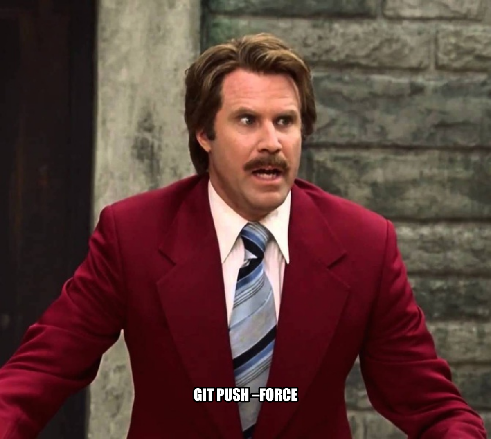

# 31  Version Control

> **TIP:**
>
> **Prerequisites (read first if unfamiliar):** [sec-terminal](#sec-terminal).
>
> **See also:** [sec-collaboration](#sec-collaboration), [sec-automation](#sec-automation), [sec-project-management](#sec-project-management), [sec-writing-manuscripts](#sec-writing-manuscripts), [sec-writing-thesis](#sec-writing-thesis), [sec-latex](#sec-latex).

## Purpose



Version control is the safety system for technical work. [Git](https://git-scm.com/doc) records a history of changes so you can recover, compare, and collaborate without overwriting each other. [GitHub](https://docs.github.com/en) adds shared hosting, review workflows, and discussion tools. This chapter teaches novice-friendly Git fundamentals and the everyday GitHub workflows students need: pushing and pulling, branches and merges, pull requests, forks, and review/commenting practices.

## Learning objectives

By the end of this chapter, you should be able to:

1.  Explain what version control is and why Git is “distributed.”

2.  Create or clone a repository and make clean commits.

3.  Understand the working tree, staging area, and commit history.

4.  Use branches for features/fixes and merge changes safely.

5.  Work with remotes (`origin`, `upstream`) and synchronize using fetch/pull/push.

6.  Use GitHub to open a pull request, respond to feedback, and merge.

7.  Resolve common merge conflicts with a disciplined playbook.

8.  Use forks for contributing to projects you do not control.

9.  Write good commit messages and PR descriptions; comment constructively in reviews.

## Running theme: make changes small, reviewable, and reversible

A healthy Git workflow favors small commits, small pull requests, clear messages, and frequent synchronization.

## 31.1 Mental models and vocabulary

A **repository** is your project folder plus a hidden `.git` directory inside it. Everything Git knows about your project — every commit, every branch, every author, every file at every point in time — is stored in `.git`. Delete the directory, and you have a regular folder with no version control. Keep it, and you have a complete history you can rewind to.

A **commit** is a snapshot of every tracked file in the repository at a specific moment, plus a small bundle of metadata: the author, the time, the commit message you wrote, and a unique identifier (the SHA hash) that names this specific snapshot forever. Commits are the unit of history. They are how you say “this is the state of the project right now, save it.”

``` bash
$ git log --oneline -3
8b73ab1 Part I: convert outline bullets to narrative prose
185d03f Part II: convert outline bullets to narrative prose
c127108 Merge pre-commit chapter into automation
```


Figure 31.1: ALT: GitHub repository page showing the Code tab, the list of top-level files, and the README rendered underneath. The navigation tabs (Code, Issues, Pull requests, Actions) are visible along the top of the page.

> **WARNING:**
>
> A rejection almost always means **the remote has commits you do not have locally** — someone else pushed to the same branch before you. Run `git fetch origin` to see what changed, then `git pull --rebase origin <branch>` to replay your commits on top of theirs. If that produces conflicts, resolve them in the marked files, `git add` the resolved files, and continue the rebase with `git rebase --continue`. Once the rebase finishes cleanly, `git push` will work.
>
> If you see “non-fast-forward” on a branch no one else should be pushing to, check that you are on the right branch (`git branch` shows the current one with an asterisk) and that you are pushing to the right remote (`git remote -v`). Never “fix” a rejection with `git push --force` unless you understand exactly which commits you are about to overwrite. See [sec-asking-questions](#sec-asking-questions) if you need help.


Figure 31.2: ALT: GitHub pull request page showing the diff view with red removed lines and green added lines side by side, plus a reviewer comment thread anchored to a specific line.

Git history is not a single straight line — it is a graph. Branches diverge and merge back together, and the same project can have many parallel lines of work in flight at once. Once you internalize that mental picture, the rest of Git makes more sense.

There are three zones any file moves through on its way into history. The **working tree** is the version of the file as it exists on disk right now — what you see when you open it in your editor. The **staging area** (also called the *index*) is the set of changes you have explicitly told Git you intend to include in your next commit. And the **commit** is the saved snapshot in history once you actually run `git commit`. Edits land in the working tree first; `git add` promotes them to staging; `git commit` turns staging into a commit.

``` text
edit file        →  working tree
git add file     →  staging area
git commit       →  history
```

A **branch** is a movable pointer that names one specific commit (and, by extension, the entire history leading up to it). Branches are cheap — creating one is essentially free, since Git just records “the name `feature-x` points at this commit.” That cheapness is what enables the standard workflow of “make a branch for every change, no matter how small.” Use branches; they are not heavy ceremony.

A **remote** is another copy of the repository hosted somewhere else — usually on GitHub. The conventional name for the default remote is **origin**, which is just a short label for “the GitHub repository this clone came from.” When you also have a fork relationship, you typically add a second remote called **upstream** that points at the original repository you forked. The local copy on your computer can talk to multiple remotes, and `git push`, `git pull`, and `git fetch` all take a remote name as an (often implicit) argument.

A **pull request** (PR, sometimes called a *merge request* on GitLab) is GitHub’s mechanism for proposing that one branch be merged into another. A PR is not a Git concept — it is a GitHub feature layered on top of Git — but it is where most collaborative decisions actually happen: you push a branch, open a PR, your teammates comment on the diff, you respond and revise, and eventually someone clicks Merge. PRs are how teams make changes *visible* before they land.

## 31.2 Why version control matters for student data work

### Use cases

The most immediate payoff of version control is **recovery from mistakes**. You delete a file by accident, or you rewrite a function and realize two hours later that the old version was right. Without Git, those mistakes are permanent — or at least they cost you however long it takes to retype everything. With Git, you run `git checkout` or `git restore` and the old version comes back exactly as it was. That safety net alone is worth learning the tool, even for solo projects.

Beyond recovery, version control gives you a clear answer to *“what changed, and when?”*. Every commit has an author, a timestamp, and a message explaining why the change was made. A week from now, when you open a file and wonder why on earth a certain line looks the way it does, `git log` and `git blame` tell you exactly who wrote it and what commit introduced it. On a team, this is how you avoid silently trampling each other’s work: everyone’s edits live in tracked history instead of whatever version happened to be emailed around last.

The third reason, which matters most for coursework and research, is **audit trail**. Your commit history is a record of decisions — *“switched from mean to median imputation here, see issue \#42”*, *“fixed the off-by-one error in the date parser”*. Six weeks later, when you are writing up your results or answering a reviewer’s question, that history is how you reconstruct what you did and why. It is also how you *prove* to a collaborator, instructor, or future employer that your work is yours.

### What to version and what not to version

As a rule, version everything that is **small, textual, and authored by you or your team**: source code, notebooks (with the discipline described in the data-science section below), Markdown documentation, configuration files like `requirements.txt` and [`.gitignore`](https://git-scm.com/docs/gitignore), and small reference data that your scripts read. These files are the project — if you lost them, you would have to rewrite them. Git’s line-by-line diffing works beautifully on text, and the storage cost is negligible.

Do **not** version a short, specific list of things. **Secrets and credentials** — API keys, database passwords, `.env` files — should never be committed; once they land in history they are effectively published, even if you delete the file later (see [sec-secrets](#sec-secrets) for why, and how to recover if it happens). **Large raw datasets** — anything bigger than a few megabytes — belong in cloud storage or a shared drive with a clear retrieval script, not inside your repository; Git is not a data store, and a multi-gigabyte CSV will make every `git clone` slow forever. **Generated artifacts** — compiled binaries, cached model files, HTML output, `__pycache__` directories — should be reproducible from your code, which means they do not need to be versioned; `.gitignore` is where you list them. And **environment folders** — `.venv/`, conda env directories — are enormous, machine-specific, and should never be committed; the environment spec (`requirements.txt`, `environment.yml`) is the thing that goes in Git.

## 31.3 Getting started: create or clone

### Initialize a repository (local)

When you are starting a project from scratch — a blank folder, no code yet — `git init` turns that folder into a Git repository. Run it inside the directory you want to track, and Git creates the hidden `.git/` folder that stores all your history. Before your first commit, add two files that every project should have from day one: a `README.md` that explains what the project is, and a `.gitignore` that tells Git which files to *never* track (see `Special considerations for data science projects` below for a starter `.gitignore`).

``` bash
mkdir housing-audit && cd housing-audit
git init
# ... create README.md and .gitignore ...
git add README.md .gitignore
git commit -m "Initialize repository"
```

Making those two files your *first* commit matters more than it sounds. It establishes the project’s intent in writing, and it ensures the `.gitignore` is active before you accidentally commit a `.venv/` folder or a 2 GB dataset. Do not skip this step with the promise of “I’ll add the README later” — later never comes, and by the time you remember, your commit history is cluttered with junk.

### Clone an existing repository

When a course, lab, or open-source project gives you starter code, you do not initialize — you **clone**. `git clone` downloads the entire repository, including every commit in its history, into a new folder on your computer.

``` bash
git clone https://github.com/course-org/ds101-starter.git
cd ds101-starter
```

What you get is a *full* copy, not just a snapshot of the current state. That is what “distributed version control” means: your clone is a complete, self-contained repository with the entire history, not a thin reference to a server. You can work offline, inspect old commits, create branches, and even reconstruct the project if the server disappears. The trade-off is that cloning a repository with a lot of history (or a lot of committed binary files) can be slow and take real disk space — which is one more reason not to commit large files.

### First-time setup (identity and defaults)

Before your first commit on a new machine, tell Git who you are. Git stamps every commit with an author name and email, and if you skip this step you will either get an error on your first commit or — worse — end up with a history full of commits attributed to `root@your-laptop`.

``` bash
git config --global user.name "Your Name"
git config --global user.email "you@example.edu"
git config --global init.defaultBranch main
```

Use the same email address you use on GitHub (or the email your course instructor expects), so commits made locally are correctly associated with your online account. The `init.defaultBranch main` line sets the name of the default branch in every new repository you create; `main` is the modern convention and matches what almost every course and open-source project uses today. These settings live in `~/.gitconfig` and only need to be run once per machine.

## 31.4 Daily Git workflow (the minimum viable loop)

The healthy daily loop is the same handful of commands repeated over and over: see what changed, stage what you want, commit it with a clear message, and sync with the remote. Once this loop is automatic, the rest of Git becomes much less intimidating.

The first move when you sit down to commit is always to check **what changed** since your last commit. `git status` tells you which files have been modified, added, or deleted. `git diff` shows the actual line-by-line changes inside those files. Read both before you commit anything — committing without looking at the diff is how you accidentally include debugging print statements, hard-coded passwords, or unrelated experiments.

``` bash
$ git status
On branch main
Changes not staged for commit:
  modified:   src/cleaning.py
  modified:   notebooks/analysis.ipynb

$ git diff src/cleaning.py
@@ -12,7 +12,7 @@ def clean_sales(df):
-    df = df.dropna()
+    df = df.dropna(subset=["customer_id"])
```

Once you have decided what you want to commit, **stage it intentionally**. The smallest coherent change is the right unit — one logical idea per commit. If your working tree contains both a bug fix and an unrelated rename, stage them as two separate commits, not one. The tool for this is `git add` (or `git add -p` for the interactive “stage this hunk, skip this hunk” experience), and the discipline is to think about each file before you stage it rather than reflexively running `git add .`.

Then **commit with a meaningful message**. A good commit message is a short summary line in the imperative mood — *“Add data intake checks”*, not *“Added data intake checks”* and not *“changes”*. If the change deserves more explanation, leave a blank line after the summary and then a paragraph or two of context: what the change does, why it was needed, and any subtleties a reader might miss.

``` bash
git commit -m "Add data intake checks for missing customer_id"
```

Finally, **sync with the remote**. Push your work so it is backed up to GitHub and visible to your collaborators. Pull (or `git fetch` followed by `git merge`) before you start a new piece of work, so your local copy reflects whatever your teammates have been doing. Frequent small pushes and pulls are dramatically less painful than one giant sync at the end of the week.

``` bash
git push                # send your commits to origin
git pull                # fetch and merge the remote into your branch
```

That is the entire daily loop: status, diff, add, commit, push, pull. Master those six and you have most of what version control gives you.

## 31.5 Branches and merges (collaboration without chaos)

### Why branches

Branches exist so that work in progress does not contaminate the version of the project that everyone else depends on. The idea is simple: `main` is the branch that always works. Every new feature, every bug fix, every experiment, happens on its own short-lived branch. You make your changes, you test them, you open a pull request, it gets reviewed, and only then does the work land on `main`. Anyone who clones the project at any time gets a working copy — no half-written functions, no broken imports.

The second reason branches matter is **isolation**. Two people can work on two different features simultaneously without stepping on each other’s toes, because their commits live on separate branches. When both are ready, Git merges them together — and if they touched the same lines, Git tells you about the conflict instead of silently choosing a winner. Without branches, parallel work on a shared file is a recipe for lost changes. Branches also let you experiment safely: create a branch called `try-new-parser`, make a mess, and if it does not pan out, just delete the branch. Nothing on `main` was ever at risk.

### A standard branch workflow

The workflow for almost every change, from a one-line typo fix to a multi-day feature, is the same five-step loop:

1.  **Update `main`** with `git switch main && git pull` so you start from the latest version.
2.  **Create a new branch** with a descriptive name — `fix-date-parser`, `add-missing-tests`, `issue-42-cleanup-nulls` — so teammates (and future-you) can tell what is in it.
3.  **Make commits on that branch**, one logical change at a time, following the daily Git loop above.
4.  **Open a pull request** on GitHub as soon as there is something to discuss, even if the work is not finished (draft PRs are for exactly this).
5.  **Merge after review**, once at least one other person has looked at the diff and tests pass.

``` bash
git switch main
git pull
git switch -c fix-date-parser
# ... edit files, run tests ...
git add src/parsers.py tests/test_parsers.py
git commit -m "Fix date parser off-by-one for February"
git push -u origin fix-date-parser
# Then open a PR on GitHub.
```

The `-u` flag on your first push tells Git “from now on, this local branch is linked to this remote branch”, so subsequent `git push` and `git pull` commands do not need the branch name.

### Merge vs rebase (novice policy)

When you are ready to integrate your branch with `main`, Git gives you two strategies. A **merge** creates a new commit — the *merge commit* — that ties the two branches together and preserves the full history of what each branch did in parallel. A **rebase** rewrites your branch’s commits so they appear to have been created *on top of* the latest `main`, producing a linear history with no branch points. The result is cleaner-looking but the history is edited: the commit hashes change, and the original order of events is gone.

For student work, use **merges** by default. Merges are easier to reason about, they never rewrite commits anyone else might have pulled, and the “cluttered” history they produce is not actually a problem — it is an honest record of how the work happened. Rebase is a powerful tool once you understand it, but it has sharp edges (`git rebase` on a branch that other people have already pulled can destroy their work), and the handbook’s advice is to defer that skill until a specific project policy asks for it. If your instructor or team prefers rebase-and-merge, follow their policy; otherwise, stay with merges.

### Undo safely (intro)

Git gives you several “undo” commands, and the important thing is that they undo different things at different stages. If you edited a file and have not staged or committed it, you want `git restore <file>` to throw away the unsaved edits and bring back the last committed version. If you already staged a change with `git add` but want to unstage it, `git restore --staged <file>` puts it back into the working tree without losing your edits. If you already committed something and want to undo the commit while keeping the changes around, `git reset --soft HEAD~1` moves the branch pointer back one commit and leaves your work in the staging area.

``` bash
git restore src/broken.py            # throw away unstaged edits
git restore --staged src/broken.py   # unstage without losing edits
git reset --soft HEAD~1               # undo last commit, keep changes
```

The rule that matters most when you are undoing things is this: **prefer “make a new commit that fixes it” over “rewrite history.”** If the problematic commit has already been pushed to a shared remote, rewriting history with `git reset --hard`, `git rebase`, or `git push --force` can delete work that your teammates have already pulled. Instead, write a new commit that reverses the mistake (`git revert <sha>` does this for you automatically), push it normally, and leave the original in the history. It is uglier but safe. History rewriting is a tool for branches no one else is looking at yet.

> **WARNING:**
>
> Never run `git push --force` on `main` or any branch your teammates share. If you genuinely need to rewrite history on your own feature branch, use `git push --force-with-lease`, which refuses to overwrite if someone else has pushed in the meantime. On a shared branch, force-pushing is how you erase a collaborator’s work.

## 31.6 Remotes: fetch, pull, push

### What these commands do conceptually

Three commands move work between your local repository and a remote one, and it helps to understand exactly what each one does. `git fetch` downloads the latest commits from the remote into your local copy, but it **does not change the files in your working tree**. It is the safest of the three: fetch, look at what came in, then decide what to do with it. After a fetch, you can run `git log main..origin/main` to see exactly which new commits the remote has that you do not.

`git pull` is `git fetch` followed by a merge into your current branch. It is the convenient one-stop command you will use most of the time, but it is not magic — if the remote has changes that conflict with yours, `pull` will drop you into a merge conflict just like any other merge. `git push` goes the other direction: it uploads your local commits to the remote so other people can see them and so your work is backed up. Push only affects the branch you are currently on, and only uploads commits the remote does not already have.

``` bash
git fetch origin               # see what is on the remote without merging
git pull                       # fetch + merge into current branch
git push                       # upload current branch's commits to origin
```

### The drift problem

On a team, multiple people are pushing to `main` every day. If you branched off `main` on Monday and do not look at it again until Friday, your local copy is now four days behind the world. This is “drift,” and the longer you let it accumulate, the worse your eventual merge conflict becomes. Someone renamed the function you depend on; someone else restructured a file you were about to edit; the test you were writing now depends on an API that no longer exists.

The habit that prevents drift is simple: **pull before you start new work, and push small, complete units often**. Specifically, run `git pull` on `main` before every new branch, rebase or merge `main` into your long-lived feature branch at least once a day, and push your commits as soon as they are coherent. Small, frequent synchronizations mean every conflict is small. A once-a-week “catch-up” sync is where the scary merge conflicts live.

## 31.7 GitHub fundamentals

### Repository anatomy on GitHub

A GitHub repository page has several tabs, and each one is a different surface your team uses for a different job. **Code** is the file browser — the current state of the default branch, with a rendering of the README at the bottom. **Issues** is where bugs, tasks, and open questions live; it is the project’s to-do list and discussion forum. **Pull Requests** is where proposed changes are reviewed and merged. **Actions** is where automated workflows run on every push ([sec-automation](#sec-automation) covers GitHub Actions and CI in depth). **Releases** is where you publish tagged, named versions of your project that other people can download and cite.

The single most important file in any repository is the **README**, because it is the front door. When someone lands on your repository for the first time — a classmate, a reviewer, a potential employer, or future-you — the README is what tells them what the project is, how to install it, and how to run it. If the README is missing or stale, every other tab is less useful because readers have no orientation. Invest in the README first and maintain it as part of the work (see [sec-project-management](#sec-project-management) for what a good README contains).

### Pull requests: the core collaboration primitive

A pull request is a proposal: “I would like these commits from this branch to become part of this other branch.” Mechanically, a PR bundles together three things — the commits you made, the file-level diff those commits produce, and the discussion thread where reviewers and the author work out whether the change should merge. All three live on the same page, which is why PRs are the natural place for code review.

Two habits make PRs actually work. First, **open a draft PR early**, even before the code is finished, if you want feedback on the approach. A draft PR signals “do not merge this yet, but please comment.” Second, **keep PRs small and focused on a single idea**. A PR that touches 30 files across three unrelated changes is almost impossible to review meaningfully — reviewers will skim and rubber-stamp, or they will refuse. A PR that touches five files for one clear purpose gets read carefully and merged quickly.

### PR merge strategies (team policy)

GitHub offers three ways to merge a PR, and each produces slightly different history. **Merge commit** preserves every commit on the branch and adds a merge commit tying them into `main` — the most honest record of how the work happened. **Squash-and-merge** flattens all the PR’s commits into a single commit on `main`, which keeps `main`’s history linear and clean but loses the fine-grained steps. **Rebase-and-merge** replays each commit onto `main` as if they had been written there directly, producing a linear history with the original commits preserved but without a merge commit.

There is no “best” strategy — each has trade-offs. The important thing is to **pick one and be consistent within a repository**. Mixing strategies across PRs makes the history confusing. For student projects, squash-and-merge is a reasonable default because it means sloppy work-in-progress commits on a branch become a single clean commit on `main`. Whatever the policy is, you usually configure it once in the repository settings on GitHub, and then every PR uses it.

### Reviews and commenting best practices

Good review comments share three traits: they point to a specific line or region, they explain the *why*, and they propose a concrete direction. “This is wrong” is useless; “This assumes the column is never null, but the source data has about 3% nulls, so this line will crash on real input — consider adding a dropna or fillna before this step” is actionable. Aim for that level of specificity on every comment you leave.

It also helps reviewers and authors to tag the *kind* of feedback a comment is. A simple taxonomy — **Blocker** (must fix before merge, correctness or security), **Suggestion** (a better alternative, non-blocking), **Question** (asking the author to clarify intent), **Nit** (a minor style or naming point, explicitly non-blocking) — lets the author know what actually has to change before the PR can merge versus what is opinion. When you are the author responding to reviews, always reply to each thread explicitly: either “changed in commit abc123” or “kept as-is because…” so the reviewer can see the loop closed. Chapter [sec-collaboration](#sec-collaboration) has more on this.

### Linking work: issues \\\leftrightarrow\\ PRs

GitHub notices when you reference an issue number in a PR description, a commit message, or another issue’s comments, and it automatically creates a link between them. Take advantage of this: every PR should reference the issue(s) it addresses, and every issue should be closed with a summary that links to the PR that resolved it. That cross-referencing turns the repository into a searchable, navigable history of *why* changes were made, not just *what* they were.

``` markdown
## Summary
Fix the off-by-one in the date parser so February rolls over correctly.

Closes #42.
```

The magic words — `Closes #42`, `Fixes #42`, or `Resolves #42` — will cause GitHub to automatically close issue \#42 when the PR is merged. That single line is how you keep the issue tracker honest without any manual bookkeeping.

## 31.8 Forking workflow (contributing without direct write access)

### Fork vs clone

Forking and cloning sound similar but do different things. **Cloning** downloads a repository to your computer — it is a local-vs-remote operation. **Forking** creates a personal copy of someone else’s repository on GitHub, under your own account — it is a GitHub-to-GitHub operation. You fork when you do not have permission to push directly to the original repository, which is the normal situation for open-source projects and for most course repositories you did not create yourself.

The standard pattern is to fork *and* clone: fork the repo on GitHub to get `github.com/your-name/project`, then clone your fork to your laptop to get a working copy you can actually edit. From there, the fork is the remote you have write access to (`origin`), and the original project is a second read-only remote (`upstream`) you use to stay in sync.

### The standard fork contribution flow

The full six-step workflow for contributing to a repository you do not own:

1.  **Fork** the repository on GitHub by clicking the Fork button. You now own a copy at `github.com/your-name/project`.
2.  **Clone** *your fork* (not the original) to your computer.
3.  **Add `upstream`** as a second remote so you can pull updates from the original project.
4.  **Create a feature branch** for your change (never work directly on your fork’s `main`).
5.  **Push** the feature branch to your fork.
6.  **Open a PR** from your fork’s feature branch *to the original repository’s* `main`.

``` bash
# After forking on GitHub:
git clone https://github.com/your-name/project.git
cd project
git remote add upstream https://github.com/original-owner/project.git
git remote -v
# origin    https://github.com/your-name/project.git  (fetch/push)
# upstream  https://github.com/original-owner/project.git (fetch/push)

git switch -c fix-typo-in-readme
# ... make changes ...
git push -u origin fix-typo-in-readme
# Then open a PR on GitHub targeting original-owner/project main.
```

The one subtle point is that your PR goes from your fork’s feature branch *into* the original repository’s `main`. GitHub’s PR creation page handles this automatically once both sides exist — you just confirm the source branch (yours) and the target branch (theirs).

### Keeping your fork up to date

Forks get stale. While you are working on your feature, the original project continues to receive commits, and your fork’s `main` branch will fall behind. If you let the drift get too large before you sync, your eventual PR will conflict with recent changes and reviewers will ask you to rebase.

The fix is to periodically pull from `upstream` into your local `main`, then push the updated `main` to your fork. Do this before you start any new branch:

``` bash
git switch main
git fetch upstream
git merge upstream/main
git push origin main
```

Once your local and forked `main` branches are current, you can branch off them with confidence. If you have a long-lived feature branch, merge the updated `main` into it the same day you see upstream has moved. Resolving a small conflict today is orders of magnitude easier than resolving a month’s worth of accumulated drift when you are trying to get a PR over the finish line.

## 31.9 Merge conflicts: a disciplined resolution playbook

### What a conflict is

A merge conflict is what happens when two branches both changed the same lines of the same file in incompatible ways, and Git cannot tell which change you want to keep. Conflicts are not a sign that something has gone wrong — they are a normal part of any collaboration where two people edit the same area of the codebase. The right response is “okay, time to resolve this,” not panic.

### The safe sequence

When `git pull` or `git merge` reports a conflict, work through this sequence in order. **First, stop and read the error.** Git tells you exactly which files conflicted; do not skip past that text.

``` text
Auto-merging src/cleaning.py
CONFLICT (content): Merge conflict in src/cleaning.py
Automatic merge failed; fix conflicts and then commit the result.
```

**Second, run `git status`** to confirm the list of conflicted files, then open each one in your editor. Conflicted files contain little markers that show you both versions of every contested region:

``` python
<<<<<<< HEAD
    df = df.dropna(subset=["customer_id"])
=======
    df = df.dropna(subset=["customer_id", "date"])
>>>>>>> feature-strict-cleaning
```

The lines between `<<<<<<< HEAD` and `=======` are the version that was on your branch; the lines between `=======` and `>>>>>>> feature-strict-cleaning` are the version coming in from the other branch. **Third, decide the correct combined content** — and “correct” almost never means “pick one side wholesale.” Read both versions, understand what each was trying to do, and write the merged version that preserves both intents:

``` python
    df = df.dropna(subset=["customer_id", "date"])
```

Delete the conflict markers when you are done — they are not valid code and Git will not magically remove them for you.

**Fourth, stage the resolved files** with `git add`. Git uses staging as the signal that “I have finished resolving this file.” **Fifth, run `git commit`** (or `git merge --continue`) to finalize the merge. Git produces a default commit message describing the merge; you can usually accept it. **Sixth and most important, run a smoke test** — execute the code, run any tests, open the notebook — to confirm that your manually-merged version actually works. A “successful” merge that produces broken code is the most common way for conflicts to silently introduce bugs.

### When to ask for help

- If you cannot explain what each side of a conflict represents.

- If conflicts involve data files or notebooks that are difficult to merge.

## 31.10 Special considerations for data science projects

### `.gitignore` hygiene

Data science projects accumulate files that *should not* be in Git — environment folders, caches, temporary outputs, secrets — and the tool for keeping them out is `.gitignore`. The file sits at the root of your repository and lists patterns that Git will refuse to track. Add it as one of your first commits, and adjust it as the project grows.

A reasonable starter `.gitignore` for a Python data-science project looks like this:

``` text
# Python bytecode and caches
__pycache__/
*.py[cod]
.pytest_cache/
.ipynb_checkpoints/

# Environments
.venv/
venv/
env/
.conda/

# Secrets and local config
.env
.env.local
credentials.json

# Data (commit small reference data only; large files live elsewhere)
data/raw/
data/interim/
data/processed/
*.csv
!data/examples/*.csv

# Editor and OS junk
.DS_Store
.idea/
.vscode/*
!.vscode/settings.json
```

The `!` prefix means “un-ignore this” — it is how you exclude a pattern from a broader rule. The block above ignores every `*.csv` except the ones under `data/examples/`, which is a useful trick when you want most data out of Git but a small fixture committed as test input. The `.vscode/*` / `!.vscode/settings.json` pair does the same for a shared editor config.

### Notebooks in Git

Jupyter notebooks are JSON files, not plain text. They contain your code, your markdown, *and* your cell outputs (including any figures, tables, and printed values) all in one big structured blob. Git can diff them, but the diffs are noisy, hard to read in a PR, and prone to spurious changes that appear every time you re-run a cell.

Three practices keep notebooks manageable in Git. **First, clear outputs before committing** — either manually via “Restart & Clear Outputs” in Jupyter, or automatically with a pre-commit hook using `nbstripout` ([sec-automation](#sec-automation) covers pre-commit hooks). The resulting notebook diffs capture only the code and prose you actually changed. **Second, keep cells in execution order** from top to bottom — a notebook with cells executed `[3]`, `[1]`, `[5]` is confusing for reviewers and unreliable when rerun. **Third, treat notebooks as narrative and keep heavy code in `src/`** — import helper functions from versioned Python modules rather than redefining them in every notebook. That way notebook diffs stay small and the code that really matters lives in files Git can review cleanly.

### Large files and datasets

Do not commit large raw datasets to Git. Git was designed for source code — thousands of small text files — and it does not compress or handle multi-megabyte binary files well. A committed 500 MB CSV makes every `git clone` slow forever, because Git keeps the file in history even if you delete it later. A committed 2 GB model file can push your repository past GitHub’s size limits.

The right pattern is to **store raw data outside the repository** — in a cloud bucket, a shared drive, a course-provided URL, or a dedicated data-storage service — and commit only the *retrieval script* that downloads it into your local `data/raw/` folder. That way the code to reproduce the dataset is versioned, the dataset itself is not, and a new collaborator can run `make data` or `python scripts/download_data.py` to populate their local copy. If you really do need to version large files inside a repository, look into **Git LFS** (Large File Storage), which is a separate system that stores big blobs alongside Git instead of inside it — but it is an advanced tool and overkill for most student projects.

### Releases and tags (optional)

A **tag** is a name you attach to a specific commit that does not move as you continue to commit. Branches move; tags do not. Git tags are how you mark “this is the exact version of the project I submitted for the midterm” or “this is the version of the code used in the published figure,” so that you — or anyone else — can come back months later and reproduce exactly that state:

``` bash
git tag -a v1.0-midterm -m "Midterm submission, 2025-03-10"
git push origin v1.0-midterm
```

On GitHub, you can promote a tag to a **release**, which adds release notes and optional downloadable files (like a zipped data snapshot or a compiled PDF). Releases are the right mechanism for citation: a paper or report can reference `v1.0-midterm` and a reviewer can click through to the exact code that produced the results. You do not need releases for day-to-day work, but they are cheap to create and worth knowing about for the moments they matter.

## 31.11 Stakes and politics

Git and GitHub look like neutral plumbing for tracking changes, but they carry two distinct political dimensions worth seeing clearly. Three things to notice. First, *Git’s mental model is its own gatekeeper*. The distributed, branching, hash-tagged commit graph rewards a particular kind of mental model and punishes everything else: the rich literature of horror stories about students “ruining their repository” with a force-push or a misunderstood rebase reflects a real cognitive load that more visual tools (Google Docs’s revision history, Word’s track changes) impose far less. Fluency with Git is not nothing — it is one of the higher-leverage technical skills in this handbook — but it is also a credentialing mechanism.

Second, *GitHub is not Git*. Git is open and decentralized; GitHub is a single private platform now owned by Microsoft, which also owns the dominant editor (VS Code), substantial chunks of the LLM ecosystem (Copilot, OpenAI partnership), and the messaging tool many teams use for code review (Teams). The sentence “if it’s not on GitHub, it doesn’t exist” is true in many job markets and false in important ones, and the migration of open-source projects to a single corporate host concentrates a kind of infrastructural power that is uncomfortable to depend on. GitLab, Codeberg, and self-hosted Gitea exist precisely so that Git the protocol does not collapse into one company’s product.

Third, *“if it’s not in Git, it didn’t happen”* is a useful slogan that quietly excludes work that does not fit Git’s model: dataset curation, oral knowledge, design conversations, mentoring labor. As with project management, the visible kind of work gets credit; the rest does not.

See [sec-artifacts-politics](#sec-artifacts-politics) for the broader framework. The concrete prompt to carry forward: when a tutorial says “host it on GitHub,” ask what changes if the platform does — and which work is still real even when Git cannot represent it.

## 31.12 Worked examples (outline)

### The daily loop

- Edit file, check status/diff, stage, commit, push.

### Branch + PR workflow

- Create feature branch, commit in small steps, open PR, respond to review, merge.

### Resolve a merge conflict

- Create an intentional conflict, resolve using the playbook, run a smoke test.

### Fork contribution

- Fork, clone, add upstream, sync, open PR to upstream.

## 31.13 Templates

### Template A: Commit message

     <Short summary in imperative mood>

    Why:

    * ...

    What changed:

    * ...

### Template B: Pull request description

    ## Summary

    ## Why

    ## What changed

    *

    ## How to test

    *

    ## Screenshots/outputs (if relevant)

    ## Related issues

    Closes #

### Template C: Review comment taxonomy

    Blocker: correctness, security, reproducibility
    Suggestion: improvement, alternative approach
    Question: clarify intent, edge cases
    Nit: formatting, naming (non-blocking)

## 31.14 Exercises

1.  Initialize a repo, add a README and `.gitignore`, and make three meaningful commits.

2.  Create a branch, make changes, push it, and open a PR.

3.  Review a classmate’s PR using the comment taxonomy; request one change and approve after revision.

4.  Create a merge conflict deliberately and resolve it using the playbook.

5.  Fork a repository, add an upstream remote, sync it, and open a PR from your fork.

## 31.15 One-page checklist

- I understand working tree vs staging vs commits.

- I can create branches and keep `main` stable.

- I can fetch/pull/push and explain what each does.

- I can open, review, and merge pull requests.

- I can use forks and keep them synchronized with upstream.

- I can resolve merge conflicts methodically.

- I follow hygiene: `.gitignore`, no secrets, controlled notebook diffs.

## 31.16 Quick reference: common commands (student set)

    # create/clone

    git init
    git clone <url>

    # inspect

    git status
    git diff
    git log --oneline --graph --decorate

    # stage/commit

    git add <file>
    git add -p
    git commit -m "..."

    # branches

    git branch
    git switch -c <name>
    git switch <name>

    # remotes

    git remote -v
    git fetch
    git pull
    git push -u origin <branch>

    # merge/conflicts

    git merge <branch>
    git merge --abort

> **NOTE:**
>
> - Scott Chacon and Ben Straub, [*Pro Git*](https://git-scm.com/book/en/v2) — the free, authoritative book on Git, written by one of its maintainers; chapters 1–3 cover the daily loop, chapters 4–7 cover collaboration and internals.
> - GitHub, [Getting started with Git](https://docs.github.com/en/get-started/using-git/about-git) — beginner-friendly overview of Git concepts paired with GitHub features.
> - GitHub Education, [Git cheat sheet (PDF)](https://education.github.com/git-cheat-sheet-education.pdf) — printable reference for everyday commands.
> - Julia Evans, [Oh shit, git!?!](https://ohshitgit.com/) — short, blunt recipes for the moments when Git appears to have eaten your work; the right page to bookmark before you hit your first detached HEAD.
> - [Git Internals](https://git-scm.com/book/en/v2/Git-Internals-Plumbing-and-Porcelain) — the chapter that demystifies the object database; the moment Git stops feeling like magic.
> - [GitLab](https://about.gitlab.com/) and [Codeberg](https://codeberg.org/) — open-core and non-profit alternatives to GitHub; useful to know exist when the “Stakes and politics” point about platform concentration above lands.
> - Software Carpentry, [Version Control with Git](https://swcarpentry.github.io/git-novice/) — a complete beginner workshop with exercises; pairs well with this chapter as a hands-on follow-up.
